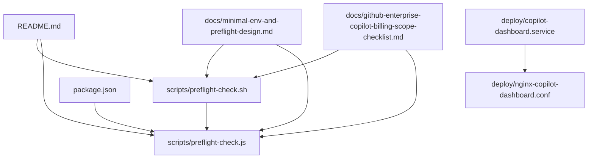
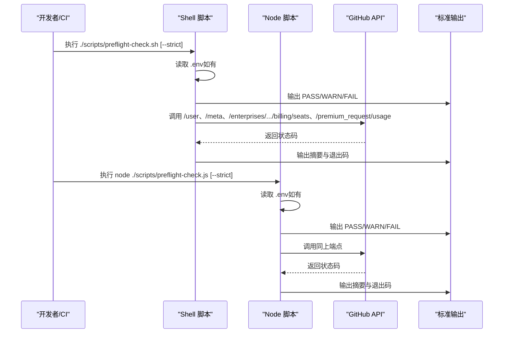
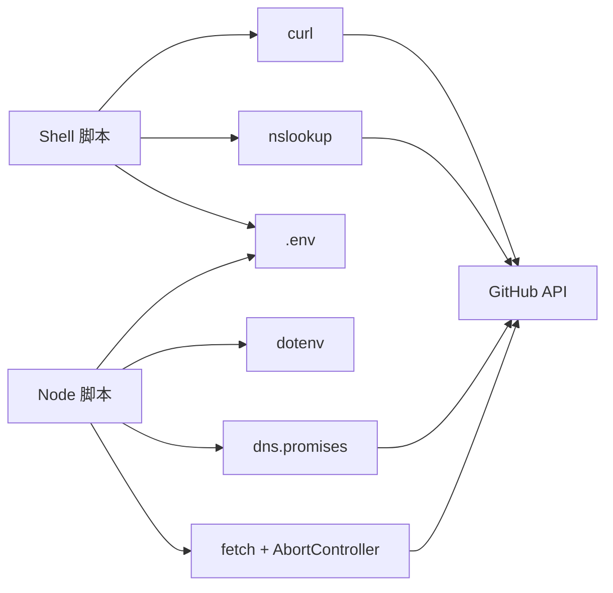

# 启动前检查

<cite>
**本文引用的文件**
- [preflight-check.sh](file://scripts/preflight-check.sh)
- [preflight-check.js](file://scripts/preflight-check.js)
- [README.md](file://README.md)
- [package.json](file://package.json)
- [minimal-env-and-preflight-design.md](file://docs/minimal-env-and-preflight-design.md)
- [github-enterprise-copilot-billing-scope-checklist.md](file://docs/github-enterprise-copilot-billing-scope-checklist.md)
- [copilot-dashboard.service](file://deploy/copilot-dashboard.service)
- [nginx-copilot-dashboard.conf](file://deploy/nginx-copilot-dashboard.conf)
</cite>

## 目录
1. [简介](#简介)
2. [项目结构](#项目结构)
3. [核心组件](#核心组件)
4. [架构总览](#架构总览)
5. [详细组件分析](#详细组件分析)
6. [依赖关系分析](#依赖关系分析)
7. [性能考量](#性能考量)
8. [故障排查指南](#故障排查指南)
9. [结论](#结论)
10. [附录](#附录)

## 简介
本文件系统性阐述启动前检查（Preflight Check）的设计原理与执行流程，覆盖 Shell 脚本与 Node.js 脚本的双重检查机制。内容涵盖环境变量验证、网络连通性测试、Token 有效性与权限探测、关键 API 可达性检查、可选功能探测、失败处理策略、严格模式、CI/CD 集成建议、常见问题诊断与解决方案，以及扩展与自定义检查项的方法。目标是帮助开发与运维团队在部署与启动前快速发现并解决问题，降低线上风险。

## 项目结构
启动前检查位于 scripts 目录，配套文档位于 docs 目录，部署与反向代理配置位于 deploy 目录。README 提供了使用说明与环境变量说明，package.json 提供了项目脚本与依赖。

图表来源
- [preflight-check.sh:1-182](file://scripts/preflight-check.sh#L1-L182)
- [preflight-check.js:1-188](file://scripts/preflight-check.js#L1-L188)
- [README.md:180-195](file://README.md#L180-L195)
- [package.json:6-11](file://package.json#L6-L11)
- [minimal-env-and-preflight-design.md:40-52](file://docs/minimal-env-and-preflight-design.md#L40-L52)
- [copilot-dashboard.service:1-18](file://deploy/copilot-dashboard.service#L1-L18)
- [nginx-copilot-dashboard.conf:1-14](file://deploy/nginx-copilot-dashboard.conf#L1-L14)

章节来源
- [README.md:1-120](file://README.md#L1-L120)
- [package.json:1-26](file://package.json#L1-L26)

## 核心组件
- Shell 版预检查脚本：提供跨平台、轻量、易于在 CI/CD 与服务器环境中直接执行的检查流程。
- Node.js 版预检查脚本：复用项目统一的请求头、超时控制与日志风格，便于与现有日志体系整合。
- 配套文档：最小权限 .env 模板、权限核对清单、自检设计说明，指导检查项与失败处理策略。

章节来源
- [preflight-check.sh:1-182](file://scripts/preflight-check.sh#L1-L182)
- [preflight-check.js:1-188](file://scripts/preflight-check.js#L1-L188)
- [minimal-env-and-preflight-design.md:40-52](file://docs/minimal-env-and-preflight-design.md#L40-L52)

## 架构总览
预检查系统采用“双引擎 + 统一输出”的架构：Shell 与 Node 两个入口分别执行相同顺序的检查流程，最终输出 PASS/WARN/FAIL 与摘要统计，并根据 FAIL/WARN 数量决定退出码。严格模式下，WARN 会被视为 FAIL。

图表来源
- [preflight-check.sh:62-181](file://scripts/preflight-check.sh#L62-L181)
- [preflight-check.js:37-187](file://scripts/preflight-check.js#L37-L187)

## 详细组件分析

### Shell 版预检查脚本（preflight-check.sh）
- 功能概览
  - 支持严格模式（--strict），将 WARN 视为 FAIL。
  - 读取 .env（如存在）注入环境变量。
  - 顺序执行：环境变量检查、DNS/网络连通性、Token 有效性、必要 API 可达性、可选功能探测。
  - 统计 PASS/WARN/FAIL 数量，输出摘要并按规则返回退出码。

- 关键检查项与失败处理
  - 环境变量检查
    - 必填：GITHUB_TOKEN、ENTERPRISE_SLUG。
    - 可选数值：CACHE_TTL、INCLUDED_QUOTA、PORT，非整数时报 FAIL。
    - GITHUB_API_BASE 非法时 FAIL。
  - DNS 与网络连通性
    - 若系统存在 nslookup，则进行 DNS 解析；否则发出 WARN 并跳过。
    - 使用 HTTPS 443 端口连通性测试；失败 FAIL。
  - Token 有效性
    - 优先调用 /user 验证；200 为 PASS。
    - 若失败，尝试 /meta；200 为 PASS，否则 FAIL，并给出状态标签。
  - 必要 API 可达性
    - 座位端点：/enterprises/{enterprise}/copilot/billing/seats，200 PASS，否则 FAIL。
    - Premium usage 端点：/enterprises/{enterprise}/settings/billing/premium_request/usage（按年月拼接），200 PASS，否则 FAIL。
  - 可选功能探测
    - Cost Centers：/enterprises/{enterprise}/settings/billing/cost-centers，200 PASS；404 WARN；403 WARN；其他 WARN。
    - Budgets：/enterprises/{enterprise}/settings/billing/budgets，200 PASS；404 WARN；403 WARN；其他 WARN。
  - 严格模式
    - 若存在 FAIL，直接退出 1。
    - 若启用 --strict 且存在 WARN，退出 1。

- 输出与退出码
  - 输出格式：[级别] 描述。
  - 退出码：FAIL>0 时 1；否则 0；严格模式下 WARN>0 时 1。

章节来源
- [preflight-check.sh:4-181](file://scripts/preflight-check.sh#L4-L181)
- [README.md:297-314](file://README.md#L297-L314)

### Node.js 版预检查脚本（preflight-check.js）
- 功能概览
  - 支持严格模式（--strict）。
  - 读取 .env（如存在）。
  - 使用 fetch + AbortController 控制超时。
  - 统一输出 PASS/WARN/FAIL，统计并输出摘要，按规则退出。

- 关键检查项与失败处理
  - 环境变量检查：同 Shell 版。
  - DNS 与网络连通性：使用 dns.promises.lookup 进行 DNS 解析；随后调用 /meta 验证 443 可达性。
  - Token 有效性：调用 /user；200 PASS；否则尝试 /meta；200 PASS；否则 FAIL。
  - 必要 API 可达性：同 Shell 版。
  - 可选功能探测：同 Shell 版。
  - 严格模式：同 Shell 版。

- 输出与退出码
  - 输出格式：[级别] 描述。
  - 退出码：FAIL>0 时 1；否则 0；严格模式下 WARN>0 时 1。

章节来源
- [preflight-check.js:1-188](file://scripts/preflight-check.js#L1-L188)
- [README.md:297-314](file://README.md#L297-L314)

### 统一失败状态标签映射
- Shell 版：status_label 函数将状态码映射为可读标签。
- Node 版：statusLabel 函数做同样映射。
- 常见映射：
  - 401：token 无效或过期
  - 403：权限不足（角色或 scope）
  - 404：资源不存在（企业 slug 错误或功能未启用）
  - 422：参数校验错误
  - 5xx：GitHub 服务器错误
  - 000/0：网络或超时错误

章节来源
- [preflight-check.sh:32-42](file://scripts/preflight-check.sh#L32-L42)
- [preflight-check.js:23-31](file://scripts/preflight-check.js#L23-L31)

### 严格模式与退出码约定
- 默认：存在 FAIL 即退出 1；仅 WARN 时退出 0。
- 严格模式：存在 FAIL 退出 1；存在 WARN 也退出 1。
- 用途：在 CI/CD 中将“功能受限”也阻断发布，确保上线质量。

章节来源
- [minimal-env-and-preflight-design.md:102-106](file://docs/minimal-env-and-preflight-design.md#L102-L106)
- [preflight-check.sh:176-181](file://scripts/preflight-check.sh#L176-L181)
- [preflight-check.js:179-186](file://scripts/preflight-check.js#L179-L186)

### CI/CD 集成建议
- 本地开发
  - 在 package.json 中添加 preflight 脚本，便于本地执行。
- 生产部署
  - systemd ExecStartPre 阶段执行预检查，失败则阻止启动。
- CI/CD
  - 在部署前 Gate 阶段执行预检查，失败阻断发布。
  - 可将结果写入 artifacts，便于审计与回溯。

章节来源
- [minimal-env-and-preflight-design.md:115-119](file://docs/minimal-env-and-preflight-design.md#L115-L119)
- [copilot-dashboard.service:1-18](file://deploy/copilot-dashboard.service#L1-L18)
- [package.json:6-11](file://package.json#L6-L11)

### 自定义检查项与扩展指南
- 新增检查项步骤
  - 在相应位置插入新的检查逻辑（如 DNS、网络、API 端点）。
  - 使用统一的 log 函数输出 PASS/WARN/FAIL。
  - 对于可选功能，使用 WARN；对于关键功能，使用 FAIL。
  - 如需严格模式，确保在严格模式下将 WARN 视为 FAIL。
- 输出与统计
  - 使用 counters/pass/warn/fail 统计数量，输出摘要。
  - 保持输出格式一致，便于日志解析与告警。
- 依赖与环境
  - Shell 版依赖 curl、nslookup（可选）、.env。
  - Node 版依赖 dotenv、Node.js 运行时、网络可达性。

章节来源
- [minimal-env-and-preflight-design.md:132-138](file://docs/minimal-env-and-preflight-design.md#L132-L138)
- [preflight-check.js:10-21](file://scripts/preflight-check.js#L10-L21)
- [preflight-check.sh:13-26](file://scripts/preflight-check.sh#L13-L26)

## 依赖关系分析
- Shell 版依赖
  - curl：HTTP 请求与超时控制。
  - nslookup：DNS 解析（可选）。
  - .env：环境变量注入。
- Node 版依赖
  - dotenv：加载 .env。
  - Node.js 内置 dns、fetch、AbortController：DNS 解析与 HTTP 请求。
- 两者共同依赖
  - GitHub API：统一的端点与版本头。
  - 环境变量：GITHUB_TOKEN、ENTERPRISE_SLUG、GITHUB_API_BASE 等。

图表来源
- [preflight-check.sh:44-60](file://scripts/preflight-check.sh#L44-L60)
- [preflight-check.js:44-63](file://scripts/preflight-check.js#L44-L63)
- [package.json:12-21](file://package.json#L12-L21)

章节来源
- [package.json:12-21](file://package.json#L12-L21)
- [preflight-check.sh:44-60](file://scripts/preflight-check.sh#L44-L60)
- [preflight-check.js:44-63](file://scripts/preflight-check.js#L44-L63)

## 性能考量
- 超时控制
  - Shell 版：curl 设置连接与最大超时，避免长时间阻塞。
  - Node 版：AbortController 控制超时，避免长时间占用事件循环。
- 并发与去重
  - 预检查为串行短流程，无需并发；如扩展为多端点检查，建议复用统一的超时与去重策略。
- 输出与日志
  - 统一输出格式，便于日志收集与告警；避免冗余信息影响可读性。

章节来源
- [preflight-check.sh:47-59](file://scripts/preflight-check.sh#L47-L59)
- [preflight-check.js:44-63](file://scripts/preflight-check.js#L44-L63)

## 故障排查指南
- 环境变量问题
  - 缺失必填变量：GITHUB_TOKEN、ENTERPRISE_SLUG。
  - 可选变量类型错误：CACHE_TTL、INCLUDED_QUOTA、PORT 非整数。
  - GITHUB_API_BASE 非法。
  - 解决：补齐 .env，确保变量类型正确。
- 网络与 DNS 问题
  - DNS 解析失败或 443 不可达。
  - 解决：检查防火墙、代理、DNS 配置；使用 curl 或 Node 的 DNS 检查定位。
- Token 问题
  - 401：Token 无效或过期。
  - 403：角色或 scope 不足。
  - 404：企业 slug 错误或功能未启用。
  - 422：参数校验错误。
  - 5xx：GitHub 服务器错误。
  - 解决：核对权限与功能开关，必要时更换 Token 或启用功能。
- API 权限不足
  - 座位端点或 Premium usage 端点返回 403。
  - 解决：提升角色或 scope；参考权限核对清单。
- 可选功能未启用
  - Cost Centers/Budgets 404。
  - 解决：启用对应企业能力或在严格模式下接受 WARN。
- 严格模式阻断
  - 存在 WARN 时退出 1。
  - 解决：修复问题或在非严格模式下继续。

章节来源
- [preflight-check.sh:70-169](file://scripts/preflight-check.sh#L70-L169)
- [preflight-check.js:72-176](file://scripts/preflight-check.js#L72-L176)
- [github-enterprise-copilot-billing-scope-checklist.md:94-107](file://docs/github-enterprise-copilot-billing-scope-checklist.md#L94-L107)

## 结论
启动前检查系统通过 Shell 与 Node.js 双引擎实现了统一的检查流程与输出规范，覆盖环境、网络、Token 有效性与关键 API 可达性，并对可选功能进行探测。严格模式进一步提升了上线质量门槛。结合 CI/CD 与 systemd 集成，可在问题暴露于生产之前及时拦截，显著降低故障概率与影响面。

## 附录

### 检查项一览与作用
- 环境变量检查：确保运行所需的关键变量存在且类型正确。
- DNS 与网络连通性：确保可解析与访问 GitHub API。
- Token 有效性：确保认证通过，区分不同失败原因。
- 必要 API 可达性：Seat 与 Premium usage 端点，保障核心功能可用。
- 可选功能探测：Cost Centers 与 Budgets，识别功能可用性与权限。

章节来源
- [minimal-env-and-preflight-design.md:53-82](file://docs/minimal-env-and-preflight-design.md#L53-L82)
- [preflight-check.sh:70-169](file://scripts/preflight-check.sh#L70-L169)
- [preflight-check.js:72-176](file://scripts/preflight-check.js#L72-L176)

### CI/CD 集成要点
- 本地：通过 npm scripts 执行预检查。
- 生产：systemd ExecStartPre 阶段执行，失败阻止启动。
- CI/CD：部署前 Gate 阶段执行，失败阻断发布。

章节来源
- [minimal-env-and-preflight-design.md:115-119](file://docs/minimal-env-and-preflight-design.md#L115-L119)
- [copilot-dashboard.service:9-12](file://deploy/copilot-dashboard.service#L9-L12)

### 反向代理与服务配置
- systemd 服务单元：以 www-data 用户运行，自动重启，加载 .env。
- Nginx 反向代理：将 80 端口转发到 Node.js 3000 端口。

章节来源
- [copilot-dashboard.service:1-18](file://deploy/copilot-dashboard.service#L1-L18)
- [nginx-copilot-dashboard.conf:1-14](file://deploy/nginx-copilot-dashboard.conf#L1-L14)