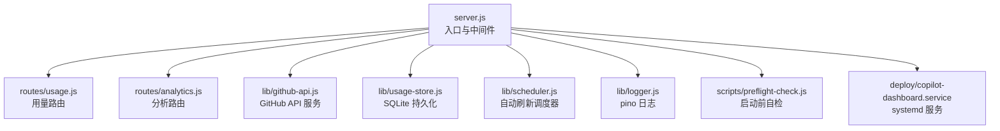
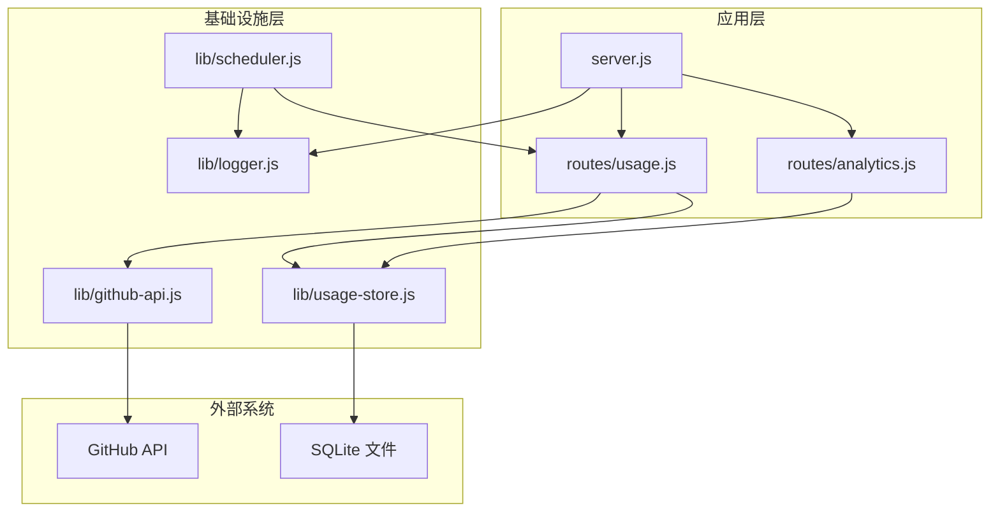
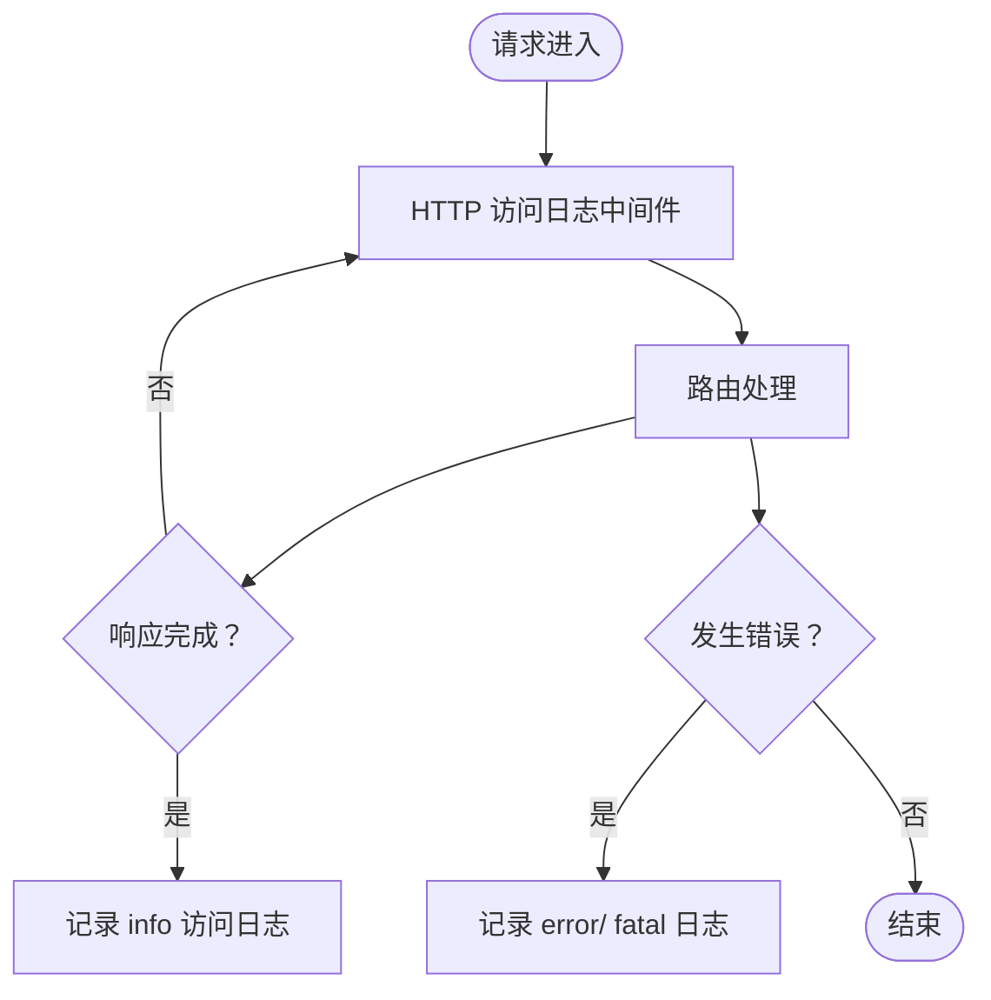
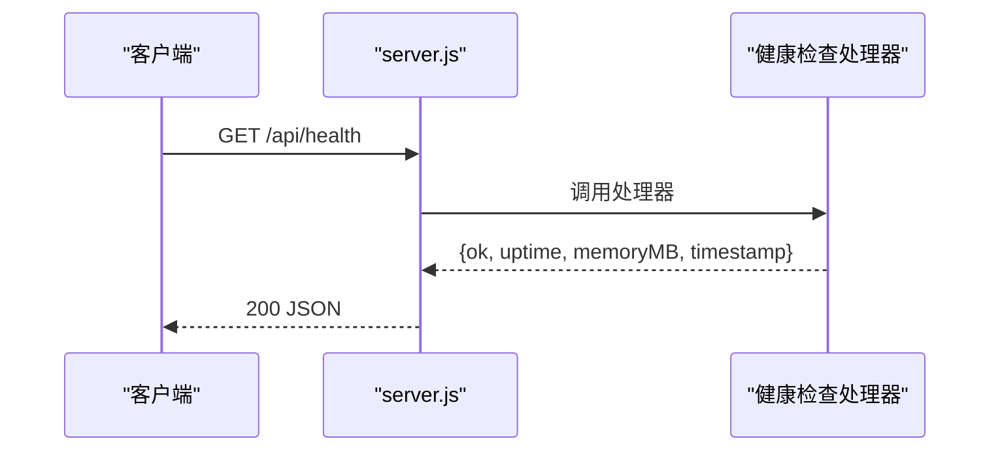
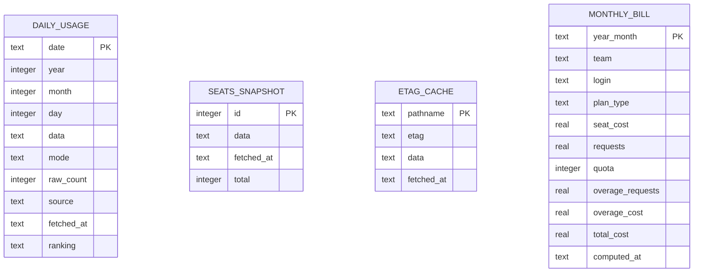
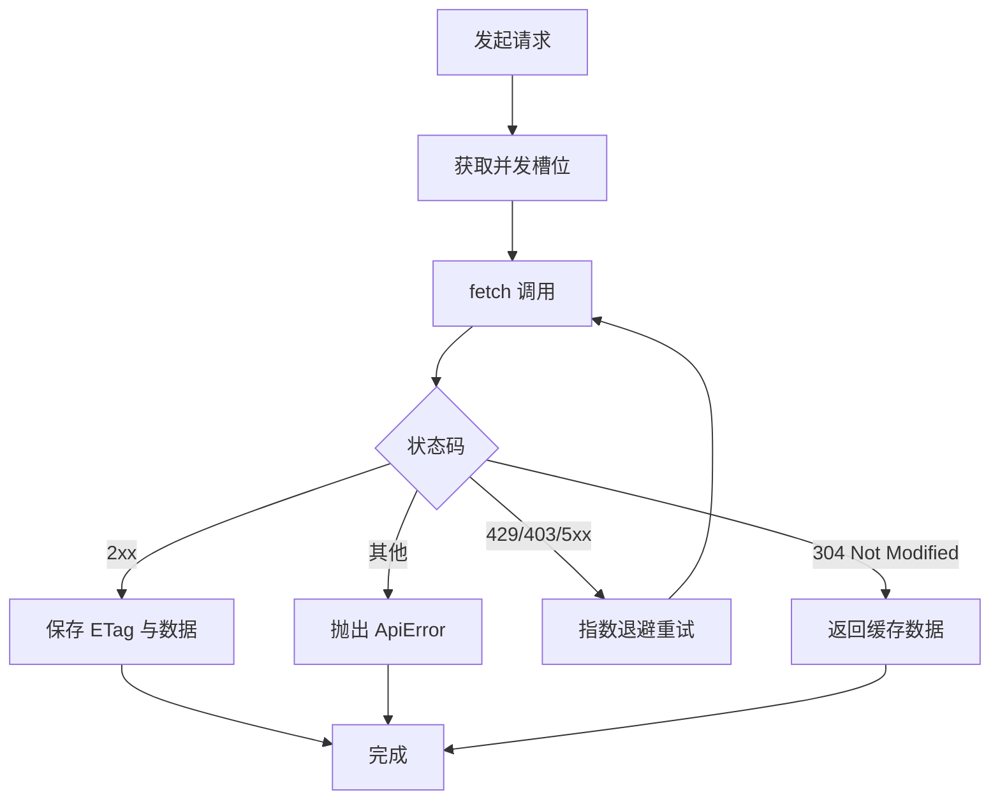
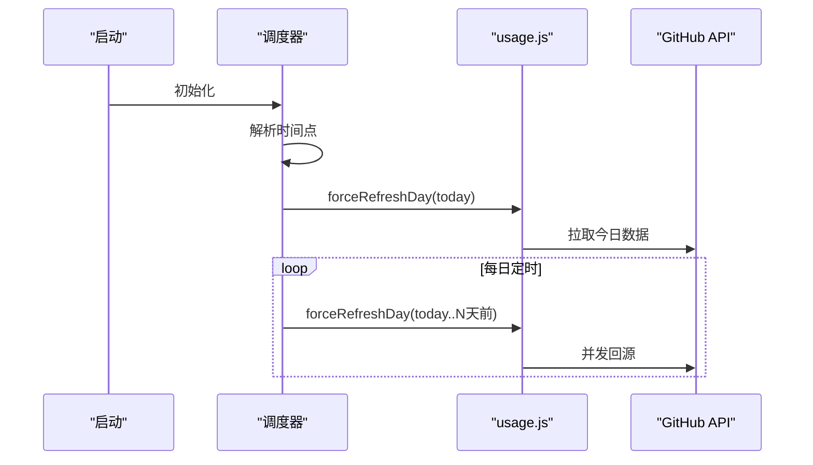
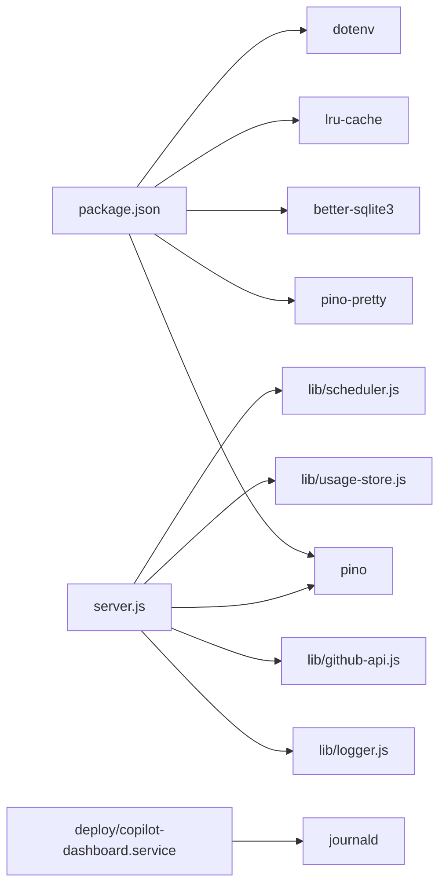

# 监控与日志

<cite>
**本文引用的文件**
- [server.js](file://server.js)
- [lib/logger.js](file://lib/logger.js)
- [lib/usage-store.js](file://lib/usage-store.js)
- [lib/github-api.js](file://lib/github-api.js)
- [lib/scheduler.js](file://lib/scheduler.js)
- [routes/usage.js](file://routes/usage.js)
- [routes/analytics.js](file://routes/analytics.js)
- [scripts/preflight-check.js](file://scripts/preflight-check.js)
- [deploy/copilot-dashboard.service](file://deploy/copilot-dashboard.service)
- [package.json](file://package.json)
- [README.md](file://README.md)
</cite>

## 目录
1. [简介](#简介)
2. [项目结构](#项目结构)
3. [核心组件](#核心组件)
4. [架构总览](#架构总览)
5. [详细组件分析](#详细组件分析)
6. [依赖关系分析](#依赖关系分析)
7. [性能考量](#性能考量)
8. [故障排查指南](#故障排查指南)
9. [结论](#结论)
10. [附录](#附录)

## 简介
本指南围绕 CopilotEnterpriseUsageDisplay 的系统监控与日志管理，系统性阐述以下内容：
- pino 结构化日志体系的配置与使用，包括日志级别、输出格式、敏感信息脱敏与性能优化建议
- 健康检查接口的实现原理与使用方法，覆盖服务状态与依赖项检查
- 性能监控的关键指标与告警阈值建议
- 日志轮转与存储策略（当前实现与最佳实践）
- 故障排查的日志分析方法与常用命令
- 系统资源监控、API 调用监控与业务指标监控的最佳实践

## 项目结构
该项目采用模块化分层架构，后端入口为 server.js，路由层位于 routes/，核心业务与基础设施位于 lib/，前端静态资源位于 public/，部署与文档位于 deploy/ 与 docs/。

**图表来源**
- [server.js:1-182](file://server.js#L1-L182)
- [routes/usage.js:1-470](file://routes/usage.js#L1-L470)
- [routes/analytics.js:1-132](file://routes/analytics.js#L1-L132)
- [lib/github-api.js:1-320](file://lib/github-api.js#L1-L320)
- [lib/usage-store.js:1-324](file://lib/usage-store.js#L1-L324)
- [lib/scheduler.js:1-160](file://lib/scheduler.js#L1-L160)
- [lib/logger.js:1-41](file://lib/logger.js#L1-L41)
- [scripts/preflight-check.js:1-188](file://scripts/preflight-check.js#L1-L188)
- [deploy/copilot-dashboard.service:1-18](file://deploy/copilot-dashboard.service#L1-L18)

**章节来源**
- [server.js:1-182](file://server.js#L1-L182)
- [README.md:46-96](file://README.md#L46-L96)

## 核心组件
- 结构化日志（pino）
  - 日志级别：支持 trace、debug、info、warn、error，生产默认 info，开发默认 debug
  - 输出格式：开发模式使用 pino-pretty，生产模式输出 JSON
  - 敏感信息脱敏：自动遮蔽 Authorization、token、password、secret 等字段
  - 序列化器：请求、响应、错误对象标准化输出
- 健康检查接口
  - /api/health 返回运行时长、内存占用、时间戳等基础健康信息
- 缓存与存储
  - 三层缓存：内存 Map/LRU → SQLite → GitHub API
  - SQLite 表：daily_usage、seats_snapshot、etag_cache、monthly_bill
- GitHub API 层
  - 并发队列、重试退避、ETag 条件请求、单飞行去重、LRU 缓存
- 自动刷新调度器
  - 启动后延迟刷新当天数据，按本地时间点定期强制刷新近 N 天

**章节来源**
- [lib/logger.js:1-41](file://lib/logger.js#L1-L41)
- [server.js:100-108](file://server.js#L100-L108)
- [lib/usage-store.js:24-79](file://lib/usage-store.js#L24-L79)
- [lib/github-api.js:25-48](file://lib/github-api.js#L25-L48)
- [lib/scheduler.js:54-157](file://lib/scheduler.js#L54-L157)

## 架构总览
下图展示了监控与日志在系统中的位置与交互：

**图表来源**
- [server.js:1-182](file://server.js#L1-L182)
- [routes/usage.js:1-470](file://routes/usage.js#L1-L470)
- [routes/analytics.js:1-132](file://routes/analytics.js#L1-L132)
- [lib/github-api.js:1-320](file://lib/github-api.js#L1-L320)
- [lib/usage-store.js:1-324](file://lib/usage-store.js#L1-L324)
- [lib/scheduler.js:1-160](file://lib/scheduler.js#L1-L160)
- [lib/logger.js:1-41](file://lib/logger.js#L1-L41)

## 详细组件分析

### pino 结构化日志系统
- 日志级别与默认值
  - 开发环境：LOG_LEVEL 未设置时默认 debug
  - 生产环境：LOG_LEVEL 未设置时默认 info
- 输出格式
  - 开发：使用 pino-pretty，彩色输出，包含时间与忽略字段
  - 生产：输出 JSON，便于日志收集与分析
- 敏感信息脱敏
  - 脱敏路径：headers.authorization、req.headers.authorization、githubToken、token、password、secret
  - 脱敏值：统一替换为 [REDACTED]
- 序列化器
  - 请求：method、url、remoteAddress、remoteHostname、userAgent
  - 响应：statusCode
  - 错误：标准错误序列化
- 访问日志中间件
  - 在 res.finish 事件中记录 time、IP、主机名、方法、URL、动作、成功与否、状态码、响应时间
- 全局错误处理
  - 捕获未处理异常与拒绝，记录完整上下文与堆栈

**图表来源**
- [server.js:16-38](file://server.js#L16-L38)
- [server.js:120-139](file://server.js#L120-L139)
- [lib/logger.js:13-37](file://lib/logger.js#L13-L37)

**章节来源**
- [lib/logger.js:1-41](file://lib/logger.js#L1-L41)
- [server.js:16-38](file://server.js#L16-L38)
- [server.js:120-139](file://server.js#L120-L139)

### 健康检查接口
- 路径：GET /api/health
- 返回字段：ok、uptime（秒）、memoryMB（RSS）、timestamp（ISO）
- 作用：服务存活探测、负载均衡健康检查、容器编排探针

**图表来源**
- [server.js:100-108](file://server.js#L100-L108)

**章节来源**
- [server.js:100-108](file://server.js#L100-L108)

### 缓存与存储监控
- 三层缓存
  - 内存 Map/LRU：refreshCache、etagCache、teamCache
  - SQLite：daily_usage、seats_snapshot、etag_cache、monthly_bill
- TTL 策略
  - 近 3 天：1 小时（应对 GitHub Billing API 24–48h 延迟）
  - 更老：90 天
- SQLite 表结构与索引
  - daily_usage：按 date 主键与 fetched_at 索引
  - seats_snapshot：按 fetched_at 索引
  - etag_cache：按 pathname 主键与 fetched_at 索引
  - monthly_bill：按 year_month 主键与索引
- 命中率展示
  - 刷新后页面顶部显示 cacheHitRatio，直观反映 API 调用节省效果

**图表来源**
- [lib/usage-store.js:24-71](file://lib/usage-store.js#L24-L71)

**章节来源**
- [lib/usage-store.js:1-324](file://lib/usage-store.js#L1-L324)
- [routes/usage.js:134-235](file://routes/usage.js#L134-L235)

### GitHub API 调用监控
- 并发控制
  - MAX_CONCURRENT_GITHUB：默认 3，防止触发 Secondary Rate Limit
  - acquireGithubSlot/releaseGithubSlot：队列式并发管理
- 重试与退避
  - MAX_GITHUB_RETRIES：默认 3
  - 指数退避，最大等待不超过 60 秒
- ETag 条件请求
  - 未变化返回 304，不消耗配额
  - 内存 etagCache 与 SQLite etag_cache 双向同步
- 单飞行去重
  - 同一 key 的请求共享同一 Promise，避免重复查询
- LRU 缓存
  - max=500，按路径 TTL 策略缓存 GET 响应

**图表来源**
- [lib/github-api.js:108-168](file://lib/github-api.js#L108-L168)
- [lib/github-api.js:172-227](file://lib/github-api.js#L172-L227)
- [lib/github-api.js:231-269](file://lib/github-api.js#L231-L269)

**章节来源**
- [lib/github-api.js:1-320](file://lib/github-api.js#L1-L320)

### 自动刷新调度器
- 启动行为
  - 延迟启动（默认 5000ms），强制刷新当天数据
- 定时行为
  - 每天本地时间点（默认 03:00、12:00）强制刷新今天 + 近 N 天（默认 2）
- 配置
  - SCHED_DISABLED、SCHED_DAILY_TIMES、SCHED_BACKFILL_DAYS、SCHED_STARTUP_DELAY_MS
- 多实例安全
  - 可通过 SCHED_DISABLED=true 在只读副本禁用调度

**图表来源**
- [lib/scheduler.js:54-157](file://lib/scheduler.js#L54-L157)
- [routes/usage.js:273-277](file://routes/usage.js#L273-L277)

**章节来源**
- [lib/scheduler.js:1-160](file://lib/scheduler.js#L1-L160)
- [routes/usage.js:1-470](file://routes/usage.js#L1-L470)

### 访问日志与错误日志
- 访问日志字段
  - time、remoteAddress、remoteHostname、method、url、action、success、statusCode、responseTime
- URL 到动作映射
  - 将路径映射为语义化动作，如 refresh_usage、get_seats、health_check
- 全局错误中间件
  - 记录错误上下文（IP、主机名、动作、状态码）与堆栈

**章节来源**
- [server.js:54-86](file://server.js#L54-L86)
- [server.js:16-38](file://server.js#L16-L38)
- [server.js:120-139](file://server.js#L120-L139)

## 依赖关系分析
- 运行时依赖
  - pino、pino-pretty：结构化日志
  - better-sqlite3：SQLite 数据库
  - lru-cache：LRU 缓存
  - dotenv：环境变量加载
- 启动与部署
  - systemd 服务单元将标准输出/错误重定向到 journald
  - 健康检查接口用于 systemd 与容器探针

**图表来源**
- [package.json:12-21](file://package.json#L12-L21)
- [server.js:1-11](file://server.js#L1-L11)
- [deploy/copilot-dashboard.service:13-14](file://deploy/copilot-dashboard.service#L13-L14)

**章节来源**
- [package.json:1-26](file://package.json#L1-L26)
- [deploy/copilot-dashboard.service:1-18](file://deploy/copilot-dashboard.service#L1-L18)

## 性能考量
- 日志级别与性能
  - 生产环境建议 info，避免 trace/debug 的高开销
  - pino-pretty 仅用于开发，生产使用 JSON 输出
- 缓存命中与 API 调用
  - 三层缓存显著降低 GitHub API 调用，命中率越高越好
  - 近期数据采用 1 小时 TTL，避免 GitHub 延迟导致的空/不完整数据被长期缓存
- 并发与重试
  - 合理设置 GITHUB_MAX_CONCURRENT 与 GITHUB_MAX_RETRIES，避免触发 Secondary Rate Limit
  - ETag 条件请求减少无效传输
- SQLite 性能
  - WAL 模式 + NORMAL 同步提升并发写入性能
  - 预编译语句减少 SQL 解析开销
- 前端缓存
  - CACHE_TTL 控制前端缓存时长，SWR 策略提升刷新体验

**章节来源**
- [lib/logger.js:3-37](file://lib/logger.js#L3-L37)
- [lib/usage-store.js:16-17](file://lib/usage-store.js#L16-L17)
- [lib/github-api.js:25-27](file://lib/github-api.js#L25-L27)
- [README.md:218-242](file://README.md#L218-L242)

## 故障排查指南
- 健康检查
  - 访问 /api/health，观察 uptime、memoryMB、timestamp 是否正常
- 日志定位
  - 开发：设置 LOG_LEVEL=debug，查看 pino-pretty 输出
  - 生产：从 journald 采集 JSON 日志，按时间、动作、状态码过滤
  - 常见关键字：LRU cache hit/miss、ETag conditional request、GitHub API retry、Unhandled route error
- systemd 与日志采集
  - 查看服务状态与日志：systemctl status copilot-dashboard、journalctl -u copilot-dashboard -f
- 环境变量与权限
  - 使用 preflight-check.js 检查必填变量、DNS、网络连通性、Token 有效性、必要 API 权限
- API 限流与重试
  - 若出现 429/403 rate limit，检查重试等待与退避策略是否生效
- 数据新鲜度
  - 使用 /api/usage/refresh 的 force:true 参数强制回源，验证数据是否恢复正常

**章节来源**
- [server.js:100-108](file://server.js#L100-L108)
- [lib/logger.js:13-37](file://lib/logger.js#L13-L37)
- [scripts/preflight-check.js:1-188](file://scripts/preflight-check.js#L1-L188)
- [deploy/copilot-dashboard.service:1-18](file://deploy/copilot-dashboard.service#L1-L18)

## 结论
本项目通过 pino 结构化日志、三层缓存与 GitHub API 优化、健康检查接口与自动刷新调度器，构建了可观测、可维护、高性能的 Copilot 用量监控系统。建议在生产环境中：
- 固定日志级别为 info，启用 JSON 输出
- 监控健康检查与关键指标（响应时间、缓存命中率、API 状态码分布）
- 配置日志轮转与归档策略，保障长期可追溯性
- 结合 systemd 与 journald 实施统一日志采集与告警

## 附录

### 健康检查接口定义
- 方法：GET
- 路径：/api/health
- 成功响应：200，字段包括 ok、uptime、memoryMB、timestamp

**章节来源**
- [server.js:100-108](file://server.js#L100-L108)

### 日志级别与输出格式对照
- 级别：trace < debug < info < warn < error
- 开发：pino-pretty，彩色输出，包含时间与忽略字段
- 生产：JSON 输出，便于日志平台解析

**章节来源**
- [lib/logger.js:3-37](file://lib/logger.js#L3-L37)

### 日志轮转与存储策略
- 当前实现
  - systemd 将标准输出/错误重定向到 journald，由系统负责滚动与保留
- 建议实践
  - 使用 journald 配置文件设置最大文件大小与保留天数
  - 将 journald 日志导出到集中式日志平台（如 ELK/ Loki）进行长期归档与检索
  - 对关键业务日志（如 /api/usage/refresh 的结果与错误）单独采集与告警

**章节来源**
- [deploy/copilot-dashboard.service:13-14](file://deploy/copilot-dashboard.service#L13-L14)

### 性能监控关键指标与阈值建议
- 响应时间
  - 95 分位：建议 < 2s；> 5s 触发告警
- 缓存命中率
  - 建议 > 90%；< 70% 触发告警
- API 状态码分布
  - 429/403 比例 > 1% 触发告警
  - 5xx 比例 > 0.1% 触发告警
- 内存使用
  - RSS > 512MB（根据实例规模调整）触发告警
- 健康检查
  - /api/health 连续失败 > 3 次触发告警

[本节为通用指导，不直接分析具体文件，故无“章节来源”]