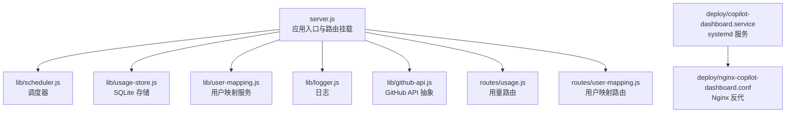
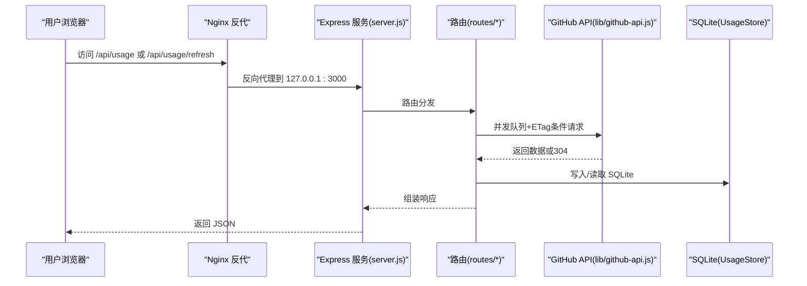
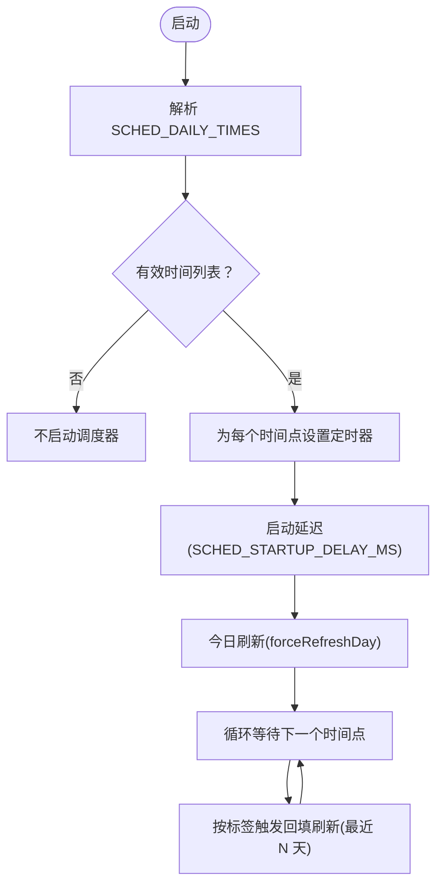
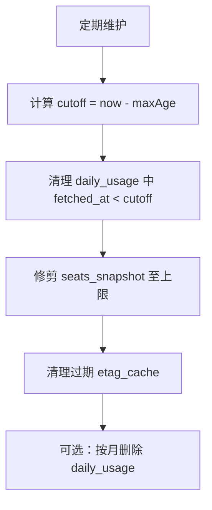
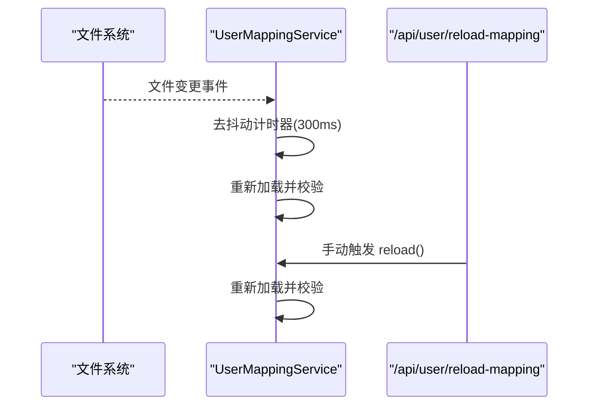
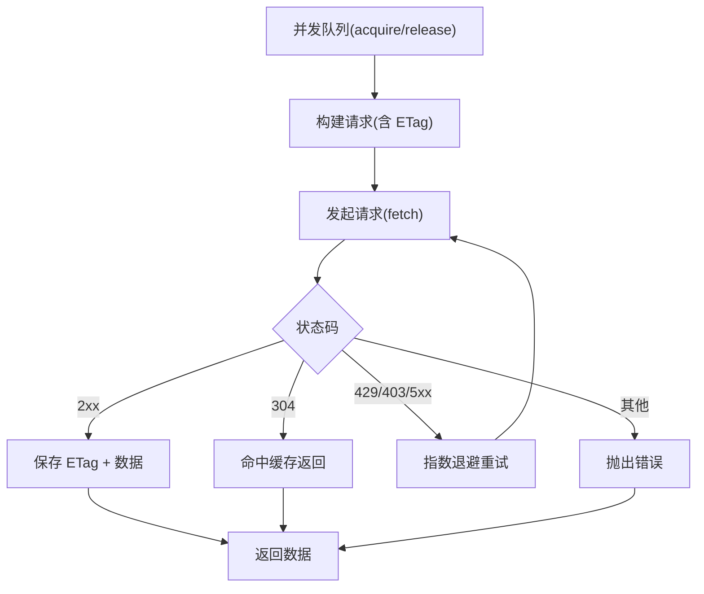
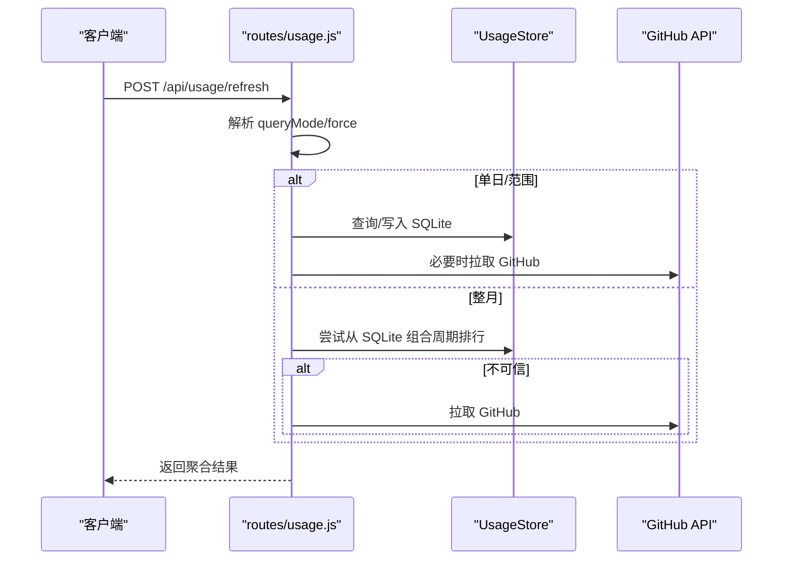
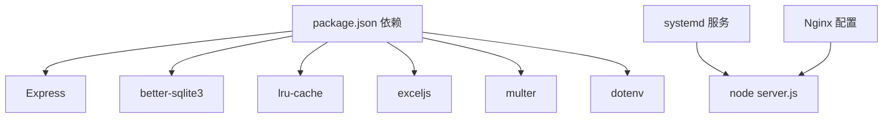

# 维护与运维

<cite>
**本文引用的文件**
- [server.js](file://server.js)
- [scheduler.js](file://lib/scheduler.js)
- [usage-store.js](file://lib/usage-store.js)
- [user-mapping.js](file://lib/user-mapping.js)
- [logger.js](file://lib/logger.js)
- [github-api.js](file://lib/github-api.js)
- [usage.js](file://routes/usage.js)
- [user-mapping.js](file://routes/user-mapping.js)
- [copilot-dashboard.service](file://deploy/copilot-dashboard.service)
- [nginx-copilot-dashboard.conf](file://deploy/nginx-copilot-dashboard.conf)
- [preflight-check.js](file://scripts/preflight-check.js)
- [package.json](file://package.json)
</cite>

## 目录
1. [简介](#简介)
2. [项目结构](#项目结构)
3. [核心组件](#核心组件)
4. [架构总览](#架构总览)
5. [详细组件分析](#详细组件分析)
6. [依赖关系分析](#依赖关系分析)
7. [性能考量](#性能考量)
8. [故障排查指南](#故障排查指南)
9. [结论](#结论)
10. [附录](#附录)

## 简介
本指南面向运维团队，提供 CopilotEnterpriseUsageDisplay 系统的日常维护与操作手册，覆盖以下主题：
- 自动刷新调度器的配置与管理（调度频率、任务监控、异常处理）
- 数据库维护（SQLite 备份、清理、性能优化）
- 服务重启、配置更新与版本升级标准流程
- 用户映射文件热重载机制与维护方法
- 数据导出、报表生成与备份恢复实践
- 常见运维场景与应急响应流程

## 项目结构
系统采用 Node.js + Express 架构，核心由服务入口、调度器、数据存储、用户映射、日志与 GitHub API 抽象组成，并通过部署脚本与 Nginx 提供反向代理。

图示来源
- [server.js:146-148](file://server.js#L146-L148)
- [scheduler.js:54-157](file://lib/scheduler.js#L54-L157)
- [usage-store.js:10-324](file://lib/usage-store.js#L10-L324)
- [user-mapping.js:7-158](file://lib/user-mapping.js#L7-L158)
- [logger.js:1-41](file://lib/logger.js#L1-L41)
- [github-api.js:1-320](file://lib/github-api.js#L1-L320)
- [usage.js:13-470](file://routes/usage.js#L13-L470)
- [user-mapping.js:12-135](file://routes/user-mapping.js#L12-L135)
- [copilot-dashboard.service:1-18](file://deploy/copilot-dashboard.service#L1-L18)
- [nginx-copilot-dashboard.conf:1-14](file://deploy/nginx-copilot-dashboard.conf#L1-L14)

章节来源
- [server.js:146-148](file://server.js#L146-L148)
- [package.json:1-26](file://package.json#L1-L26)

## 核心组件
- 应用入口与生命周期：负责启动、挂载路由、健康检查、优雅关闭与未捕获错误处理。
- 调度器：每日定时刷新用量数据，支持多时间点、回填天数与启动延迟配置。
- 数据存储：基于 SQLite 的 UsageStore，包含用量、座位快照、ETag 缓存与月账单表。
- 用户映射：读取 user_mapping.json，支持热重载与去抖动。
- 日志：统一日志级别与脱敏策略。
- GitHub API：并发队列、重试退避、ETag 条件请求与 LRU 缓存。
- 部署：systemd 服务与 Nginx 反代配置。

章节来源
- [server.js:101-182](file://server.js#L101-L182)
- [scheduler.js:1-160](file://lib/scheduler.js#L1-L160)
- [usage-store.js:10-324](file://lib/usage-store.js#L10-L324)
- [user-mapping.js:7-158](file://lib/user-mapping.js#L7-L158)
- [logger.js:1-41](file://lib/logger.js#L1-L41)
- [github-api.js:1-320](file://lib/github-api.js#L1-L320)

## 架构总览
下图展示从客户端到后端、再到 GitHub API 的典型调用链路与缓存路径。

图示来源
- [server.js:88-99](file://server.js#L88-L99)
- [usage.js:378-462](file://routes/usage.js#L378-L462)
- [github-api.js:108-168](file://lib/github-api.js#L108-L168)
- [usage-store.js:137-160](file://lib/usage-store.js#L137-L160)

## 详细组件分析

### 自动刷新调度器（Scheduler）
- 启动行为：应用启动后按配置延迟执行“今日”刷新；随后在每个本地时间点触发“最近 N 天”的强制刷新。
- 配置项（环境变量）：
  - SCHED_DISABLED：禁用调度器（适用于只读副本/额外 worker）
  - SCHED_DAILY_TIMES：逗号分隔的 HH:MM 列表，默认 03:00,12:00
  - SCHED_BACKFILL_DAYS：回填天数，默认 2（昨天 + 前天）
  - SCHED_STARTUP_DELAY_MS：启动延迟毫秒数，默认 5000
- 异常处理：单次刷新失败会记录告警日志；调度循环继续运行，避免影响后续任务。
- 停止方式：优雅关闭时停止所有定时器并释放资源。

图示来源
- [scheduler.js:54-157](file://lib/scheduler.js#L54-L157)

章节来源
- [scheduler.js:1-160](file://lib/scheduler.js#L1-L160)
- [server.js:146-148](file://server.js#L146-L148)

### 数据库维护（SQLite）
- 表结构与索引：daily_usage、seats_snapshot、etag_cache、monthly_bill；包含 TTL 与清理逻辑。
- 清理策略：
  - 按 fetched_at 超期删除 daily_usage
  - 按月份删除 daily_usage
  - 限制 seats_snapshot 最大快照数量，超出则删除旧快照
  - 清理过期 ETag 缓存
- 性能优化建议：
  - 使用 WAL 模式与 NORMAL 同步策略
  - 合理设置索引以加速查询
  - 定期清理过期数据，控制表规模
- 备份与恢复：
  - 停机备份：直接复制 usage.db 文件
  - 在线备份：使用 SQLite 备份命令或事务快照
  - 恢复：停止服务后替换 usage.db，再启动服务

图示来源
- [usage-store.js:195-207](file://lib/usage-store.js#L195-L207)
- [usage-store.js:226-239](file://lib/usage-store.js#L226-L239)
- [usage-store.js:275-278](file://lib/usage-store.js#L275-L278)

章节来源
- [usage-store.js:10-324](file://lib/usage-store.js#L10-L324)

### 用户映射文件热重载
- 文件位置：data/user_mapping.json
- 加载与校验：启动时确保文件存在并加载；校验每条记录的有效性，过滤无效项。
- 热重载机制：使用 fs.watch 监听文件变化，配合短去抖动（300ms）防止频繁重复加载。
- 手动重载：提供 /api/user/reload-mapping 接口强制重新加载。
- 关闭：优雅关闭时释放 watcher 并清理定时器。

图示来源
- [user-mapping.js:98-116](file://lib/user-mapping.js#L98-L116)
- [user-mapping.js:140-142](file://lib/user-mapping.js#L140-L142)
- [user-mapping.js:79-102](file://routes/user-mapping.js#L79-L102)

章节来源
- [user-mapping.js:7-158](file://lib/user-mapping.js#L7-L158)
- [user-mapping.js:12-135](file://routes/user-mapping.js#L12-L135)

### GitHub API 抽象与缓存
- 并发控制：固定最大并发数，队列排队，避免瞬时压力。
- 重试与退避：对 429/403/5xx 场景进行指数退避与固定上限等待。
- ETag 条件请求：内存中维护 LRU 缓存镜像，持久化至 SQLite，减少重复请求。
- 单飞去重：同一键值的请求在飞行中会被去重，提升稳定性。

图示来源
- [github-api.js:25-48](file://lib/github-api.js#L25-L48)
- [github-api.js:172-227](file://lib/github-api.js#L172-L227)
- [github-api.js:231-269](file://lib/github-api.js#L231-L269)

章节来源
- [github-api.js:1-320](file://lib/github-api.js#L1-L320)

### 用量刷新与缓存策略
- 内存缓存：按查询参数键缓存，受 CACHE_TTL 控制。
- SQLite 缓存：按日期缓存每日结果，区分“近期（1小时）”与“长期（90天）”TTL。
- 回退策略：当 SQLite 缓存不可信时回退到按用户逐个查询。
- 强制刷新：支持按单日/范围/整月强制刷新，绕过缓存写入 SQLite。

图示来源
- [usage.js:387-462](file://routes/usage.js#L387-L462)
- [usage.js:279-348](file://routes/usage.js#L279-L348)
- [usage.js:134-235](file://routes/usage.js#L134-L235)

章节来源
- [usage.js:11-470](file://routes/usage.js#L11-L470)

## 依赖关系分析
- 运行时依赖：Express、better-sqlite3、pino、lru-cache、exceljs、multer、dotenv。
- systemd 服务与 Nginx：systemd 管理进程生命周期，Nginx 提供反向代理与静态资源。
- 健康检查：/api/health 返回运行时信息，便于外部监控。

图示来源
- [package.json:12-21](file://package.json#L12-L21)
- [copilot-dashboard.service:5-14](file://deploy/copilot-dashboard.service#L5-L14)
- [nginx-copilot-dashboard.conf:5-12](file://deploy/nginx-copilot-dashboard.conf#L5-L12)

章节来源
- [package.json:1-26](file://package.json#L1-26)
- [server.js:100-108](file://server.js#L100-L108)

## 性能考量
- 并发与限流：合理设置 GitHub 并发与重试次数，避免触发速率限制。
- 缓存策略：利用内存 LRU 与 ETag 条件请求减少网络开销；SQLite 缓存降低重复聚合成本。
- 数据库调优：启用 WAL、NORMAL 同步；定期清理过期数据；为高频查询建立索引。
- 日志级别：生产环境使用 info/warn/error，避免过度输出影响性能。

## 故障排查指南
- 服务无法启动
  - 检查 .env 是否正确（GITHUB_TOKEN、ENTERPRISE_SLUG 等），使用预检脚本验证网络与权限。
  - 查看 systemd 日志与应用日志，定位启动阶段错误。
- 调度器不工作
  - 检查 SCHED_DISABLED/SCHED_DAILY_TIMES/SCHED_BACKFILL_DAYS/SCHED_STARTUP_DELAY_MS。
  - 观察日志中“Scheduler started/next slot scheduled”等信息确认是否启动。
- 用量数据异常
  - 使用 /api/usage/refresh 强制刷新；检查 SQLite 中 daily_usage 与 fetched_at。
  - 若回退到 per-user-fallback，确认 seats 数据可用性。
- 用户映射不生效
  - 确认 data/user_mapping.json 格式正确且字段齐全；查看热重载日志。
  - 使用 /api/user/reload-mapping 强制重载。
- GitHub API 限流
  - 查看日志中的 retry-after 与速率限制信息；适当降低并发或增加重试等待。
- 健康检查
  - 访问 /api/health 获取运行时信息，核对内存占用与进程存活。

章节来源
- [preflight-check.js:65-187](file://scripts/preflight-check.js#L65-L187)
- [scheduler.js:58-69](file://lib/scheduler.js#L58-L69)
- [usage.js:387-462](file://routes/usage.js#L387-L462)
- [user-mapping.js:98-116](file://lib/user-mapping.js#L98-L116)
- [github-api.js:172-227](file://lib/github-api.js#L172-L227)
- [server.js:100-108](file://server.js#L100-L108)

## 结论
通过规范的调度器配置、数据库维护与缓存策略，结合 systemd/Nginx 的稳定部署，CopilotEnterpriseUsageDisplay 能够在高负载场景下保持可靠与高性能。运维团队应遵循本文提供的标准流程与最佳实践，确保系统持续稳定运行。

## 附录

### 标准运维操作流程

- 服务重启
  - 使用 systemd 控制：systemctl restart copilot-dashboard.service
  - 观察日志：journalctl -u copilot-dashboard.service -f
- 配置更新
  - 更新 .env 后重启服务；必要时手动触发 /api/user/reload-mapping
- 版本升级
  - 备份 data/ 与 usage.db
  - npm ci 安装依赖后重启服务
- 数据导出与报表
  - 通过前端页面导出；或使用 /api/usage 接口获取当前排行数据
- 备份与恢复
  - 停机备份：cp data/usage.db <备份目录>
  - 恢复：停止服务后替换 usage.db，再启动服务

章节来源
- [copilot-dashboard.service:1-18](file://deploy/copilot-dashboard.service#L1-L18)
- [user-mapping.js:79-102](file://routes/user-mapping.js#L79-L102)
- [usage-store.js:195-207](file://lib/usage-store.js#L195-L207)