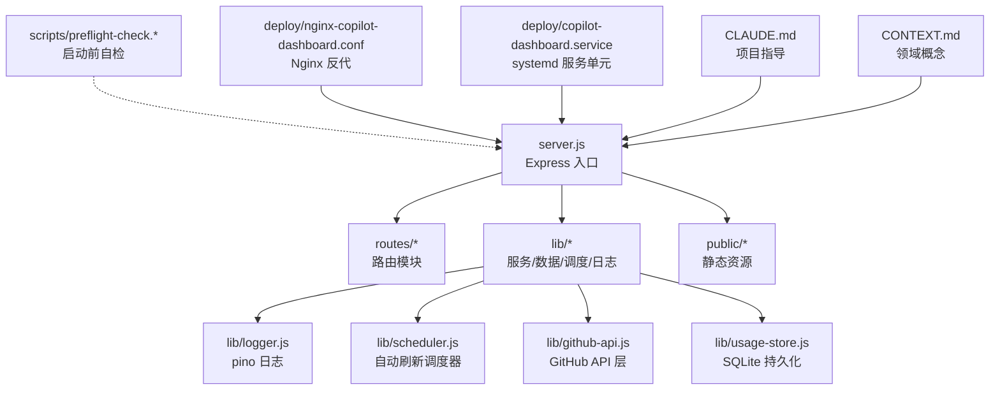
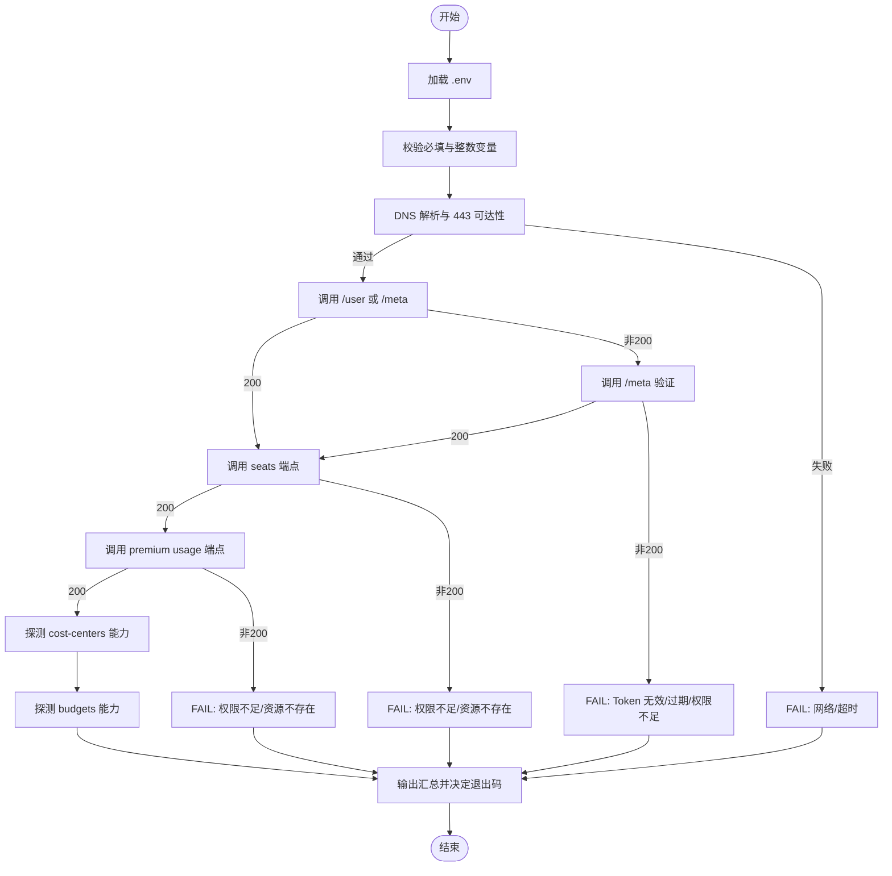
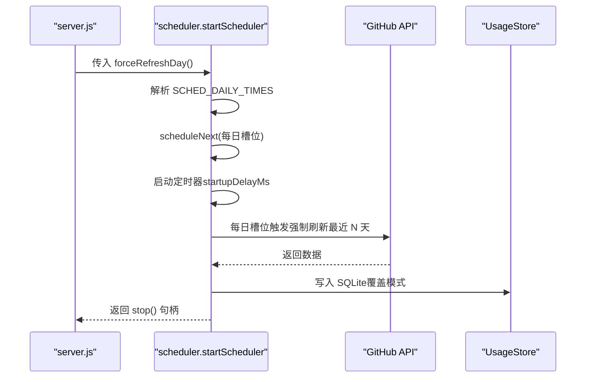
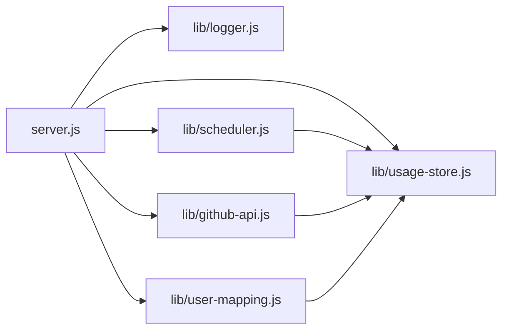

# 部署与运维

<cite>
**本文引用的文件**
- [package.json](file://package.json)
- [server.js](file://server.js)
- [lib/logger.js](file://lib/logger.js)
- [lib/scheduler.js](file://lib/scheduler.js)
- [lib/github-api.js](file://lib/github-api.js)
- [lib/usage-store.js](file://lib/usage-store.js)
- [scripts/preflight-check.js](file://scripts/preflight-check.js)
- [scripts/preflight-check.sh](file://scripts/preflight-check.sh)
- [deploy/copilot-dashboard.service](file://deploy/copilot-dashboard.service)
- [deploy/nginx-copilot-dashboard.conf](file://deploy/nginx-copilot-dashboard.conf)
- [README.md](file://README.md)
- [CLAUDE.md](file://CLAUDE.md)
- [CONTEXT.md](file://CONTEXT.md)
- [docs/minimal-env-and-preflight-design.md](file://docs/minimal-env-and-preflight-design.md)
</cite>

## 更新摘要
**变更内容**
- 新增 CLAUDE.md 和 CONTEXT.md 文档的分析与应用指导
- 更新项目架构说明，包含依赖注入模式和三层缓存架构
- 增强环境变量说明，涵盖新增的调度器和日志配置选项
- 完善开发约定和页面路由说明
- 更新领域概念词汇表，提供清晰的术语定义

## 目录
1. [简介](#简介)
2. [项目结构](#项目结构)
3. [核心组件](#核心组件)
4. [架构总览](#架构总览)
5. [详细组件分析](#详细组件分析)
6. [依赖关系分析](#依赖关系分析)
7. [性能考量](#性能考量)
8. [故障排除指南](#故障排除指南)
9. [结论](#结论)
10. [附录](#附录)

## 简介
本指南面向运维工程师，提供 CopilotEnterpriseUsageDisplay 在生产环境的完整部署与运维手册。内容覆盖：
- Ubuntu 22.04 的安装与部署流程（Node.js、应用部署、权限与目录）
- Nginx 反向代理配置与 systemd 服务单元
- 启动前自检脚本的实现原理与检查项
- 日志系统配置与监控策略（pino 结构化日志）
- 性能监控、健康检查与故障排除
- 自动刷新调度器的配置选项与运维最佳实践
- 服务重启、日志查看与配置更新的操作流程

**新增** 基于 CLAUDE.md 和 CONTEXT.md 的项目指导与领域概念说明，帮助开发者和运维人员更好地理解和维护系统。

## 项目结构
该项目采用模块化分层架构，后端入口为 server.js，路由与业务逻辑分布在 routes/ 与 lib/，静态资源位于 public/，部署与文档位于 deploy/ 与 docs/。根据 CLAUDE.md 的架构描述，系统采用依赖注入模式，所有路由模块通过工厂函数接收依赖对象。



**图表来源**
- [server.js:1-183](file://server.js#L1-L183)
- [lib/logger.js:1-41](file://lib/logger.js#L1-L41)
- [lib/scheduler.js:1-160](file://lib/scheduler.js#L1-L160)
- [lib/github-api.js:1-200](file://lib/github-api.js#L1-L200)
- [lib/usage-store.js:1-200](file://lib/usage-store.js#L1-L200)
- [scripts/preflight-check.js:1-188](file://scripts/preflight-check.js#L1-L188)
- [scripts/preflight-check.sh:1-182](file://scripts/preflight-check.sh#L1-L182)
- [deploy/nginx-copilot-dashboard.conf:1-14](file://deploy/nginx-copilot-dashboard.conf#L1-L14)
- [deploy/copilot-dashboard.service:1-18](file://deploy/copilot-dashboard.service#L1-L18)
- [CLAUDE.md:20-52](file://CLAUDE.md#L20-L52)
- [CONTEXT.md:1-48](file://CONTEXT.md#L1-L48)

**章节来源**
- [README.md:51-101](file://README.md#L51-L101)
- [CLAUDE.md:20-52](file://CLAUDE.md#L20-L52)
- [CONTEXT.md:1-48](file://CONTEXT.md#L1-L48)

## 核心组件
- 应用入口与中间件：HTTP 访问日志中间件、全局错误处理、健康检查端点、优雅关闭与信号处理。
- 日志系统：pino 结构化日志，支持开发与生产差异化输出、敏感信息脱敏与序列化。
- 自动刷新调度器：基于本地时间的定时任务，支持启动后立即刷新与每日多次强制刷新。
- GitHub API 层：并发队列、重试与退避、ETag 条件请求、单次飞行去重、LRU 缓存。
- SQLite 持久化：三层缓存架构（内存/SQLite/GitHub），数据表结构与预编译语句。
- 启动前自检：Shell 与 Node 两版脚本，覆盖环境变量、网络连通性、Token 有效性与关键 API 权限。
- **新增** 依赖注入模式：所有路由模块通过工厂函数接收依赖对象，避免直接导入单例。
- **新增** 三层缓存架构：内存（5分钟）→ SQLite（动态TTL）→ GitHub API，显著降低API调用。

**章节来源**
- [server.js:100-183](file://server.js#L100-L183)
- [lib/logger.js:1-41](file://lib/logger.js#L1-L41)
- [lib/scheduler.js:1-160](file://lib/scheduler.js#L1-L160)
- [lib/github-api.js:1-200](file://lib/github-api.js#L1-L200)
- [lib/usage-store.js:1-200](file://lib/usage-store.js#L1-L200)
- [scripts/preflight-check.js:1-188](file://scripts/preflight-check.js#L1-L188)
- [scripts/preflight-check.sh:1-182](file://scripts/preflight-check.sh#L1-L182)
- [CLAUDE.md:54-57](file://CLAUDE.md#L54-L57)

## 架构总览
下图展示生产环境典型拓扑：Nginx 作为反向代理接收 80 端口流量，转发至本地 3000 端口的 Node.js 应用；应用通过 systemd 管理生命周期；日志输出到 systemd-journald；数据持久化于 SQLite。

```mermaid
graph TB
subgraph "客户端"
U["浏览器/监控探针"]
end
subgraph "边缘与反代"
NGINX["Nginx<br/>listen 80<br/>proxy_pass http://127.0.0.1:3000"]
end
subgraph "应用节点"
SVC["systemd 服务单元<br/>copilot-dashboard.service"]
APP["Node.js 应用<br/>server.js"]
LOG["pino 日志<br/>systemd-journald"]
DB["SQLite 数据库<br/>usage.db"]
ENDPOINTS["API 端点<br/>/api/*"]
PAGES["页面路由<br/>/ (SPA)"]
ENDPOINT_MAPPING["URL到动作映射<br/>mapUrlToAction"]
ENDPOINT_MAPPING --> ENDPOINTS
PAGES --> APP
ENDPOINTS --> APP
APP --> LOG
APP --> DB
```

**图表来源**
- [deploy/nginx-copilot-dashboard.conf:1-14](file://deploy/nginx-copilot-dashboard.conf#L1-L14)
- [deploy/copilot-dashboard.service:1-18](file://deploy/copilot-dashboard.service#L1-L18)
- [server.js:140-183](file://server.js#L140-L183)
- [lib/logger.js:1-41](file://lib/logger.js#L1-L41)
- [lib/usage-store.js:10-79](file://lib/usage-store.js#L10-L79)
- [server.js:53-86](file://server.js#L53-L86)

## 详细组件分析

### Nginx 反向代理配置
- 监听 80 端口，将所有请求转发至本地 3000 端口。
- 设置必要的头部以便应用识别真实客户端 IP、协议等。
- 建议在生产环境中启用 HTTPS 并配置证书，此处提供 80→3000 的基础反代。

**章节来源**
- [deploy/nginx-copilot-dashboard.conf:1-14](file://deploy/nginx-copilot-dashboard.conf#L1-L14)
- [README.md:461-472](file://README.md#L461-L472)

### systemd 服务单元与权限
- 以 www-data 用户运行，工作目录为 /opt/copilot-dashboard。
- 通过 EnvironmentFile=/opt/copilot-dashboard/.env 注入环境变量。
- 标准输出与错误重定向至 journald，便于集中收集。
- 异常自动重启（on-failure），重启间隔 5 秒。

**章节来源**
- [deploy/copilot-dashboard.service:1-18](file://deploy/copilot-dashboard.service#L1-L18)
- [README.md:444-459](file://README.md#L444-L459)

### 启动前自检脚本（实现原理与检查项）
- 环境变量校验：必填项 GITHUB_TOKEN、ENTERPRISE_SLUG；可选整数项 CACHE_TTL、INCLUDED_QUOTA、PORT。
- DNS 与网络连通性：解析 GITHUB_API_BASE 指定的主机名，探测 443 端口可达性。
- Token 有效性：尝试调用 /user 或 /meta，区分 200 与非 200 的含义。
- 关键 API 权限：检查 seats 与 premium usage 端点可用性；对 cost-centers 与 budgets 进行能力探测（404/403/WARN）。
- 严格模式：--strict 将 WARN 视为 FAIL，便于 CI/CD 阻断发布。



**图表来源**
- [scripts/preflight-check.js:37-187](file://scripts/preflight-check.js#L37-L187)
- [scripts/preflight-check.sh:62-181](file://scripts/preflight-check.sh#L62-L181)

**章节来源**
- [scripts/preflight-check.js:1-188](file://scripts/preflight-check.js#L1-L188)
- [scripts/preflight-check.sh:1-182](file://scripts/preflight-check.sh#L1-L182)
- [docs/minimal-env-and-preflight-design.md:40-138](file://docs/minimal-env-and-preflight-design.md#L40-L138)

### 日志系统与监控策略
- 日志级别：trace < debug < info < warn < error；生产默认 info，开发默认 debug。
- 输出格式：开发模式使用 pino-pretty；生产模式输出 JSON。
- 敏感信息脱敏：自动遮蔽 Authorization、Token、Password、Secret。
- 访问日志：记录时间、来源 IP/主机名、方法、URL、动作、成功/失败、状态码、响应时间。
- 监控建议：通过 journald 收集日志，结合日志检索与告警；利用 /api/health 健康检查端点接入探针。

**章节来源**
- [lib/logger.js:1-41](file://lib/logger.js#L1-L41)
- [server.js:16-139](file://server.js#L16-L139)
- [README.md:590-619](file://README.md#L590-L619)

### 自动刷新调度器（配置与运维）
- 默认行为：启动后延迟刷新当天数据；每天 03:00 与 12:00 强制刷新今天 + 最近 N 天（默认 N=2）。
- 禁用与调整：SCHED_DISABLED、SCHED_DAILY_TIMES、SCHED_BACKFILL_DAYS、SCHED_STARTUP_DELAY_MS。
- 多实例安全：在非主副本设置 SCHED_DISABLED=true，避免重复调用 GitHub API。
- 失败处理：调度器内部失败仅记录 warn，不影响主流程。



**图表来源**
- [lib/scheduler.js:54-157](file://lib/scheduler.js#L54-L157)
- [server.js:146-148](file://server.js#L146-L148)

**章节来源**
- [lib/scheduler.js:1-160](file://lib/scheduler.js#L1-L160)
- [README.md:252-298](file://README.md#L252-L298)

### GitHub API 层与缓存策略
- 并发控制：最大并发数由 GITHUB_MAX_CONCURRENT 控制，内部队列排队。
- 重试与退避：最大重试次数由 GITHUB_MAX_RETRIES 控制，遇到 429/403 secondary rate limit 或 5xx 自动退避。
- 缓存：LRU GET 缓存（max=500）、ETag 条件请求、单次飞行去重（in-flight dedup）。
- SQLite 持久化：ETag 持久化、席位快照、每日用量与月度账单。

**章节来源**
- [lib/github-api.js:25-200](file://lib/github-api.js#L25-L200)
- [lib/usage-store.js:10-79](file://lib/usage-store.js#L10-L79)

### 健康检查与优雅关闭
- 健康检查：/api/health 返回运行时信息（uptime、memoryMB、timestamp）。
- 优雅关闭：监听 SIGTERM/SIGINT，10 秒强制退出，释放资源（HTTP 服务器、调度器、数据库连接）。

**章节来源**
- [server.js:100-144](file://server.js#L100-L144)
- [server.js:150-183](file://server.js#L150-L183)

### 依赖注入模式与页面路由
- **依赖注入模式**：所有路由模块通过工厂函数接收依赖对象 { usageStore, teamCache, userMappingService }，避免直接导入单例。
- **页面路由**：支持 SPA 模式，/ 路由渲染主页面，/billpage 为隐式入口，其他路由通过 /api/* 提供 RESTful 接口。
- **URL到动作映射**：将 API 路径映射为语义化动作标签，便于日志分析和监控。

**章节来源**
- [CLAUDE.md:54-57](file://CLAUDE.md#L54-L57)
- [server.js:88-119](file://server.js#L88-L119)
- [server.js:53-86](file://server.js#L53-L86)

### 领域概念词汇表
基于 CONTEXT.md 定义的核心概念，为项目提供统一的术语标准：

**核心概念**
- **Enterprise**：GitHub Enterprise 组织，通过 slug 标识
- **Premium Request**：Copilot AI 请求，用量跟踪的基本单位
- **Seat**：Copilot 分配的用户，包含登录名、AD 显示名、团队归属
- **Cycle/Period**：月度计费周期，"本周期"指当前日历月的聚合用量
- **Included Quota**：用户订阅包含的 Premium Requests 数量
- **Overage**：超出包含配额的 Premium Requests，按 $0.04/request 收费

**架构术语**
- **三层缓存**：内存（5分钟）→ SQLite（动态TTL）→ GitHub API
- **Single-Flight**：并发请求去重，防止重复的 GitHub API 调用
- **Dynamic TTL**：SQLite 缓存 TTL 按数据年龄变化的策略
- **DI（依赖注入）**：路由模块通过工厂函数接收依赖对象

**章节来源**
- [CONTEXT.md:5-33](file://CONTEXT.md#L5-L33)

## 依赖关系分析
- 应用入口依赖日志、调度器、用户映射与 GitHub API；路由模块依赖 UsageStore 与团队缓存。
- 调度器依赖 UsageStore 的强制刷新回调；GitHub API 层依赖 UsageStore 的 ETag 持久化。
- systemd 与 Nginx 为外部依赖，负责进程生命周期与反向代理。
- **新增** 依赖注入模式消除了模块间的直接耦合，提高了代码的可测试性和可维护性。



**图表来源**
- [server.js:1-183](file://server.js#L1-183)
- [lib/scheduler.js:1-160](file://lib/scheduler.js#L1-L160)
- [lib/github-api.js:1-200](file://lib/github-api.js#L1-L200)
- [lib/usage-store.js:1-200](file://lib/usage-store.js#L1-L200)

**章节来源**
- [package.json:12-24](file://package.json#L12-L24)

## 性能考量
- 三层缓存：内存（5 分钟）→ SQLite（动态 TTL，近 3 天 1 小时，更老 90 天）→ GitHub API，显著降低 API 调用。
- 并发与限流：通过 GITHUB_MAX_CONCURRENT 与重试退避避免触发二级限流。
- 动态 TTL：缓解 GitHub Billing API 24–48 小时延迟导致的数据不完整问题。
- 预编译语句与 WAL 模式：提升 SQLite 写入吞吐与并发稳定性。
- **新增** 单次飞行去重：多个浏览器标签页同时刷新时自动复用同一 Promise，避免重复查询。

**章节来源**
- [README.md:227-251](file://README.md#L227-L251)
- [lib/github-api.js:25-98](file://lib/github-api.js#L25-L98)
- [lib/usage-store.js:16-19](file://lib/usage-store.js#L16-L19)

## 故障排除指南
- 启动前自检失败
  - 检查 .env 中必填项与数值变量是否符合要求。
  - 使用脚本的 --strict 模式在 CI/CD 中阻断发布。
- 网络与 DNS 问题
  - 确认 GITHUB_API_BASE 指向域名可解析且 443 可达。
- Token 与权限
  - 确认 GITHUB_TOKEN 具备最小 scope（manage_billing:copilot、read:enterprise）。
  - 如 seats 或 premium usage 返回 403/404，核对企业 slug 与功能启用状态。
- 调度器异常
  - 检查 SCHED_* 环境变量格式与取值范围。
  - 多实例部署时，在非主副本设置 SCHED_DISABLED=true。
- 日志与监控
  - 使用 journalctl -u copilot-dashboard -f 实时查看日志。
  - 健康检查：curl http://localhost:3000/api/health。
- SQLite 数据异常
  - 使用按月强制刷新接口或页面按钮进行兑底刷新。
- **新增** 依赖注入问题
  - 确保所有路由模块正确接收依赖对象。
  - 检查工厂函数调用时的参数传递。

**章节来源**
- [scripts/preflight-check.js:1-188](file://scripts/preflight-check.js#L1-L188)
- [scripts/preflight-check.sh:1-182](file://scripts/preflight-check.sh#L1-L182)
- [lib/scheduler.js:59-71](file://lib/scheduler.js#L59-L71)
- [README.md:252-298](file://README.md#L252-L298)

## 结论
通过 Nginx 反代与 systemd 管理，结合 pino 结构化日志与健康检查端点，CopilotEnterpriseUsageDisplay 可在生产环境稳定运行。借助启动前自检与自动刷新调度器，可有效降低权限与网络问题带来的风险；三层缓存与并发控制保障性能与可靠性。基于 CLAUDE.md 的依赖注入模式和 CONTEXT.md 的领域概念词汇表，进一步提升了系统的可维护性和团队协作效率。建议在多实例部署中合理配置调度器，配合日志与健康检查实现可观测性与自动化运维。

## 附录

### Ubuntu 22.04 完整部署流程
- 安装 Node.js 18
- 部署应用代码与 .env，设置 www-data 权限与 data/uploads 目录
- 安装生产依赖并配置 systemd 与 Nginx
- 常用管理命令：status、restart、journalctl

**章节来源**
- [README.md:422-472](file://README.md#L422-L472)

### 环境变量一览（关键项）
- GITHUB_TOKEN、ENTERPRISE_SLUG（必填）
- GITHUB_API_BASE、PORT（可选）
- CACHE_TTL、INCLUDED_QUOTA（可选）
- GITHUB_MAX_CONCURRENT、GITHUB_MAX_RETRIES（可选）
- LOG_LEVEL（可选）
- SCHED_*（调度器相关）
- **新增** COPILOT_START_DATE（Copilot 启用日期）

**章节来源**
- [README.md:204-226](file://README.md#L204-L226)
- [lib/logger.js:13-14](file://lib/logger.js#L13-L14)
- [lib/github-api.js:25-26](file://lib/github-api.js#L25-L26)
- [lib/scheduler.js:59-71](file://lib/scheduler.js#L59-L71)

### 开发约定与最佳实践
- **无 TypeScript**：纯 CommonJS（require/module.exports）
- **无前端框架**：vanilla JS + Chart.js，IIFE 包装避免全局变量
- **依赖注入**：路由模块通过工厂函数接收依赖对象
- **测试**：vitest 框架，覆盖纯函数模块
- **UTC 日期**：始终使用 getUTCFullYear/getUTCMonth/getUTCDate()

**章节来源**
- [CLAUDE.md:67-76](file://CLAUDE.md#L67-L76)

### 页面路由与 API 端点
- **页面路由**：/（主页面）、/analytics（数据分析）、/costcenter（成本中心）、/user（用户映射）
- **API 端点**：/api/*（RESTful 接口），包括 /api/health、/api/usage/refresh、/api/bill/refresh 等
- **账单页面**：/billpage（隐式入口，需手动访问）

**章节来源**
- [CLAUDE.md:77-87](file://CLAUDE.md#L77-L87)
- [README.md:116-136](file://README.md#L116-L136)