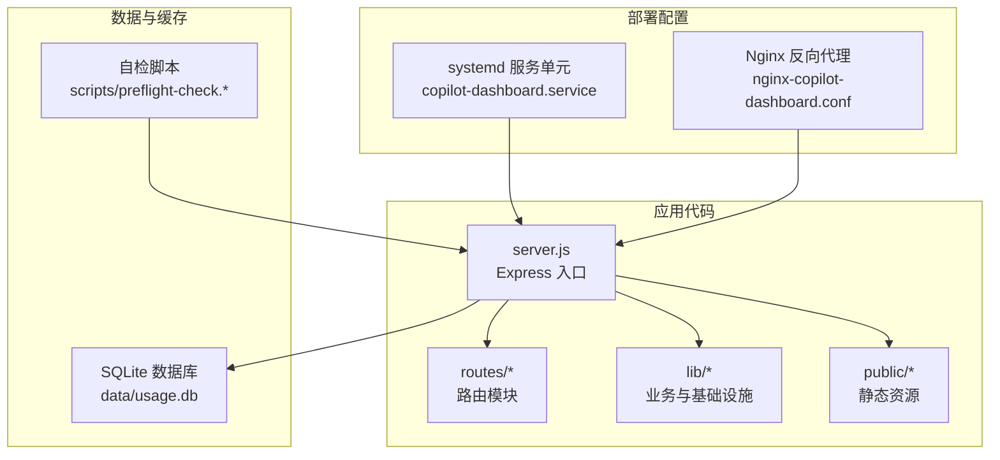
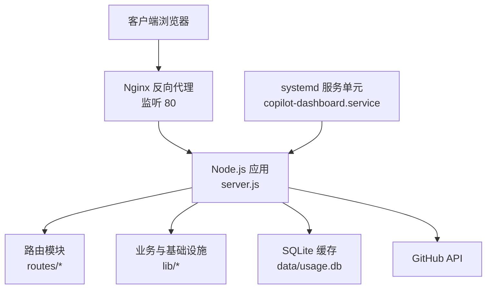
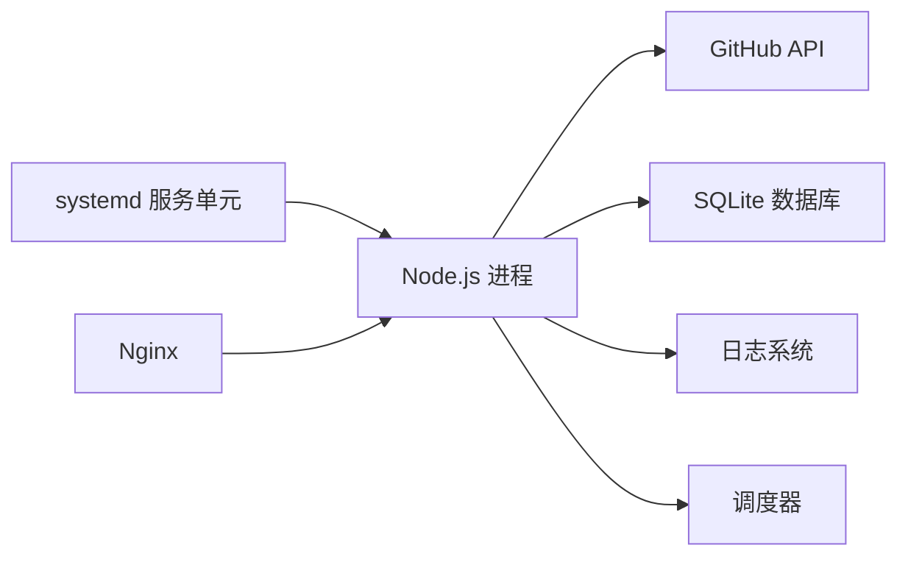

# 部署配置

<cite>
**本文引用的文件**
- [README.md](file://README.md)
- [copilot-dashboard.service](file://deploy/copilot-dashboard.service)
- [nginx-copilot-dashboard.conf](file://deploy/nginx-copilot-dashboard.conf)
- [.env.example](file://.env.example)
- [preflight-check.sh](file://scripts/preflight-check.sh)
- [preflight-check.js](file://scripts/preflight-check.js)
- [server.js](file://server.js)
- [logger.js](file://lib/logger.js)
- [scheduler.js](file://lib/scheduler.js)
- [sqlite-cache-design.md](file://docs/sqlite-cache-design.md)
- [github-enterprise-copilot-billing-scope-checklist.md](file://docs/github-enterprise-copilot-billing-scope-checklist.md)
</cite>

## 目录
1. [简介](#简介)
2. [项目结构](#项目结构)
3. [核心组件](#核心组件)
4. [架构总览](#架构总览)
5. [详细组件分析](#详细组件分析)
6. [依赖关系分析](#依赖关系分析)
7. [性能考量](#性能考量)
8. [故障排查指南](#故障排查指南)
9. [结论](#结论)
10. [附录](#附录)

## 简介
本文件面向运维工程师，提供 CopilotEnterpriseUsageDisplay 在生产环境的完整部署配置与操作指南。内容覆盖：
- Nginx 反向代理配置的实现原理与头部转发机制
- systemd 服务单元的配置选项与运行策略
- Ubuntu 22.04 的安装与部署步骤（Node.js 环境、应用部署、权限与防火墙）
- 服务启动、停止、重启的标准操作流程
- 配置文件参数说明与最佳实践
- 部署清单与验证步骤

## 项目结构
该项目采用模块化分层架构，后端以 Express 为核心，前端静态资源位于 public 目录，核心业务逻辑分布在 routes 与 lib 目录，部署相关配置位于 deploy 目录，启动前自检脚本位于 scripts 目录，设计文档位于 docs 目录。

**图表来源**
- [copilot-dashboard.service:1-18](file://deploy/copilot-dashboard.service#L1-L18)
- [nginx-copilot-dashboard.conf:1-14](file://deploy/nginx-copilot-dashboard.conf#L1-L14)
- [server.js:1-182](file://server.js#L1-L182)
- [README.md:46-96](file://README.md#L46-L96)

**章节来源**
- [README.md:46-96](file://README.md#L46-L96)

## 核心组件
- systemd 服务单元：以 www-data 用户运行 Node.js 应用，异常自动重启，日志输出到 journald，并从环境文件加载配置。
- Nginx 反向代理：监听 80 端口，将请求转发至本地 3000 端口，设置标准 HTTP/1.1 与必要的 X-Forwarded-* 头，便于上游识别真实客户端与协议。
- Express 服务：提供健康检查、路由挂载、访问日志、优雅关闭与调度器启动。
- SQLite 缓存：持久化用量与 ETag 数据，显著降低 GitHub API 调用频率。
- 自检脚本：Shell 与 Node 版本，用于环境变量、DNS、网络连通性、Token 有效性与关键 API 可达性检查。

**章节来源**
- [copilot-dashboard.service:1-18](file://deploy/copilot-dashboard.service#L1-L18)
- [nginx-copilot-dashboard.conf:1-14](file://deploy/nginx-copilot-dashboard.conf#L1-L14)
- [server.js:101-118](file://server.js#L101-L118)
- [sqlite-cache-design.md:1-50](file://docs/sqlite-cache-design.md#L1-L50)
- [preflight-check.sh:1-182](file://scripts/preflight-check.sh#L1-L182)
- [preflight-check.js:1-188](file://scripts/preflight-check.js#L1-L188)

## 架构总览
生产环境典型拓扑：Nginx 作为反向代理接收外部请求，转发至本地 Node.js 应用；Node.js 通过 lib 层调用 GitHub API，使用 SQLite 缓存提升性能；systemd 管理服务生命周期与自动重启。

**图表来源**
- [nginx-copilot-dashboard.conf:1-14](file://deploy/nginx-copilot-dashboard.conf#L1-L14)
- [server.js:1-182](file://server.js#L1-L182)
- [copilot-dashboard.service:1-18](file://deploy/copilot-dashboard.service#L1-L18)

## 详细组件分析

### Nginx 反向代理配置
- 监听端口：80
- 服务器名称：通配符（server_name _）
- 路由规则：location / 将请求转发至 http://127.0.0.1:3000
- HTTP 版本：proxy_http_version 1.1
- 头部转发：
  - Host：保留原始 Host
  - X-Real-IP：客户端真实 IP
  - X-Forwarded-For：累积转发链路
  - X-Forwarded-Proto：客户端使用的协议（http/https）

实现原理说明：
- 通过 proxy_pass 将请求从 80 端口透明转发到本地 3000 端口
- 设置 HTTP/1.1 以支持 keep-alive 与更好的兼容性
- 通过 X-Forwarded-* 头，上游 Node.js 可正确识别客户端 IP、协议与原始主机名，便于访问日志与安全策略

最佳实践建议：
- 如需 HTTPS，建议在上游 Nginx 配置 SSL 终结，或使用 Let’s Encrypt 自动证书
- 对静态资源可考虑缓存策略与 gzip 压缩
- 为反向代理添加限流与 WAF 规则，提升安全性

**章节来源**
- [nginx-copilot-dashboard.conf:1-14](file://deploy/nginx-copilot-dashboard.conf#L1-L14)
- [server.js:16-38](file://server.js#L16-L38)

### systemd 服务单元配置
- 单元类型：simple
- 运行用户：www-data
- 工作目录：/opt/copilot-dashboard
- 可执行命令：/usr/bin/node server.js
- 重启策略：on-failure，重启间隔 5 秒
- 环境文件：/opt/copilot-dashboard/.env
- 日志输出：StandardOutput=journal，StandardError=journal
- 安装目标：multi-user.target

关键要点：
- 使用 www-data 用户运行，降低权限风险
- 通过 EnvironmentFile 注入环境变量，便于配置管理
- on-failure 重启策略适配临时网络或上游 API 异常
- 日志输出到 journald，便于 systemd-journald 收集与检索

运维建议：
- 启动后立即执行 systemctl start，随后 enable 开机自启
- 使用 journalctl -u copilot-dashboard -f 实时查看日志
- 如需调试，可临时将 StandardOutput/StandardError 指向文件或 stderr

**章节来源**
- [copilot-dashboard.service:1-18](file://deploy/copilot-dashboard.service#L1-L18)

### Ubuntu 22.04 完整安装步骤
- 安装 Node.js 18
  - 使用 nodesource 仓库安装
  - 验证 node -v
- 部署应用代码
  - 复制项目文件到 /opt/copilot-dashboard
  - 复制 .env 至工作目录
  - 安装生产依赖（--production）
  - 设置 www-data 权限
  - 创建 data 与 uploads 目录
- 配置 systemd
  - 复制服务单元到 /etc/systemd/system/
  - 执行 daemon-reload
  - enable 并 start 服务
- 配置 Nginx
  - 安装 nginx
  - 复制配置到 sites-available 并建立符号链接
  - 删除默认站点
  - nginx -t 测试配置
  - reload nginx
- 防火墙设置
  - 允许 80/TCP（Nginx）
  - 仅允许本地 3000/TCP（仅本机访问）
  - 如需 HTTPS，开放 443/TCP

**章节来源**
- [README.md:412-462](file://README.md#L412-L462)

### 服务启动、停止与重启
- 启动：systemctl start copilot-dashboard
- 停止：systemctl stop copilot-dashboard
- 重启：systemctl restart copilot-dashboard
- 状态：systemctl status copilot-dashboard
- 实时日志：journalctl -u copilot-dashboard -f

验证步骤：
- 访问 http://<服务器IP>，确认页面加载
- 调用 /api/health，确认返回 {ok: true}
- 查看 systemd 日志，确认服务正常运行

**章节来源**
- [README.md:443-449](file://README.md#L443-L449)
- [server.js:101-108](file://server.js#L101-L108)

### 配置文件参数说明与最佳实践
- .env 示例参数
  - GITHUB_TOKEN：必填，具备 Enterprise billing 读取权限
  - ENTERPRISE_SLUG 或 ORG_NAME：选择其一
  - INCLUDED_QUOTA：每用户每周期包含请求配额（默认 300）
  - PRODUCT、MODEL：可选过滤
  - USER_LIST、ORG_LIST：可选用户/组织列表
  - MAX_USERS：fallback per-user 查询的用户上限
  - GITHUB_API_BASE：GitHub API 基础地址（默认 https://api.github.com）
  - PORT：服务端口（默认 3000）
  - CACHE_TTL：前端缓存时长（秒，默认 300）

- 环境变量（生产可用）
  - LOG_LEVEL：日志级别（info/trace/debug/warn/error）
  - SCHED_DISABLED、SCHED_DAILY_TIMES、SCHED_BACKFILL_DAYS、SCHED_STARTUP_DELAY_MS：调度器相关
  - GITHUB_MAX_CONCURRENT、GITHUB_MAX_RETRIES：GitHub API 并发与重试
  - 其他：详见 README 的环境变量说明

最佳实践：
- 使用最小权限 Token（PAT classic），scope 包含 manage_billing:copilot + read:enterprise
- 在 systemd 中通过 EnvironmentFile 管理敏感配置
- 生产环境建议将 PORT 与 Nginx 80 端口配合，避免直接暴露 3000 端口
- 启用 LOG_LEVEL=info，必要时临时提升到 debug 进行问题定位

**章节来源**
- [.env.example:1-35](file://.env.example#L1-L35)
- [README.md:196-217](file://README.md#L196-L217)
- [logger.js:1-41](file://lib/logger.js#L1-L41)

### 启动前自检（推荐）
- Shell 版：./scripts/preflight-check.sh
- Node 版：node ./scripts/preflight-check.js
- 严格模式：--strict 将 WARN 视为 FAIL
- 检查项：环境变量、DNS 与网络连通性、Token 有效性、必需 API 可达性（座位与用量）、可选功能探测（Cost Centers/Budgets）

**章节来源**
- [README.md:180-194](file://README.md#L180-L194)
- [preflight-check.sh:1-182](file://scripts/preflight-check.sh#L1-L182)
- [preflight-check.js:1-188](file://scripts/preflight-check.js#L1-L188)

## 依赖关系分析
- systemd 依赖 Node.js 运行时与 .env 环境文件
- Nginx 依赖本地 Node.js 服务（127.0.0.1:3000）
- Node.js 服务依赖 GitHub API、SQLite 数据库与日志库
- 调度器依赖环境变量与路由模块提供的刷新接口

**图表来源**
- [copilot-dashboard.service:1-18](file://deploy/copilot-dashboard.service#L1-L18)
- [nginx-copilot-dashboard.conf:1-14](file://deploy/nginx-copilot-dashboard.conf#L1-L14)
- [server.js:1-182](file://server.js#L1-L182)
- [scheduler.js:1-160](file://lib/scheduler.js#L1-L160)

**章节来源**
- [scheduler.js:1-160](file://lib/scheduler.js#L1-L160)

## 性能考量
- 三层缓存架构：内存缓存（5 分钟）→ SQLite（90 天）→ GitHub API，显著降低 API 调用频率
- ETag 条件请求：未变更数据返回 304，避免配额消耗
- per-user fallback：首次生成 ranking，后续分析页面零 API 调用
- 动态 TTL：近 3 天 1 小时，更老 90 天，避免缓存锁死
- 并发与去重：GitHub API 并发队列、single-flight 去重、in-flight dedup

运维建议：
- 定期清理过期数据（SQLite 与 ETag）
- 合理配置调度器，避免多副本重复刷新
- 监控日志与缓存命中率，及时发现异常

**章节来源**
- [sqlite-cache-design.md:218-242](file://docs/sqlite-cache-design.md#L218-L242)
- [server.js:146-148](file://server.js#L146-L148)

## 故障排查指南
- 服务无法启动
  - 检查 systemd 状态：systemctl status copilot-dashboard
  - 查看日志：journalctl -u copilot-dashboard -f
  - 确认 .env 配置与权限
- 页面 500 或空白
  - 访问 /api/health 确认服务健康
  - 检查 GitHub API 连通性与 Token 权限
  - 使用自检脚本验证环境
- 缓存异常或数据陈旧
  - 清理 SQLite 缓存或重置数据库
  - 触发强制刷新（按日/按月）
- Nginx 无法访问
  - nginx -t 检查语法
  - 确认站点启用与默认站点移除
  - 检查防火墙放行 80/TCP

**章节来源**
- [README.md:443-449](file://README.md#L443-L449)
- [preflight-check.sh:1-182](file://scripts/preflight-check.sh#L1-L182)
- [preflight-check.js:1-188](file://scripts/preflight-check.js#L1-L188)

## 结论
通过 Nginx 反向代理与 systemd 服务单元的组合，CopilotEnterpriseUsageDisplay 可在 Ubuntu 22.04 上实现稳定、可维护的生产部署。配合三层缓存与调度器，系统在性能与可靠性方面表现优异。建议在部署前完成自检，上线后持续监控日志与缓存命中率，确保服务稳定运行。

## 附录

### 部署清单（Ubuntu 22.04）
- 安装 Node.js 18
- 部署应用代码与 .env
- 安装生产依赖并设置权限
- 配置 systemd 服务单元并开机自启
- 配置 Nginx 反向代理并 reload
- 防火墙放行 80/TCP（阻断 3000/TCP 外网）
- 运行自检脚本并通过健康检查
- 观察日志与缓存命中率

**章节来源**
- [README.md:412-462](file://README.md#L412-L462)

### 配置文件参数对照
- 必填：GITHUB_TOKEN、ENTERPRISE_SLUG（或 ORG_NAME）
- 常用：PORT、GITHUB_API_BASE、LOG_LEVEL
- 调度器：SCHED_* 系列
- GitHub API：GITHUB_MAX_CONCURRENT、GITHUB_MAX_RETRIES
- 缓存：CACHE_TTL、INCLUDED_QUOTA

**章节来源**
- [.env.example:1-35](file://.env.example#L1-L35)
- [README.md:196-217](file://README.md#L196-L217)