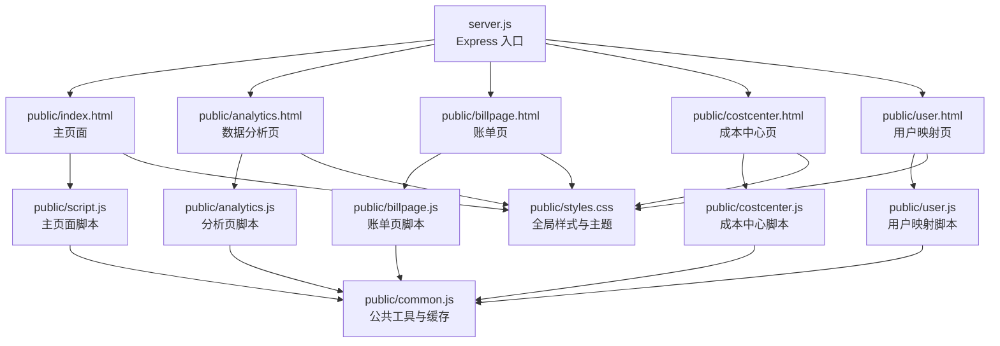
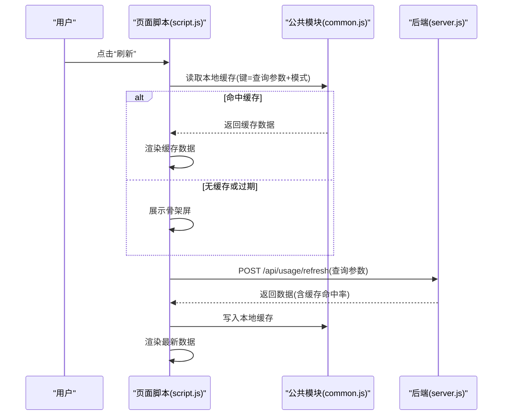
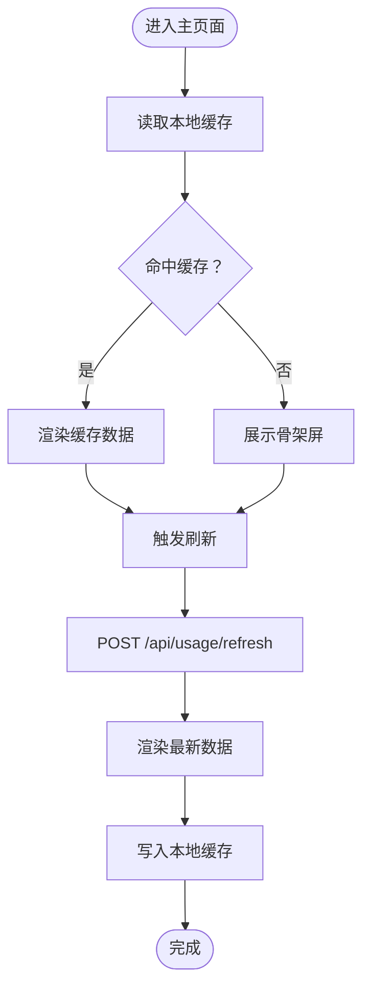
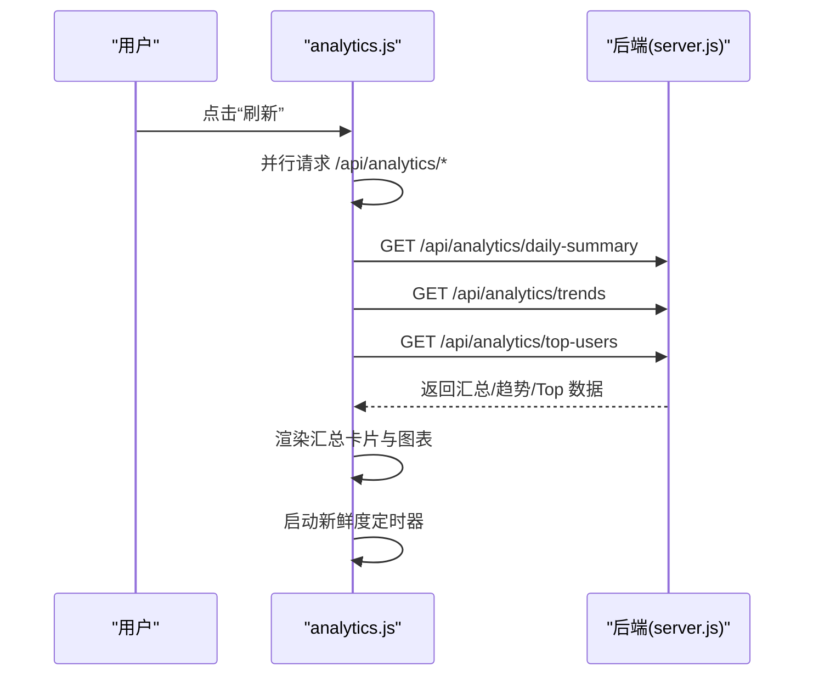
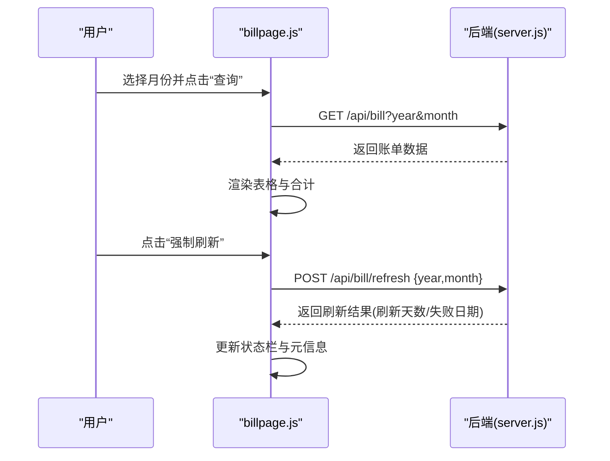
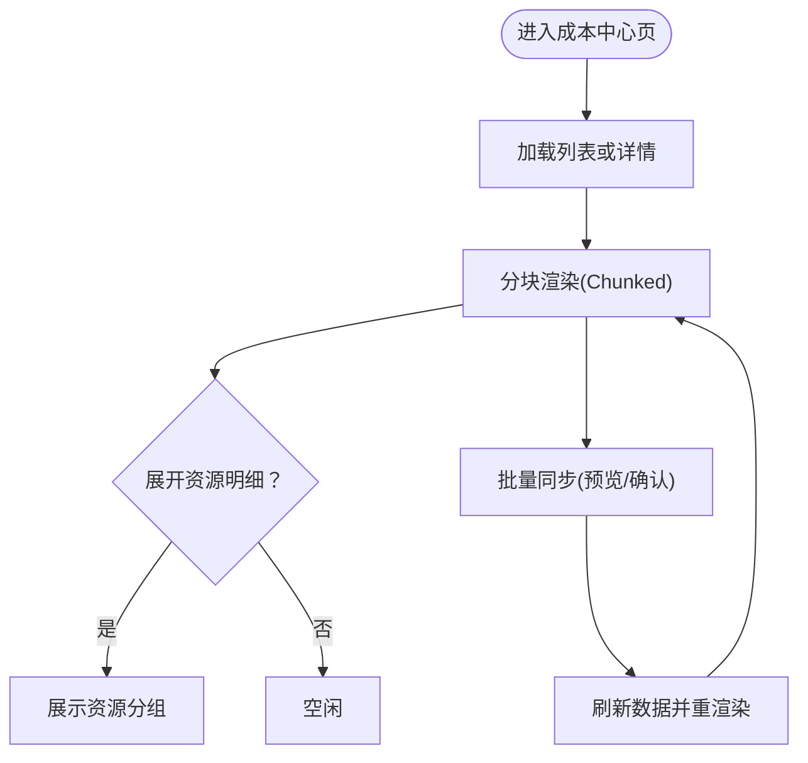
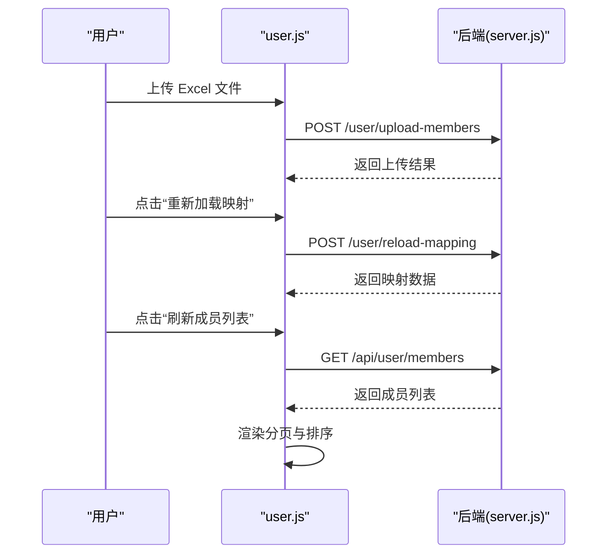
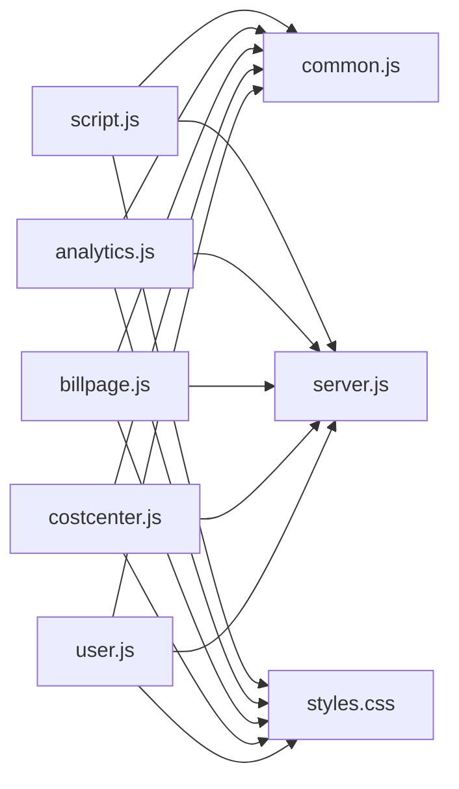
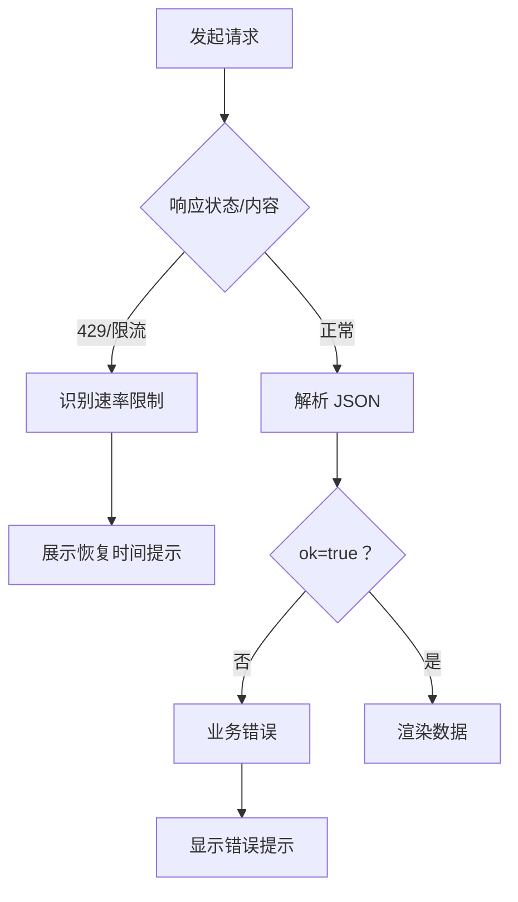

# 前端定制

<cite>
**本文引用的文件**
- [README.md](file://README.md)
- [package.json](file://package.json)
- [server.js](file://server.js)
- [public/index.html](file://public/index.html)
- [public/script.js](file://public/script.js)
- [public/styles.css](file://public/styles.css)
- [public/common.js](file://public/common.js)
- [public/analytics.html](file://public/analytics.html)
- [public/analytics.js](file://public/analytics.js)
- [public/billpage.html](file://public/billpage.html)
- [public/billpage.js](file://public/billpage.js)
- [public/costcenter.html](file://public/costcenter.html)
- [public/costcenter.js](file://public/costcenter.js)
- [public/user.html](file://public/user.html)
- [public/user.js](file://public/user.js)
</cite>

## 目录
1. [简介](#简介)
2. [项目结构](#项目结构)
3. [核心组件](#核心组件)
4. [架构总览](#架构总览)
5. [详细组件分析](#详细组件分析)
6. [依赖关系分析](#依赖关系分析)
7. [性能考量](#性能考量)
8. [故障排查指南](#故障排查指南)
9. [结论](#结论)
10. [附录](#附录)

## 简介
本指南聚焦前端定制化能力，围绕以下目标展开：
- 前端缓存策略与性能优化：数据刷新频率、SWR缓存、骨架屏、分页与分块渲染、并发去重与防抖
- 图表渲染优化：Chart.js 图表的懒加载、双轴配置、响应式缩放与交互
- 主题样式系统：颜色方案、字体与排版、阴影与圆角、深浅色与对比度
- 用户界面个性化：显示字段、排序规则、筛选条件、分页与页码策略
- 数据可视化定制：图表类型切换、数据维度调整、交互行为配置
- 响应式与移动端优化：视口配置、断点与布局、触摸交互
- 性能监控与用户体验：数据新鲜度徽章、缓存命中率、错误提示与恢复

## 项目结构
前端采用“页面级脚本 + 公共模块 + 全局样式”的组织方式，页面通过 IIFE 包裹，避免全局污染；公共模块提供通用工具与缓存封装；样式集中于单一 CSS 文件，采用 CSS 变量驱动主题。

**图表来源**
- [server.js:110-118](file://server.js#L110-L118)
- [public/index.html:1-103](file://public/index.html#L1-L103)
- [public/analytics.html:1-58](file://public/analytics.html#L1-L58)
- [public/billpage.html:1-67](file://public/billpage.html#L1-L67)
- [public/costcenter.html:1-71](file://public/costcenter.html#L1-L71)
- [public/user.html:1-54](file://public/user.html#L1-L54)
- [public/script.js:1-541](file://public/script.js#L1-L541)
- [public/analytics.js:1-235](file://public/analytics.js#L1-L235)
- [public/billpage.js:1-285](file://public/billpage.js#L1-L285)
- [public/costcenter.js:1-307](file://public/costcenter.js#L1-L307)
- [public/user.js:1-341](file://public/user.js#L1-L341)
- [public/common.js:1-113](file://public/common.js#L1-L113)
- [public/styles.css:1-800](file://public/styles.css#L1-L800)

**章节来源**
- [README.md:69-76](file://README.md#L69-L76)
- [server.js:110-118](file://server.js#L110-L118)

## 核心组件
- 页面脚本（IIFE）：各自负责页面状态、DOM 事件、数据请求、渲染与交互
- 公共模块（CopilotDashboard）：统一的工具函数、错误处理、缓存封装、骨架屏、格式化
- 全局样式（styles.css）：主题变量、排版、组件样式、响应式断点

关键前端特性与实现要点：
- 缓存与刷新
  - 前端本地缓存：localStorage + TTL，键值区分查询模式与参数
  - SWR 策略：优先展示缓存，后台静默更新，结合骨架屏提升感知性能
  - 并发去重：单飞行请求合并，避免重复查询
- 渲染优化
  - 骨架屏：大数据量渲染前展示占位动画
  - 分页与分块：分页控件与分块插入，避免主线程阻塞
  - 图表懒加载：按需创建 Chart 实例，销毁旧实例避免内存泄漏
- 交互与个性化
  - 排序：表头点击切换升/降序
  - 筛选：Team 多选、状态筛选、按名称/邮箱过滤
  - 自动刷新：下拉选择刷新间隔，定时触发后台刷新

**章节来源**
- [public/common.js:82-96](file://public/common.js#L82-L96)
- [public/script.js:298-326](file://public/script.js#L298-L326)
- [public/script.js:342-349](file://public/script.js#L342-L349)
- [public/analytics.js:158-189](file://public/analytics.js#L158-L189)
- [public/costcenter.js:132-151](file://public/costcenter.js#L132-L151)

## 架构总览
前端与后端通过 REST 接口通信，页面脚本通过公共模块封装的 fetch 方法统一处理响应与错误；后端提供健康检查、用量刷新、账单查询、分析接口等。

**图表来源**
- [public/script.js:298-326](file://public/script.js#L298-L326)
- [public/common.js:82-96](file://public/common.js#L82-L96)
- [server.js:100-108](file://server.js#L100-L108)

**章节来源**
- [README.md:14-16](file://README.md#L14-L16)
- [README.md:40-42](file://README.md#L40-L42)

## 详细组件分析

### 主页面（用量排行）
- 查询模式：单日/日期范围切换，自动默认范围查询
- 刷新策略：本地缓存 + SWR，后台静默更新，支持自动刷新定时器
- 渲染：根据查询模式动态生成表头与列数；支持按 Team 筛选
- 分页：每页 15 条，最多显示 5 个页码，支持跳转
- 排序：点击表头切换升/降序，支持用户、Team、请求量、百分比、金额
- 进度条：本周期请求量按配额基线展示，超额高亮

**图表来源**
- [public/script.js:298-326](file://public/script.js#L298-L326)
- [public/script.js:190-234](file://public/script.js#L190-L234)
- [public/script.js:236-277](file://public/script.js#L236-L277)

**章节来源**
- [public/index.html:16-64](file://public/index.html#L16-L64)
- [public/script.js:32-44](file://public/script.js#L32-L44)
- [public/script.js:190-234](file://public/script.js#L190-L234)
- [public/script.js:236-277](file://public/script.js#L236-L277)

### 数据分析页（趋势与 Top 用户）
- 统一加载：一次性并行请求汇总、趋势、Top 用户数据
- 图表配置：双轴（请求量/费用）、响应式、交互提示
- 新鲜度：数据加载时间戳 + 新鲜度徽章（实时更新）

**图表来源**
- [public/analytics.js:158-189](file://public/analytics.js#L158-L189)
- [public/analytics.js:49-114](file://public/analytics.js#L49-L114)
- [public/analytics.js:116-156](file://public/analytics.js#L116-L156)

**章节来源**
- [public/analytics.html:17-50](file://public/analytics.html#L17-L50)
- [public/analytics.js:158-189](file://public/analytics.js#L158-L189)

### 账单页（Team 月度账单）
- 查询：按月选择，支持强制刷新（逐日回源 GitHub 并覆盖缓存）
- 渲染：支持 Team 筛选；展开/折叠查看用户明细；合计行
- 状态栏：聚合状态与提示信息

**图表来源**
- [public/billpage.html:19-36](file://public/billpage.html#L19-L36)
- [public/billpage.js:194-222](file://public/billpage.js#L194-L222)
- [public/billpage.js:229-281](file://public/billpage.js#L229-L281)

**章节来源**
- [public/billpage.html:19-36](file://public/billpage.html#L19-L36)
- [public/billpage.js:50-146](file://public/billpage.js#L50-L146)

### 成本中心页（资源与预算）
- 列表渲染：分块插入，避免大量 DOM 插入阻塞
- 资源分组：Users/Organizations/Repositories/Other 分类展示
- 预算进度：按百分比可视化，超预算高亮
- 批量同步：按 Team 批量加入 Users，支持预览与二次确认删除

**图表来源**
- [public/costcenter.js:132-151](file://public/costcenter.js#L132-L151)
- [public/costcenter.js:109-123](file://public/costcenter.js#L109-L123)
- [public/costcenter.js:218-228](file://public/costcenter.js#L218-L228)

**章节来源**
- [public/costcenter.html:32-63](file://public/costcenter.html#L32-L63)
- [public/costcenter.js:125-170](file://public/costcenter.js#L125-L170)

### 用户映射页（Excel 导入与成员列表）
- 上传：.xlsx/.xls 文件上传，后端解析并保存
- 重载：手动触发映射数据重载，或依赖文件变更自动热重载
- 成员列表：分页、排序、映射状态可视化（已映射/未映射）

**图表来源**
- [public/user.html:17-23](file://public/user.html#L17-L23)
- [public/user.js:205-248](file://public/user.js#L205-L248)
- [public/user.js:250-282](file://public/user.js#L250-L282)
- [public/user.js:284-323](file://public/user.js#L284-L323)

**章节来源**
- [public/user.html:17-23](file://public/user.html#L17-L23)
- [public/user.js:205-248](file://public/user.js#L205-L248)

## 依赖关系分析
- 页面脚本依赖公共模块（工具函数、缓存、错误处理）
- 页面脚本通过 server.js 暴露的 REST 接口获取数据
- 样式文件集中管理，页面通过相对路径引入

**图表来源**
- [public/script.js:4](file://public/script.js#L4)
- [public/analytics.js:4](file://public/analytics.js#L4)
- [public/billpage.js:4](file://public/billpage.js#L4)
- [public/costcenter.js:4](file://public/costcenter.js#L4)
- [public/user.js:4](file://public/user.js#L4)
- [server.js:89-98](file://server.js#L89-L98)

**章节来源**
- [package.json:6-11](file://package.json#L6-L11)

## 性能考量
- 缓存与刷新
  - 前端缓存：localStorage + TTL（默认 5 分钟），键值包含查询参数，避免重复请求
  - SWR：优先展示缓存，后台静默更新，结合骨架屏减少白屏感知
  - 并发去重：单飞行请求合并，避免重复查询
- 渲染优化
  - 骨架屏：大数据量渲染前展示占位动画，改善感知性能
  - 分块渲染：成本中心页采用分块插入，避免主线程阻塞
  - 图表懒加载：按需创建 Chart 实例，销毁旧实例避免内存泄漏
- 网络与并发
  - 后端提供 GitHub API 并发队列、重试与指数退避，前端通过单飞行去重进一步降低并发
- 数据新鲜度
  - 分析页展示数据加载时间与新鲜度徽章，30 秒自动更新

**章节来源**
- [public/common.js:82-96](file://public/common.js#L82-L96)
- [public/script.js:298-326](file://public/script.js#L298-L326)
- [public/costcenter.js:132-151](file://public/costcenter.js#L132-L151)
- [public/analytics.js:213-230](file://public/analytics.js#L213-L230)

## 故障排查指南
- 速率限制与恢复
  - 前端识别 429 与速率限制消息，展示恢复时间提示
  - 后端对 GitHub API 速率限制进行指数退避与重试
- 错误处理
  - 统一的错误提示框，支持多种错误场景（网络、解析、业务错误）
- 健康检查
  - 后端提供 /api/health，可用于探活与负载均衡

**图表来源**
- [public/common.js:25-37](file://public/common.js#L25-L37)
- [public/common.js:39-53](file://public/common.js#L39-L53)
- [server.js:100-108](file://server.js#L100-L108)

**章节来源**
- [public/common.js:25-37](file://public/common.js#L25-L37)
- [public/common.js:39-53](file://public/common.js#L39-L53)
- [server.js:120-139](file://server.js#L120-L139)

## 结论
本项目前端通过“公共模块 + 页面脚本 + 全局样式”的分层设计，实现了可定制的缓存策略、渲染优化与交互体验。借助 SWR、骨架屏、分块渲染与并发去重，显著提升了大数据量场景下的流畅度与感知性能；通过主题变量与响应式布局，满足多终端适配需求。用户可通过查询模式、筛选与排序灵活定制视图，数据分析页提供丰富的可视化能力。

## 附录

### 前端缓存策略与性能优化配置
- 前端缓存 TTL：默认 5 分钟（毫秒级），键值包含查询参数，避免重复请求
- 刷新频率：支持 60/180/300 秒自动刷新，定时触发后台刷新
- 骨架屏：大数据量渲染前展示占位动画
- 分块渲染：成本中心页每批插入 30 行，避免主线程阻塞
- 图表懒加载：销毁旧实例，按需创建新实例

**章节来源**
- [public/script.js:42-44](file://public/script.js#L42-L44)
- [public/script.js:342-349](file://public/script.js#L342-L349)
- [public/costcenter.js:20-22](file://public/costcenter.js#L20-L22)
- [public/analytics.js:50-114](file://public/analytics.js#L50-L114)

### 主题样式系统配置
- 颜色方案：主色、强调色、表面色、文本色、危险色，通过 CSS 变量统一管理
- 字体：标题使用 Lora，正文使用 Open Sans，支持中英文混排
- 布局：卡片圆角、阴影、栅格间距、最大宽度约束
- 响应式：视口配置、断点与弹性排版（clamp）

**章节来源**
- [public/styles.css:11-28](file://public/styles.css#L11-L28)
- [public/styles.css:34-43](file://public/styles.css#L34-L43)
- [public/styles.css:45-58](file://public/styles.css#L45-L58)
- [public/styles.css:82-89](file://public/styles.css#L82-L89)

### 用户界面个性化定制
- 显示字段：主页面按查询模式动态生成列；账单页支持展开查看用户明细
- 排序规则：表头点击切换升/降序；用户映射页支持多字段排序
- 筛选条件：Team 多选、状态筛选、按名称/邮箱过滤
- 分页与页码：每页 15 条，最多显示 5 个页码，支持跳转

**章节来源**
- [public/script.js:210-226](file://public/script.js#L210-L226)
- [public/script.js:236-277](file://public/script.js#L236-L277)
- [public/user.js:29-41](file://public/user.js#L29-L41)
- [public/user.js:75-162](file://public/user.js#L75-L162)

### 数据可视化定制
- 图表类型：趋势图（折线）、Top 用户（柱状，水平）
- 数据维度：趋势图支持请求量与费用双轴；Top 用户按请求量排序
- 交互行为：悬停提示、索引模式、禁用交叉轴联动

**章节来源**
- [public/analytics.js:49-114](file://public/analytics.js#L49-L114)
- [public/analytics.js:116-156](file://public/analytics.js#L116-L156)

### 响应式设计与移动端优化
- 视口配置：width=device-width, initial-scale=1.0
- 布局适配：卡片最大宽度、表格横向滚动、按钮与输入框尺寸
- 交互优化：触摸可点击区域、滚动容器溢出处理

**章节来源**
- [public/index.html:5](file://public/index.html#L5)
- [public/styles.css:321-330](file://public/styles.css#L321-L330)
- [public/styles.css:322-324](file://public/styles.css#L322-L324)

### 性能监控与用户体验最佳实践
- 数据新鲜度：分析页展示加载时间与新鲜度徽章，30 秒自动更新
- 缓存命中率：刷新后显示缓存命中百分比，直观反映节省效果
- 错误提示：统一错误框，支持速率限制与业务错误分类处理
- 优雅降级：骨架屏与占位符，避免长时间空白

**章节来源**
- [public/analytics.js:213-230](file://public/analytics.js#L213-L230)
- [public/script.js:314-320](file://public/script.js#L314-L320)
- [public/common.js:19-23](file://public/common.js#L19-L23)