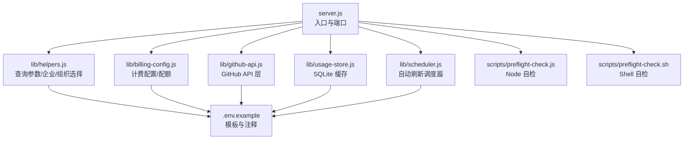
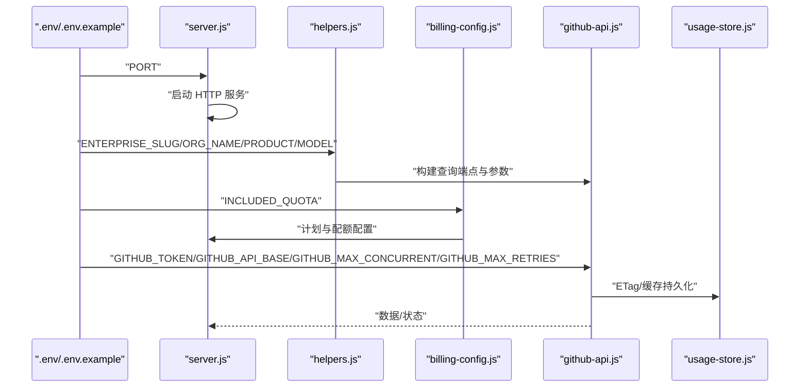
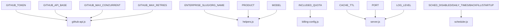
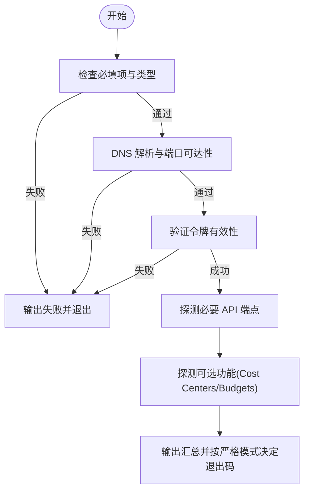

# 环境变量配置

<cite>
**本文档引用的文件**
- [server.js](file://server.js)
- [.env.example](file://.env.example)
- [README.md](file://README.md)
- [lib/billing-config.js](file://lib/billing-config.js)
- [lib/helpers.js](file://lib/helpers.js)
- [lib/github-api.js](file://lib/github-api.js)
- [lib/usage-store.js](file://lib/usage-store.js)
- [lib/scheduler.js](file://lib/scheduler.js)
- [scripts/preflight-check.js](file://scripts/preflight-check.js)
- [scripts/preflight-check.sh](file://scripts/preflight-check.sh)
</cite>

## 目录
1. [简介](#简介)
2. [项目结构](#项目结构)
3. [核心组件](#核心组件)
4. [架构概览](#架构概览)
5. [详细组件分析](#详细组件分析)
6. [依赖关系分析](#依赖关系分析)
7. [性能考虑](#性能考虑)
8. [故障排查指南](#故障排查指南)
9. [结论](#结论)
10. [附录](#附录)

## 简介
本文件系统化梳理 Copilot 企业用量仪表盘所需的全部环境变量，涵盖必填项与可选项、权限要求、配置策略、性能调优与部署差异，并提供验证方法与常见问题排查路径。目标是帮助管理员在 GitHub Enterprise Cloud 与 GitHub Enterprise Server 等不同环境中快速、安全地完成配置。

## 项目结构
围绕环境变量的关键文件分布如下：
- 服务入口与端口：server.js
- 环境变量模板：.env.example
- 配置说明与使用手册：README.md
- 计费配置与配额：lib/billing-config.js
- 查询参数构建与企业/组织选择：lib/helpers.js
- GitHub API 层（并发、重试、ETag、条件请求）：lib/github-api.js
- SQLite 持久化缓存：lib/usage-store.js
- 自动刷新调度器：lib/scheduler.js
- 自检脚本（Node/Shell）：scripts/preflight-check.js、scripts/preflight-check.sh

图表来源
- [server.js:1-182](file://server.js#L1-L182)
- [lib/github-api.js:1-320](file://lib/github-api.js#L1-L320)
- [lib/usage-store.js:1-324](file://lib/usage-store.js#L1-L324)
- [lib/scheduler.js:1-160](file://lib/scheduler.js#L1-L160)
- [lib/helpers.js:1-83](file://lib/helpers.js#L1-L83)
- [lib/billing-config.js:1-25](file://lib/billing-config.js#L1-L25)
- [.env.example:1-35](file://.env.example#L1-L35)
- [scripts/preflight-check.js:1-188](file://scripts/preflight-check.js#L1-L188)
- [scripts/preflight-check.sh:1-182](file://scripts/preflight-check.sh#L1-L182)

章节来源
- [server.js:1-182](file://server.js#L1-L182)
- [.env.example:1-35](file://.env.example#L1-L35)
- [README.md:196-217](file://README.md#L196-L217)

## 核心组件
本节聚焦与环境变量直接相关的组件及其职责：
- 端口与入口：server.js 读取 PORT 并启动服务
- 计费与配额：lib/billing-config.js 读取 INCLUDED_QUOTA 并定义 PLAN_CONFIG
- 查询参数与作用域：lib/helpers.js 读取 PRODUCT/MODEL，并根据 ENTERPRISE_SLUG 或 ORG_NAME 构建查询端点
- GitHub API 层：lib/github-api.js 读取 GITHUB_TOKEN、GITHUB_API_BASE、并发与重试参数
- 缓存与持久化：lib/usage-store.js 管理 SQLite 表与 TTL
- 自动刷新：lib/scheduler.js 读取 SCHED_* 系列变量
- 自检：scripts/preflight-check.js 与 scripts/preflight-check.sh 校验必填项与连通性

章节来源
- [server.js:10-11](file://server.js#L10-L11)
- [lib/billing-config.js:11](file://lib/billing-config.js#L11)
- [lib/helpers.js:38-80](file://lib/helpers.js#L38-L80)
- [lib/github-api.js:25-27](file://lib/github-api.js#L25-L27)
- [lib/usage-store.js:6-8](file://lib/usage-store.js#L6-L8)
- [lib/scheduler.js:54-71](file://lib/scheduler.js#L54-L71)
- [scripts/preflight-check.js:65-86](file://scripts/preflight-check.js#L65-L86)
- [scripts/preflight-check.sh:62-96](file://scripts/preflight-check.sh#L62-L96)

## 架构概览
环境变量在系统中的流向如下：

图表来源
- [server.js:10-11](file://server.js#L10-L11)
- [lib/helpers.js:58-80](file://lib/helpers.js#L58-L80)
- [lib/billing-config.js:11](file://lib/billing-config.js#L11)
- [lib/github-api.js:25-27](file://lib/github-api.js#L25-L27)
- [lib/usage-store.js:1-324](file://lib/usage-store.js#L1-L324)

## 详细组件分析

### 必填与可选环境变量总览
- 必填
  - GITHUB_TOKEN：企业账单读取权限
  - ENTERPRISE_SLUG：企业 slug（或配合 ORG_NAME）
- 可选
  - ORG_NAME：组织名（与 ENTERPRISE_SLUG 二选一）
  - PRODUCT：产品过滤（默认 Copilot）
  - MODEL：模型过滤
  - INCLUDED_QUOTA：每用户每周期包含请求配额（默认 300）
  - CACHE_TTL：前端缓存时长（秒，默认 300）
  - GITHUB_MAX_CONCURRENT：并发上限（默认 3）
  - GITHUB_MAX_RETRIES：最大重试次数（默认 3）
  - GITHUB_API_BASE：API 基础地址（默认 https://api.github.com）
  - PORT：服务端口（默认 3000）
  - SCHED_DISABLED/SCHED_DAILY_TIMES/SCHED_BACKFILL_DAYS/SCHED_STARTUP_DELAY_MS：调度器相关
  - LOG_LEVEL：日志级别（开发/生产默认不同）

章节来源
- [.env.example:1-35](file://.env.example#L1-L35)
- [README.md:196-217](file://README.md#L196-L217)

### GITHUB_TOKEN 权限要求与配置
- 作用：读取企业 Copilot 席位与用量数据
- 权限来源：企业账单读取权限
- 配置方式：在 .env 中设置 GITHUB_TOKEN
- 自检：preflight 脚本会尝试访问 /user 与 /meta，验证令牌有效性与可用性

章节来源
- [README.md:134-135](file://README.md#L134-L135)
- [scripts/preflight-check.js:118-130](file://scripts/preflight-check.js#L118-L130)
- [scripts/preflight-check.sh:121-132](file://scripts/preflight-check.sh#L121-L132)

### ENTERPRISE_SLUG 与 ORG_NAME 的选择策略
- 二选一：ENTERPRISE_SLUG 或 ORG_NAME
- ENTERPRISE_SLUG 优先：用于每用户用量排行与企业级聚合
- ORG_NAME：当仅需按组织维度查询时使用
- 端点构建：helpers.js 根据所选作用域生成查询路径

章节来源
- [.env.example:4-8](file://.env.example#L4-L8)
- [lib/helpers.js:58-80](file://lib/helpers.js#L58-L80)

### INCLUDED_QUOTA 的定价影响
- 作用：进度条基线与百分比计算
- 默认值：300（Business 计划）
- Enterprise 计划配额：1000
- 计费计算：在配额内收取基础费用，超出部分按单价累加

章节来源
- [lib/billing-config.js:11](file://lib/billing-config.js#L11)
- [lib/billing-config.js:13-16](file://lib/billing-config.js#L13-L16)
- [README.md:471-482](file://README.md#L471-L482)

### PRODUCT 与 MODEL 的过滤选项
- PRODUCT：产品过滤（默认 Copilot）
- MODEL：模型过滤
- 传递方式：通过查询参数构建函数注入到请求中

章节来源
- [.env.example:13-15](file://.env.example#L13-L15)
- [lib/helpers.js:38-56](file://lib/helpers.js#L38-L56)

### USER_LIST 与 ORG_LIST 的使用场景与格式
- USER_LIST：强制包含特定用户，适用于企业 API 无法枚举用户的情况
- ORG_LIST：在 ENTERPRISE_SLUG 模式下，按组织成员枚举用户
- 格式：逗号分隔的字符串
- 注意：与 ENTERPRISE_SLUG/ORG_NAME 的组合使用需满足相应权限

章节来源
- [.env.example:17-23](file://.env.example#L17-L23)

### MAX_USERS 对性能的影响
- 作用：回退到逐用户查询时的用户数量上限
- 影响：过高可能导致并发压力与 API 限流风险上升
- 建议：结合实际用户规模与 GITHUB_MAX_CONCURRENT 调整

章节来源
- [.env.example:25-26](file://.env.example#L25-L26)
- [lib/github-api.js:25-27](file://lib/github-api.js#L25-L27)

### GITHUB_API_BASE 的自定义配置
- 用途：指向 GitHub Enterprise Server 的 API 基础地址
- 默认：https://api.github.com（GitHub Enterprise Cloud）
- 校验：自检脚本会解析主机名并进行 DNS 与连通性检查

章节来源
- [.env.example:28-30](file://.env.example#L28-L30)
- [scripts/preflight-check.js:88-94](file://scripts/preflight-check.js#L88-L94)
- [scripts/preflight-check.sh:92-96](file://scripts/preflight-check.sh#L92-L96)

### PORT 端口设置
- 默认：3000
- 用途：HTTP 服务监听端口
- 自检：脚本会检查端口可达性

章节来源
- [.env.example:31](file://.env.example#L31)
- [server.js:10-11](file://server.js#L10-L11)
- [scripts/preflight-check.js:109-111](file://scripts/preflight-check.js#L109-L111)
- [scripts/preflight-check.sh:109-113](file://scripts/preflight-check.sh#L109-L113)

### CACHE_TTL 的缓存策略与性能调优
- 作用：前端 API 响应缓存时长（秒）
- 默认：300（5 分钟）
- 策略：结合三层缓存（内存 5 分钟、SQLite 90 天、GitHub API）提升命中率
- 调优：适当提高可减少 API 调用，但需平衡数据新鲜度

章节来源
- [.env.example:34](file://.env.example#L34)
- [README.md:218-235](file://README.md#L218-L235)

### 调度器相关变量（SCHED_*）
- SCHED_DISABLED：关闭调度器（多副本部署时建议在非主副本启用）
- SCHED_DAILY_TIMES：本地时间列表（默认 03:00,12:00）
- SCHED_BACKFILL_DAYS：每次回填天数（默认 2）
- SCHED_STARTUP_DELAY_MS：启动后首次刷新延迟（默认 5000）

章节来源
- [lib/scheduler.js:54-71](file://lib/scheduler.js#L54-L71)
- [README.md:243-252](file://README.md#L243-L252)

### 日志级别（LOG_LEVEL）
- 作用：控制日志输出级别（trace/debug/info/warn/error）
- 默认：开发环境 debug，生产环境 info

章节来源
- [README.md:525-530](file://README.md#L525-L530)

## 依赖关系分析
环境变量之间的耦合关系如下：

图表来源
- [lib/github-api.js:25-27](file://lib/github-api.js#L25-L27)
- [lib/helpers.js:58-80](file://lib/helpers.js#L58-L80)
- [lib/billing-config.js:11](file://lib/billing-config.js#L11)
- [server.js:10-11](file://server.js#L10-L11)
- [lib/scheduler.js:54-71](file://lib/scheduler.js#L54-L71)
- [README.md:525-530](file://README.md#L525-L530)

章节来源
- [lib/github-api.js:25-27](file://lib/github-api.js#L25-L27)
- [lib/helpers.js:58-80](file://lib/helpers.js#L58-L80)
- [lib/billing-config.js:11](file://lib/billing-config.js#L11)
- [server.js:10-11](file://server.js#L10-L11)
- [lib/scheduler.js:54-71](file://lib/scheduler.js#L54-L71)
- [README.md:525-530](file://README.md#L525-L530)

## 性能考虑
- 并发与重试：通过 GITHUB_MAX_CONCURRENT 与 GITHUB_MAX_RETRIES 控制请求压力与稳定性
- 缓存策略：三层缓存显著降低 API 调用；合理设置 CACHE_TTL 平衡新鲜度与成本
- 调度器：默认每日定时回填近期数据，避免 GitHub Billing API 延迟导致的缓存“锁死”
- 多副本：通过 SCHED_DISABLED 避免重复刷新

章节来源
- [lib/github-api.js:25-27](file://lib/github-api.js#L25-L27)
- [README.md:218-235](file://README.md#L218-L235)
- [README.md:243-252](file://README.md#L243-L252)

## 故障排查指南
- 必填项缺失：GITHUB_TOKEN 与 ENTERPRISE_SLUG 必须存在
- 类型校验：CACHE_TTL、INCLUDED_QUOTA、PORT 必须为整数
- 连通性：DNS 解析与 443 端口可达性
- 权限验证：/user 与 /meta 可访问性；企业席位与用量端点可用性
- 可选功能探测：Cost Centers 与 Budgets 的可用性与权限

图表来源
- [scripts/preflight-check.js:65-187](file://scripts/preflight-check.js#L65-L187)
- [scripts/preflight-check.sh:62-182](file://scripts/preflight-check.sh#L62-L182)

章节来源
- [scripts/preflight-check.js:65-187](file://scripts/preflight-check.js#L65-L187)
- [scripts/preflight-check.sh:62-182](file://scripts/preflight-check.sh#L62-L182)

## 结论
通过规范化的环境变量配置与严格的自检流程，可以在 GitHub Enterprise Cloud 与 GitHub Enterprise Server 环境中稳定运行仪表盘。建议在生产环境优先使用自检脚本，结合调度器与缓存策略实现高性价比与低延迟的用户体验。

## 附录

### 不同部署场景下的配置要点
- GitHub Enterprise Cloud
  - GITHUB_API_BASE 使用默认值
  - 确保 GITHUB_TOKEN 具备企业账单读取权限
- GitHub Enterprise Server
  - 设置 GITHUB_API_BASE 指向企业实例的 API 基础地址
  - 使用自检脚本验证 DNS 与连通性

章节来源
- [.env.example:28-30](file://.env.example#L28-L30)
- [scripts/preflight-check.js:88-111](file://scripts/preflight-check.js#L88-L111)
- [scripts/preflight-check.sh:92-113](file://scripts/preflight-check.sh#L92-L113)

### 配置验证方法
- Shell 版：./scripts/preflight-check.sh
- Node 版：node ./scripts/preflight-check.js
- 严格模式：--strict 将 WARN 视为 FAIL

章节来源
- [README.md:180-194](file://README.md#L180-L194)
- [scripts/preflight-check.js:8,182:8-8](file://scripts/preflight-check.js#L8-L8)
- [scripts/preflight-check.sh:4,176:4-4](file://scripts/preflight-check.sh#L4-L4)