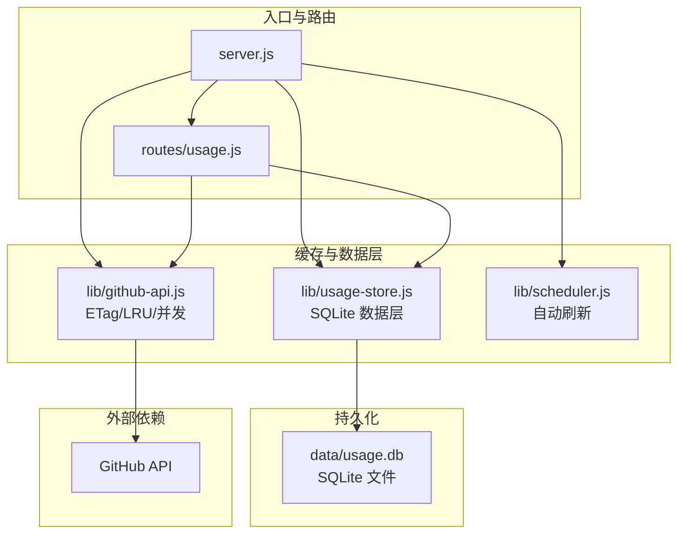
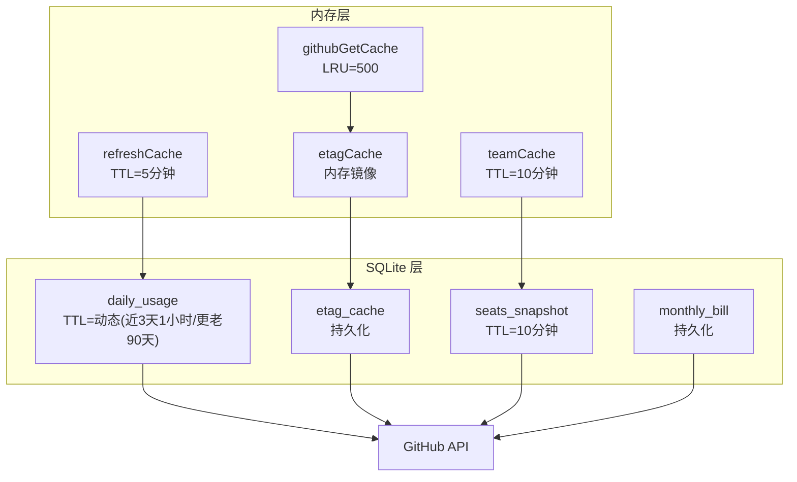
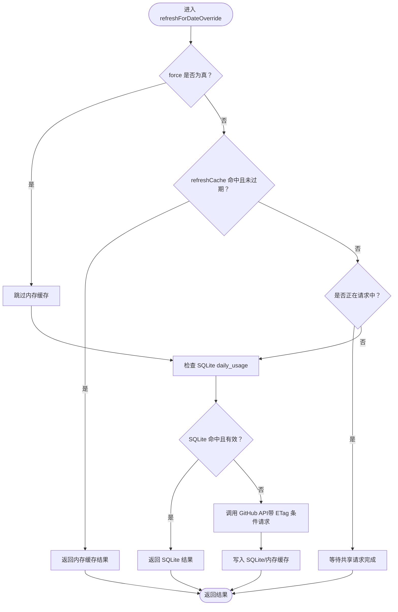
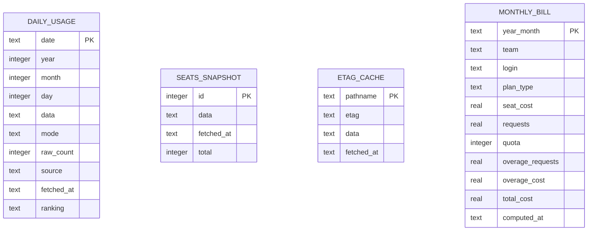
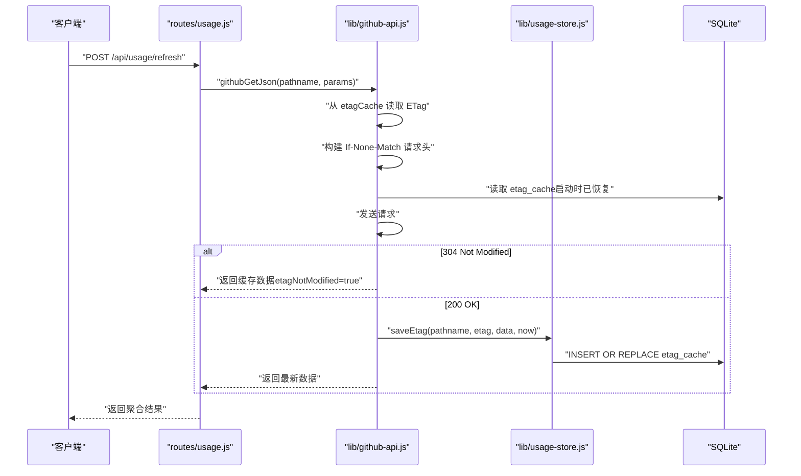
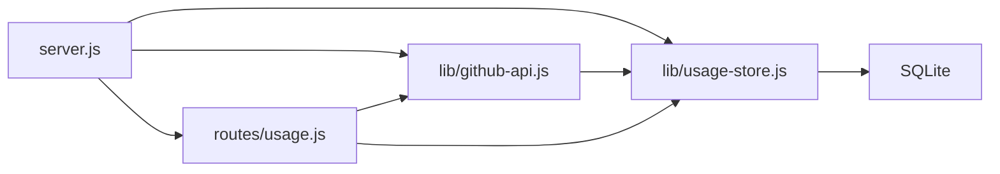

# 缓存配置

<cite>
**本文引用的文件**
- [server.js](file://server.js)
- [usage-store.js](file://lib/usage-store.js)
- [github-api.js](file://lib/github-api.js)
- [usage.js](file://routes/usage.js)
- [scheduler.js](file://lib/scheduler.js)
- [sqlite-cache-design.md](file://docs/sqlite-cache-design.md)
- [README.md](file://README.md)
- [package.json](file://package.json)
</cite>

## 目录
1. [简介](#简介)
2. [项目结构](#项目结构)
3. [核心组件](#核心组件)
4. [架构总览](#架构总览)
5. [详细组件分析](#详细组件分析)
6. [依赖关系分析](#依赖关系分析)
7. [性能考量](#性能考量)
8. [故障排查指南](#故障排查指南)
9. [结论](#结论)
10. [附录](#附录)

## 简介
本指南聚焦于本项目的多层缓存体系，涵盖内存缓存、SQLite 持久化缓存与 ETag 条件请求的配置与使用。重点说明 CACHE_TTL 参数的设置方法及其对系统性能的影响，解释缓存失效策略、缓存预热机制与缓存监控方法，并给出不同缓存层级的配置参数、磁盘空间管理、过期时间设置、性能优化最佳实践以及动态调整与故障恢复策略。

## 项目结构
项目采用模块化分层架构，后端入口 server.js 挂载路由与服务，lib 目录封装数据层与基础设施，routes 目录承载业务路由，public 目录提供前端静态资源。缓存相关能力分布在以下模块：
- server.js：入口与全局缓存初始化（内存 etagCache 从 SQLite 恢复）
- lib/usage-store.js：SQLite 数据层（daily_usage、seats_snapshot、etag_cache 表）
- lib/github-api.js：GitHub API 层（LRU GET 缓存、ETag 条件请求、单飞去重）
- routes/usage.js：用量路由（内存 refreshCache、SQLite TTL、按日/范围/默认刷新）
- lib/scheduler.js：自动刷新调度器（按 UTC 日期回填近期天数）

**图表来源**
- [server.js:1-182](file://server.js#L1-L182)
- [usage-store.js:1-324](file://lib/usage-store.js#L1-L324)
- [github-api.js:1-320](file://lib/github-api.js#L1-L320)
- [usage.js:1-470](file://routes/usage.js#L1-L470)
- [scheduler.js:1-160](file://lib/scheduler.js#L1-L160)

**章节来源**
- [server.js:1-182](file://server.js#L1-L182)
- [README.md:46-96](file://README.md#L46-L96)

## 核心组件
- 内存缓存
  - refreshCache：Map，用于最近查询的用量排名，TTL 5 分钟（参见 routes/usage.js 中的 CACHE_TTL_MS 计算与使用）
  - githubGetCache：LRU，用于 GitHub API GET 的短期缓存（LRU 容量 500，按路径 TTL 管理）
  - etagCache：Map，内存中的 ETag 条件请求缓存镜像，启动时从 SQLite 恢复
  - teamCache：内存对象，Copilot 席位列表，TTL 10 分钟
- SQLite 持久化缓存
  - daily_usage：每日用量与 per-user 排名，TTL 动态策略（近 3 天 1 小时，更老 90 天）
  - seats_snapshot：席位快照，TTL 10 分钟
  - etag_cache：ETag 持久化，重启恢复
  - monthly_bill：月度账单结果，持久化
- ETag 条件请求
  - 通过 github-api.js 的 etagCache 与 SQLite etag_cache 实现 304 Not Modified，避免 API 配额消耗

**章节来源**
- [usage.js:11](file://routes/usage.js#L11)
- [github-api.js:58-74](file://lib/github-api.js#L58-L74)
- [usage-store.js:6-8](file://lib/usage-store.js#L6-L8)
- [sqlite-cache-design.md:45-49](file://docs/sqlite-cache-design.md#L45-L49)

## 架构总览
三层缓存体系（从快到慢）：
- 内存缓存（refreshCache、githubGetCache、etagCache、teamCache）
- SQLite 持久缓存（daily_usage、seats_snapshot、etag_cache、monthly_bill）
- GitHub API（最终数据源）

**图表来源**
- [sqlite-cache-design.md:17-43](file://docs/sqlite-cache-design.md#L17-L43)
- [usage.js:11](file://routes/usage.js#L11)
- [github-api.js:58-74](file://lib/github-api.js#L58-L74)
- [usage-store.js:6-8](file://lib/usage-store.js#L6-L8)

## 详细组件分析

### 内存缓存：refreshCache 与 CACHE_TTL
- refreshCache 是 Map，键为日期/查询参数的 JSON 序列化字符串，值包含 ts 与 result
- TTL 由环境变量 CACHE_TTL（秒）转换为毫秒，用于判断缓存是否有效
- 使用场景：
  - routes/usage.js 的 refreshForDateOverride 对单日/范围/默认模式进行缓存命中判断
  - 未命中或 force=true 时才回源 GitHub API
- 影响：
  - CACHE_TTL 越短，命中率下降，回源频率上升，API 调用增多
  - CACHE_TTL 越长，命中率上升，但可能返回过期数据，影响数据新鲜度

**图表来源**
- [usage.js:237-348](file://routes/usage.js#L237-L348)

**章节来源**
- [usage.js:11](file://routes/usage.js#L11)
- [usage.js:237-348](file://routes/usage.js#L237-L348)

### SQLite 持久化缓存：daily_usage、seats_snapshot、etag_cache
- daily_usage
  - 存储每日原始数据与 per-user 排名，是用量分析与周期聚合的核心
  - TTL 动态策略：近 3 天（UTC）1 小时，更老 90 天
  - getEffectiveTTL/year/month/day 计算当前日期的有效 TTL
  - getFreshDays/start/end/TTL 过滤过期日期
- seats_snapshot
  - 席位列表快照，TTL 10 分钟，启动时恢复
  - 限制最多保留 20 条快照，避免无限增长
- etag_cache
  - 持久化 ETag，启动时从 SQLite 恢复到内存 etagCache
  - cleanupEtagCache 支持按最大年龄清理

**图表来源**
- [usage-store.js:24-71](file://lib/usage-store.js#L24-L71)
- [sqlite-cache-design.md:51-121](file://docs/sqlite-cache-design.md#L51-L121)

**章节来源**
- [usage-store.js:6-8](file://lib/usage-store.js#L6-L8)
- [usage-store.js:180-198](file://lib/usage-store.js#L180-L198)
- [usage-store.js:241-278](file://lib/usage-store.js#L241-L278)
- [sqlite-cache-design.md:75-78](file://docs/sqlite-cache-design.md#L75-L78)

### ETag 条件请求：内存 etagCache 与 SQLite etag_cache
- 初始化：server.js 启动时调用 initEtagCache(usageStore)，从 SQLite 加载所有 ETag 到内存 etagCache
- 请求流程：github-api.js 的 githubGetJson/githugGetWithHeaders 读取 etagCache，构建 If-None-Match 请求头
- 响应处理：收到 304 时返回缓存数据；收到 200 时更新 etagCache 并持久化到 SQLite
- TTL：按路径分类的 TTL（如 seats、memberships、teams、premium_request/usage 等），用于 LRU 缓存的按键 TTL 管理

**图表来源**
- [server.js:50-51](file://server.js#L50-L51)
- [github-api.js:67-74](file://lib/github-api.js#L67-L74)
- [github-api.js:231-269](file://lib/github-api.js#L231-L269)
- [usage-store.js:241-278](file://lib/usage-store.js#L241-L278)

**章节来源**
- [server.js:50-51](file://server.js#L50-L51)
- [github-api.js:67-74](file://lib/github-api.js#L67-L74)
- [github-api.js:231-269](file://lib/github-api.js#L231-L269)
- [usage-store.js:241-278](file://lib/usage-store.js#L241-L278)

### 缓存失效策略
- 内存层
  - refreshCache：由 CACHE_TTL_MS 控制（秒→毫秒），超时后自动失效
  - githubGetCache：按路径 TTL 管理，超时后失效
  - teamCache：10 分钟 TTL
- SQLite 层
  - daily_usage：动态 TTL（近 3 天 1 小时，更老 90 天），getFreshDays/start/end/TTL 过滤
  - seats_snapshot：10 分钟 TTL，最多保留 20 条
  - etag_cache：cleanupEtagCache 按最大年龄清理
- 强制刷新
  - routes/usage.js 的 force:true 跳过 refreshCache 与 SQLite TTL，仍走 single-flight 去重
  - /api/bill/refresh 按月强制刷新，删除 monthly_bill 与 daily_usage，逐日回源并重新计算

**章节来源**
- [usage.js:11](file://routes/usage.js#L11)
- [usage.js:273-277](file://routes/usage.js#L273-L277)
- [usage-store.js:180-198](file://lib/usage-store.js#L180-L198)
- [usage-store.js:275-278](file://lib/usage-store.js#L275-L278)

### 缓存预热机制
- 启动时恢复 etagCache：server.js 调用 initEtagCache(usageStore)，从 SQLite 加载所有 ETag
- 自动刷新调度器：lib/scheduler.js 在启动后与每日固定时刻，按 UTC 日期回填近期天数，强制刷新 SQLite 缓存
- 席位数据预热：ensureSeatsData 优先从 teamCache/SQLite 恢复，否则从 GitHub 拉取并写入 SQLite

**章节来源**
- [server.js:50-51](file://server.js#L50-L51)
- [scheduler.js:54-99](file://lib/scheduler.js#L54-L99)
- [billing.js:13-20](file://routes/billing.js#L13-L20)

### 缓存监控方法
- 前端缓存命中率：routes/usage.js 在 POST /api/usage/refresh 响应中返回 cacheHitRatio
- 日志与可观测性：github-api.js 与 server.js 输出 debug/info/warn/error 日志，包含缓存命中/未命中、ETag 条件请求、in-flight 去重、SQLite 命中等
- 健康检查：/api/health 返回内存使用与运行时信息，便于运维监控

**章节来源**
- [usage.js:457-458](file://routes/usage.js#L457-L458)
- [github-api.js:231-269](file://lib/github-api.js#L231-L269)
- [server.js:100-108](file://server.js#L100-L108)

## 依赖关系分析
- server.js 依赖
  - lib/usage-store.js：初始化 etagCache（从 SQLite 恢复）
  - lib/github-api.js：initEtagCache 注入 usageStore
  - routes/usage.js：使用 teamCache 与 usageStore
- routes/usage.js 依赖
  - lib/github-api.js：githubGetJson
  - lib/usage-store.js：daily_usage、etag_cache、seats_snapshot
  - lib/scheduler.js：forceRefreshDay
- lib/github-api.js 依赖
  - lru-cache：LRU 缓存
  - lib/usage-store.js：持久化 etag_cache
- lib/usage-store.js 依赖
  - better-sqlite3：SQLite 数据库
  - fs/path：数据目录与 db 文件路径

**图表来源**
- [server.js:1-182](file://server.js#L1-L182)
- [usage.js:1-470](file://routes/usage.js#L1-L470)
- [github-api.js:1-320](file://lib/github-api.js#L1-L320)
- [usage-store.js:1-324](file://lib/usage-store.js#L1-L324)

**章节来源**
- [server.js:1-182](file://server.js#L1-L182)
- [usage.js:1-470](file://routes/usage.js#L1-L470)
- [github-api.js:1-320](file://lib/github-api.js#L1-L320)
- [usage-store.js:1-324](file://lib/usage-store.js#L1-L324)

## 性能考量
- CACHE_TTL 设置建议
  - 默认 300 秒（5 分钟），平衡命中率与数据新鲜度
  - 低频访问场景可适当延长，高频交互场景可缩短
  - 影响：过短导致频繁回源，过长导致数据陈旧
- SQLite TTL 动态策略
  - 近 3 天 1 小时，更老 90 天，避免 GitHub Billing API 24–48h 延迟写入不完整数据被长期缓存锁死
  - getEffectiveTTL/year/month/day 与 getFreshDays 确保新鲜度
- 并发与去重
  - github-api.js 的 MAX_CONCURRENT_GITHUB 限制并发，避免触发 Secondary Rate Limit
  - githubInflight Map 实现 single-flight 去重，避免重复请求
- LRU 缓存
  - githubGetCache 容量 500，按路径 TTL 管理，减少重复请求
- 磁盘空间管理
  - seats_snapshot 最多保留 20 条，避免膨胀
  - cleanupOldData/cleanupEtagCache 按最大年龄清理历史数据

**章节来源**
- [usage.js:11](file://routes/usage.js#L11)
- [usage-store.js:6-8](file://lib/usage-store.js#L6-L8)
- [usage-store.js:226-239](file://lib/usage-store.js#L226-L239)
- [github-api.js:25-48](file://lib/github-api.js#L25-L48)
- [github-api.js:58-74](file://lib/github-api.js#L58-L74)

## 故障排查指南
- 缓存命中率低
  - 检查 CACHE_TTL 是否过短，或 routes/usage.js 的 refreshCache 是否被频繁覆盖
  - 确认 SQLite daily_usage 是否存在有效数据（getFreshDays 过滤）
- ETag 未生效
  - 确认 server.js 启动时 initEtagCache 是否成功从 SQLite 恢复
  - 检查 github-api.js 的 etagCache 是否存在，请求头是否包含 If-None-Match
- 数据陈旧
  - 使用 force:true 强制刷新单日/范围
  - 使用 /api/bill/refresh 按月强制刷新
  - 检查 scheduler.js 的调度是否正常（SCHED_DISABLED/SCHED_DAILY_TIMES）
- 磁盘空间不足
  - 使用 cleanupOldData/cleanupEtagCache 清理过期数据
  - 检查 seats_snapshot 是否过多（最多 20 条）
- API 限流
  - 调整 GITHUB_MAX_CONCURRENT/GITHUB_MAX_RETRIES
  - 观察日志中的 retry-after 与 x-ratelimit-* 头

**章节来源**
- [usage.js:273-277](file://routes/usage.js#L273-L277)
- [server.js:50-51](file://server.js#L50-L51)
- [github-api.js:170-227](file://lib/github-api.js#L170-L227)
- [scheduler.js:59-69](file://lib/scheduler.js#L59-L69)
- [usage-store.js:195-198](file://lib/usage-store.js#L195-L198)
- [usage-store.js:275-278](file://lib/usage-store.js#L275-L278)

## 结论
本项目通过三层缓存体系显著降低了 GitHub API 调用频率，提升了响应速度与用户体验。内存层（refreshCache、githubGetCache、etagCache、teamCache）提供快速命中，SQLite 层（daily_usage、seats_snapshot、etag_cache、monthly_bill）提供持久化与数据聚合能力，ETag 条件请求进一步节省配额。合理设置 CACHE_TTL、利用动态 TTL 与自动刷新调度器、实施磁盘清理策略，是保障系统性能与稳定性的关键。

## 附录

### 缓存层级配置参数一览
- 内存层
  - refreshCache：TTL=CACHE_TTL（秒）→毫秒
  - githubGetCache：容量=500，按路径 TTL 管理
  - etagCache：内存镜像，启动时从 SQLite 恢复
  - teamCache：TTL=10 分钟
- SQLite 层
  - daily_usage：TTL 动态（近 3 天 1 小时，更老 90 天）
  - seats_snapshot：TTL=10 分钟，最多 20 条
  - etag_cache：持久化，支持按最大年龄清理
  - monthly_bill：持久化
- ETag 过期时间设置
  - 路径级 TTL：seats/memberships/teams/budgets/premium_request/usage/billing/usage 等
  - 内存 etagCache：按路径 TTL 管理
  - SQLite etag_cache：fetched_at 用于清理

**章节来源**
- [usage.js:11](file://routes/usage.js#L11)
- [github-api.js:58-98](file://lib/github-api.js#L58-L98)
- [usage-store.js:6-8](file://lib/usage-store.js#L6-L8)
- [sqlite-cache-design.md:75-78](file://docs/sqlite-cache-design.md#L75-L78)

### 缓存性能优化最佳实践
- 缓存命中率优化
  - 合理设置 CACHE_TTL，结合业务访问模式调整
  - 使用 per-user fallback 生成的 ranking 数据，提升分析页面读取性能
- 内存使用控制
  - 控制 githubGetCache 容量与路径 TTL，避免内存膨胀
  - 定期清理 seats_snapshot，限制快照数量
- 磁盘空间管理
  - 定期执行 cleanupOldData/cleanupEtagCache
  - 监控 data/usage.db 大小，必要时重建数据库
- 动态调整与故障恢复
  - 使用 force:true 与 /api/bill/refresh 进行强制刷新
  - 启用/禁用 scheduler.js 的调度器，避免多副本重复刷新
  - 通过 /api/health 与日志观察系统健康状况

**章节来源**
- [usage.js:273-277](file://routes/usage.js#L273-L277)
- [scheduler.js:59-69](file://lib/scheduler.js#L59-L69)
- [usage-store.js:195-198](file://lib/usage-store.js#L195-L198)
- [usage-store.js:226-239](file://lib/usage-store.js#L226-L239)
- [server.js:100-108](file://server.js#L100-L108)