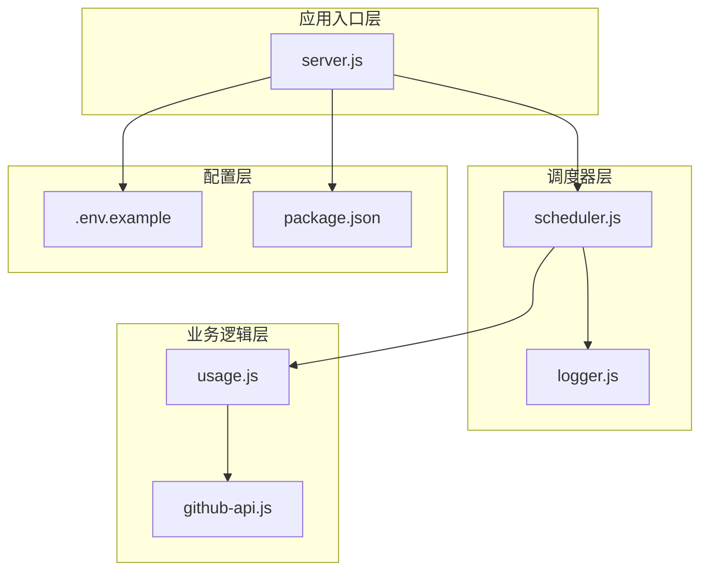
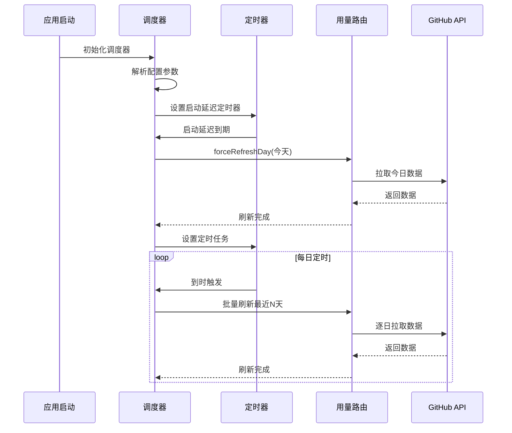
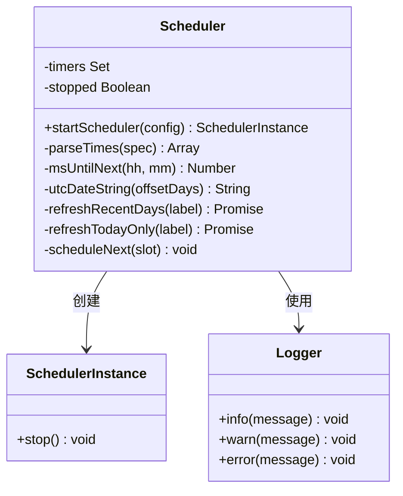
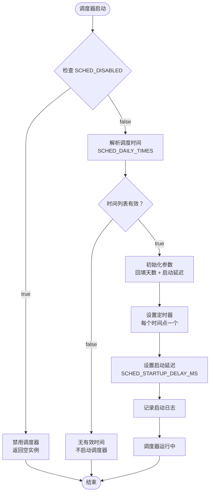
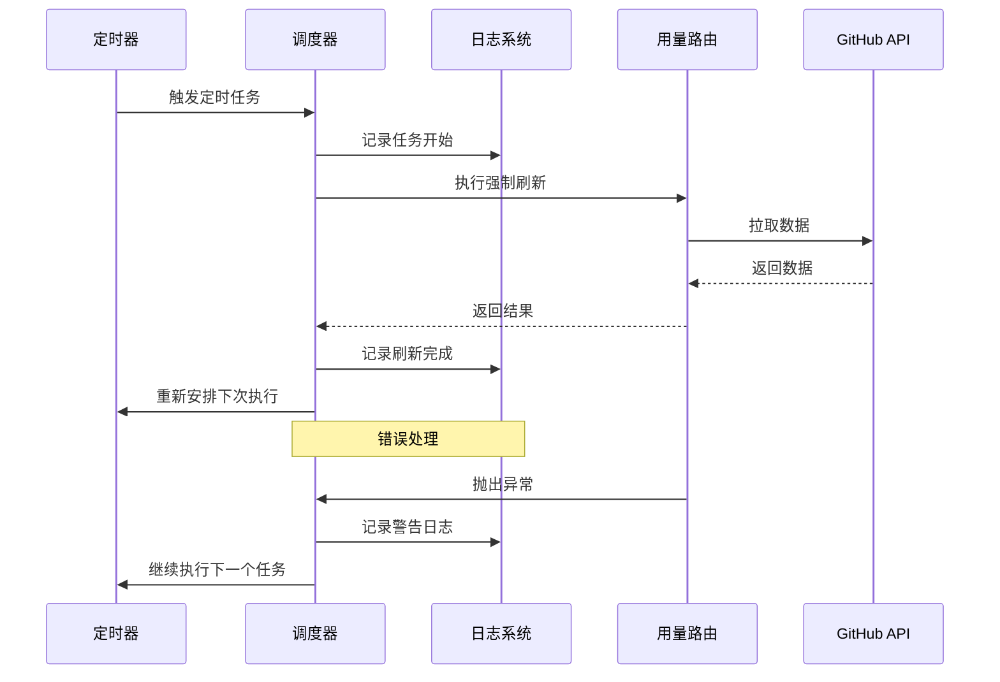
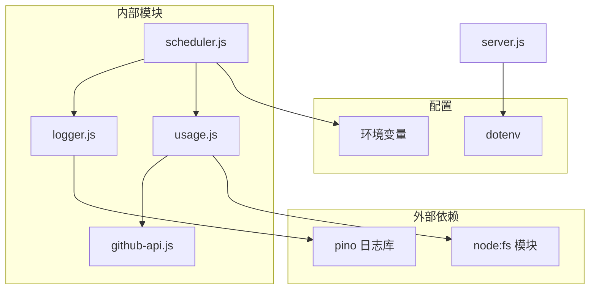

# 调度器配置

<cite>
**本文引用的文件**
- [scheduler.js](file://lib/scheduler.js)
- [server.js](file://server.js)
- [usage.js](file://routes/usage.js)
- [logger.js](file://lib/logger.js)
- [github-api.js](file://lib/github-api.js)
- [.env.example](file://.env.example)
- [README.md](file://README.md)
- [package.json](file://package.json)
- [copilot-dashboard.service](file://deploy/copilot-dashboard.service)
</cite>

## 目录
1. [简介](#简介)
2. [项目结构](#项目结构)
3. [核心组件](#核心组件)
4. [架构概览](#架构概览)
5. [详细组件分析](#详细组件分析)
6. [依赖关系分析](#依赖关系分析)
7. [性能考虑](#性能考虑)
8. [故障排查指南](#故障排查指南)
9. [结论](#结论)
10. [附录](#附录)

## 简介

Copilot 企业用量仪表盘内置了一个轻量级的自动刷新调度器，专门用于每日用量数据的自动更新。该调度器采用基于 `setTimeout` 的简单实现，无需外部依赖，能够在服务启动后自动刷新数据，并在配置的时间点定期执行批量回填操作。

调度器的核心特性包括：
- **启动时自动刷新**：服务启动后延迟数秒自动强制刷新当天数据
- **定时批量回填**：每天在配置的时间点强制刷新最近 N 天的数据
- **多实例安全**：支持通过环境变量禁用调度器，避免多副本重复调用
- **灵活配置**：支持自定义调度时间、回填天数和启动延迟
- **优雅错误处理**：失败仅记录警告，不影响主流程运行

## 项目结构

该项目采用模块化分层架构，调度器位于 `lib/scheduler.js` 文件中，与主应用通过依赖注入的方式集成。



**图表来源**
- [server.js:146-148](file://server.js#L146-L148)
- [scheduler.js:1-21](file://lib/scheduler.js#L1-L21)
- [usage.js:464-467](file://routes/usage.js#L464-L467)

**章节来源**
- [server.js:146-148](file://server.js#L146-L148)
- [scheduler.js:1-21](file://lib/scheduler.js#L1-L21)
- [README.md:60-68](file://README.md#L60-L68)

## 核心组件

### 调度器核心功能

调度器提供了以下核心功能：

1. **启动时刷新**：服务启动后延迟执行，确保仪表盘首次访问时数据为最新
2. **定时回填**：在配置的时间点批量刷新最近 N 天的数据
3. **强制刷新**：绕过内存和 SQLite 缓存，直接从 GitHub API 拉取最新数据
4. **多实例安全**：支持禁用调度器，避免多副本重复调用

### 配置选项

调度器支持以下环境变量配置：

| 环境变量 | 类型 | 默认值 | 描述 |
|---------|------|--------|------|
| `SCHED_DISABLED` | 布尔字符串 | `false` | 设置为 `"true"` 可完全禁用调度器 |
| `SCHED_DAILY_TIMES` | 字符串 | `"03:00,12:00"` | 逗号分隔的本地时间列表（HH:MM） |
| `SCHED_BACKFILL_DAYS` | 整数 | `2` | 每次运行时除今天外额外回填的天数 |
| `SCHED_STARTUP_DELAY_MS` | 整数 | `5000` | 启动后首次刷今天数据的延迟毫秒数 |

**章节来源**
- [scheduler.js:14-18](file://lib/scheduler.js#L14-L18)
- [README.md:213-216](file://README.md#L213-L216)

## 架构概览

调度器采用事件驱动的架构模式，通过定时器实现任务调度，与主应用解耦。



**图表来源**
- [server.js:146-148](file://server.js#L146-L148)
- [scheduler.js:54-71](file://lib/scheduler.js#L54-L71)
- [scheduler.js:114-132](file://lib/scheduler.js#L114-L132)

## 详细组件分析

### 调度器类结构



**图表来源**
- [scheduler.js:54-157](file://lib/scheduler.js#L54-L157)

### 启动流程分析

调度器的启动流程包含以下关键步骤：

1. **配置验证**：检查 `SCHED_DISABLED` 环境变量
2. **时间解析**：解析 `SCHED_DAILY_TIMES` 为有效的时间列表
3. **参数初始化**：设置回填天数和启动延迟
4. **定时器设置**：为每个配置的时间点创建定时器
5. **启动延迟**：设置启动后的首次刷新定时器



**图表来源**
- [scheduler.js:59-71](file://lib/scheduler.js#L59-L71)
- [scheduler.js:134-147](file://lib/scheduler.js#L134-L147)

**章节来源**
- [scheduler.js:54-157](file://lib/scheduler.js#L54-L157)

### 任务执行监控

调度器实现了完善的日志监控机制：



**图表来源**
- [scheduler.js:84-98](file://lib/scheduler.js#L84-L98)
- [scheduler.js:120-125](file://lib/scheduler.js#L120-L125)

### 错误处理机制

调度器采用"失败不影响主流程"的设计原则：

1. **单任务隔离**：每个日期的刷新失败不会影响其他日期
2. **异常捕获**：所有异步操作都在 try-catch 包裹中
3. **日志记录**：失败情况记录警告级别的日志
4. **继续执行**：即使某个日期失败，调度器仍会继续执行其他任务

**章节来源**
- [scheduler.js:86-97](file://lib/scheduler.js#L86-L97)
- [scheduler.js:122-124](file://lib/scheduler.js#L122-L124)

## 依赖关系分析

调度器的依赖关系相对简单，主要依赖于日志系统和用量路由模块。



**图表来源**
- [scheduler.js:21](file://lib/scheduler.js#L21)
- [logger.js:1](file://lib/logger.js#L1)
- [github-api.js:8](file://lib/github-api.js#L8)

**章节来源**
- [scheduler.js:21](file://lib/scheduler.js#L21)
- [logger.js:1-41](file://lib/logger.js#L1-L41)
- [github-api.js:8](file://lib/github-api.js#L8)

## 性能考虑

### 并发控制

调度器本身不直接控制 GitHub API 的并发请求，而是依赖用量路由模块的并发控制机制：

- **GitHub API 并发限制**：通过 `GITHUB_MAX_CONCURRENT` 环境变量控制
- **请求去重**：使用单飞行请求（single-flight）避免重复查询
- **指数退避**：遇到限流时自动进行指数退避重试

### 资源限制

1. **内存使用**：调度器仅维护定时器集合，内存占用极低
2. **CPU 使用**：定时器触发时才执行任务，平时几乎不消耗 CPU
3. **网络请求**：受 GitHub API 限流限制，避免过度请求

### 性能调优参数

| 参数 | 默认值 | 调优建议 | 影响范围 |
|------|--------|----------|----------|
| `SCHED_BACKFILL_DAYS` | 2 | 根据数据延迟调整（1-7天） | 每次批量刷新的数据量 |
| `SCHED_STARTUP_DELAY_MS` | 5000 | 根据应用启动时间调整（0-30000ms） | 首次访问数据新鲜度 |
| `GITHUB_MAX_CONCURRENT` | 3 | 根据 API 限额调整（1-10） | GitHub API 并发度 |
| `GITHUB_MAX_RETRIES` | 3 | 根据网络稳定性调整（1-5） | API 请求成功率 |

**章节来源**
- [github-api.js:25-27](file://lib/github-api.js#L25-L27)
- [scheduler.js:70-71](file://lib/scheduler.js#L70-L71)

## 故障排查指南

### 常见问题诊断

#### 1. 调度器未启动

**症状**：服务启动后没有自动刷新数据

**诊断步骤**：
1. 检查 `SCHED_DISABLED` 是否设置为 `"true"`
2. 验证 `SCHED_DAILY_TIMES` 格式是否正确
3. 查看启动日志中的调度器状态

**解决方法**：
```bash
# 确保调度器启用
export SCHED_DISABLED=false
# 验证时间格式
export SCHED_DAILY_TIMES="03:00,12:00,18:00"
```

#### 2. 数据刷新不完整

**症状**：某些日期的数据缺失或为空

**诊断步骤**：
1. 检查 GitHub API 限流状态
2. 查看调度器日志中的错误信息
3. 验证 `SCHED_BACKFILL_DAYS` 设置是否合理

**解决方法**：
```bash
# 增加回填天数
export SCHED_BACKFILL_DAYS=3
# 调整启动延迟
export SCHED_STARTUP_DELAY_MS=10000
```

#### 3. 多实例重复刷新

**症状**：多副本部署时出现重复调用 GitHub API

**诊断步骤**：
1. 检查各实例的环境变量配置
2. 验证主副本和从副本的配置差异

**解决方法**：
```bash
# 在从副本禁用调度器
export SCHED_DISABLED=true
# 在主副本启用调度器
export SCHED_DISABLED=false
```

### 日志分析

调度器使用结构化日志记录关键事件：

**启动日志示例**：
```
INFO: Scheduler started
{
  "times": ["3:00", "12:00"],
  "backfillDays": 2,
  "startupDelayMs": 5000
}
```

**任务执行日志示例**：
```
INFO: Scheduler: starting refresh
{
  "trigger": "daily-03:00",
  "dates": ["2026-04-28", "2026-04-27", "2026-04-26"]
}
```

**错误日志示例**：
```
WARN: Scheduler: refresh failed
{
  "trigger": "daily-03:00",
  "date": "2026-04-27",
  "err": "Network error"
}
```

**章节来源**
- [scheduler.js:83-96](file://lib/scheduler.js#L83-L96)
- [scheduler.js:128-131](file://lib/scheduler.js#L128-L131)
- [scheduler.js:123](file://lib/scheduler.js#L123)

## 结论

Copilot 企业用量仪表盘的调度器是一个设计简洁、功能明确的轻量级组件。其核心优势包括：

1. **简单可靠**：基于原生 JavaScript 实现，无外部依赖
2. **配置灵活**：支持多种参数定制，适应不同部署需求
3. **错误容错**：失败不影响主流程，确保系统稳定性
4. **多实例安全**：支持禁用功能，避免重复调用

调度器最适合以下场景：
- **定时刷新**：需要定期自动更新数据的场景
- **按需更新**：通过手动 API 触发的即时刷新
- **批量处理**：需要回填历史数据的场景

对于生产环境，建议：
1. 启用调度器但配置合理的回填天数
2. 在多副本环境中区分主从副本的调度器配置
3. 监控 GitHub API 限流状态，适时调整并发参数
4. 定期检查调度器日志，及时发现和解决问题

## 附录

### 环境变量参考

完整的环境变量配置参考：

| 变量名 | 必填 | 默认值 | 说明 |
|--------|------|--------|------|
| `SCHED_DISABLED` | 否 | `false` | 禁用调度器 |
| `SCHED_DAILY_TIMES` | 否 | `"03:00,12:00"` | 调度时间列表 |
| `SCHED_BACKFILL_DAYS` | 否 | `2` | 回填天数 |
| `SCHED_STARTUP_DELAY_MS` | 否 | `5000` | 启动延迟毫秒数 |

### 部署最佳实践

1. **单主多从架构**：只在主副本启用调度器，其他副本禁用
2. **监控告警**：设置调度器日志监控和 GitHub API 限流告警
3. **容量规划**：根据数据量和 API 限额合理设置并发参数
4. **备份策略**：定期备份 SQLite 数据库，防止数据丢失