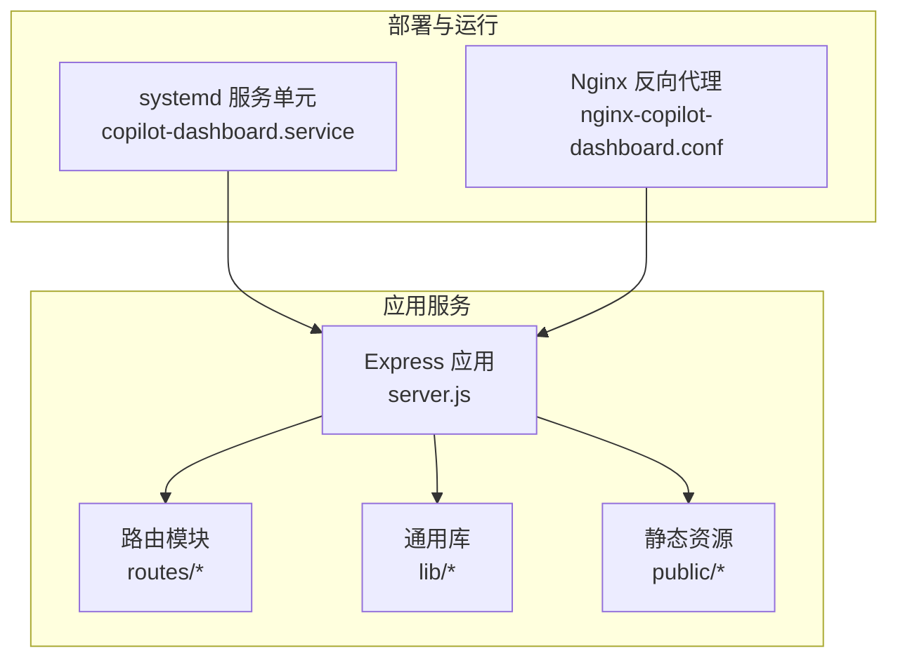
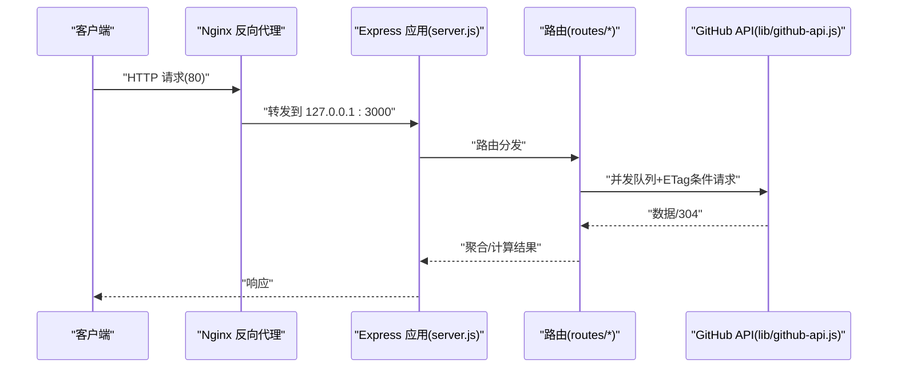
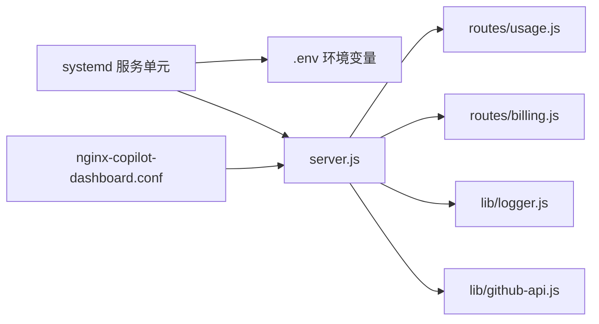

# 部署配置

<cite>
**本文引用的文件**
- [nginx-copilot-dashboard.conf](file://deploy/nginx-copilot-dashboard.conf)
- [copilot-dashboard.service](file://deploy/copilot-dashboard.service)
- [preflight-check.sh](file://scripts/preflight-check.sh)
- [preflight-check.js](file://scripts/preflight-check.js)
- [server.js](file://server.js)
- [logger.js](file://lib/logger.js)
- [github-api.js](file://lib/github-api.js)
- [usage.js](file://routes/usage.js)
- [billing.js](file://routes/billing.js)
- [README.md](file://README.md)
- [package.json](file://package.json)
- [github-enterprise-copilot-billing-scope-checklist.md](file://docs/github-enterprise-copilot-billing-scope-checklist.md)
</cite>

## 目录
1. [简介](#简介)
2. [项目结构](#项目结构)
3. [核心组件](#核心组件)
4. [架构总览](#架构总览)
5. [详细组件分析](#详细组件分析)
6. [依赖关系分析](#依赖关系分析)
7. [性能考量](#性能考量)
8. [故障排查指南](#故障排查指南)
9. [结论](#结论)
10. [附录](#附录)

## 简介
本指南围绕该 Copilot 企业用量仪表盘项目的部署配置，系统讲解 Nginx 反向代理、systemd 服务、环境变量与配置差异、容器化部署、安全与日志审计、监控与告警以及部署前预检脚本与故障排查方法。目标是帮助运维与开发人员在不同环境中（开发、测试、生产）稳定、安全地部署与运行该服务。

## 项目结构
该项目采用前后端分离的模块化架构，后端为 Node.js + Express，前端静态资源位于 public 目录，核心运行入口为 server.js。部署相关的关键文件集中在 deploy 与 scripts 目录，并通过 systemd 与 Nginx 提供反向代理与开机自启。

图表来源
- [copilot-dashboard.service:1-18](file://deploy/copilot-dashboard.service#L1-L18)
- [nginx-copilot-dashboard.conf:1-14](file://deploy/nginx-copilot-dashboard.conf#L1-L14)
- [server.js:1-182](file://server.js#L1-L182)
- [package.json:1-26](file://package.json#L1-L26)

章节来源
- [README.md:412-470](file://README.md#L412-L470)
- [package.json:1-26](file://package.json#L1-L26)

## 核心组件
- Nginx 反向代理：将 80 端口请求转发到本地 3000 端口，设置必要的头部以便后端识别真实客户端与协议。
- systemd 服务：以 www-data 用户运行 Node.js 应用，自动重启失败的服务，标准输出/错误写入 journal，支持开机自启。
- 预检脚本：Shell 与 Node 两版，用于检查环境变量、DNS/网络连通性、GitHub Token 权限与关键 API 可达性。
- 应用入口与日志：server.js 提供健康检查、优雅关闭、全局错误处理与结构化日志；logger.js 配置 pino 日志级别与敏感信息脱敏。
- GitHub API 层：封装并发队列、重试与指数退避、ETag 条件请求、单次飞行去重与 LRU 缓存，保障稳定性与性能。

章节来源
- [nginx-copilot-dashboard.conf:1-14](file://deploy/nginx-copilot-dashboard.conf#L1-L14)
- [copilot-dashboard.service:1-18](file://deploy/copilot-dashboard.service#L1-L18)
- [preflight-check.sh:1-182](file://scripts/preflight-check.sh#L1-L182)
- [preflight-check.js:1-188](file://scripts/preflight-check.js#L1-L188)
- [server.js:100-144](file://server.js#L100-L144)
- [logger.js:1-41](file://lib/logger.js#L1-L41)
- [github-api.js:1-320](file://lib/github-api.js#L1-L320)

## 架构总览
下图展示了从客户端到应用、再到 GitHub API 的典型请求路径，以及 systemd 与 Nginx 的集成位置。

图表来源
- [nginx-copilot-dashboard.conf:5-12](file://deploy/nginx-copilot-dashboard.conf#L5-L12)
- [server.js:88-98](file://server.js#L88-L98)
- [github-api.js:108-168](file://lib/github-api.js#L108-L168)

## 详细组件分析

### Nginx 反向代理配置
- 监听 80 端口，server_name 为通配符。
- 反向代理到本地 3000 端口，设置 HTTP/1.1、Host、X-Real-IP、X-Forwarded-For、X-Forwarded-Proto 等头部，便于后端识别真实客户端与协议。
- 当前配置未启用 HTTPS 与上游健康检查，建议在生产环境增加：
  - 监听 443 端口并配置 SSL 证书与 TLS 策略。
  - 配置 upstream 与健康检查，结合 keepalive 与超时参数提升稳定性。
  - 限制请求体大小、超时与缓冲策略，避免慢客户端影响。

章节来源
- [nginx-copilot-dashboard.conf:1-14](file://deploy/nginx-copilot-dashboard.conf#L1-L14)

### systemd 服务配置
- 以 www-data 用户运行，工作目录为 /opt/copilot-dashboard。
- ExecStart 指向 node server.js，EnvironmentFile 指向 .env。
- Restart=on-failure，重启间隔 5 秒；标准输出/错误写入 journal。
- 建议在生产环境增加：
  - CPU/内存资源限制（LimitCPU、LimitNOFILE、MemoryMax 等）。
  - 进程组隔离与安全上下文（User/Group、PrivateTmp、ProtectSystem 等）。
  - 多实例部署时区分实例编号与端口绑定。

章节来源
- [copilot-dashboard.service:1-18](file://deploy/copilot-dashboard.service#L1-L18)
- [README.md:434-450](file://README.md#L434-L450)

### 环境变量与配置差异
- 必填变量：GITHUB_TOKEN、ENTERPRISE_SLUG。
- 可选变量：PORT、CACHE_TTL、GITHUB_MAX_CONCURRENT、GITHUB_MAX_RETRIES、GITHUB_API_BASE、LOG_LEVEL、SCHED_* 系列等。
- 环境差异建议：
  - 开发：LOG_LEVEL=debug，PORT=3000，禁用自动刷新或缩短调度时间。
  - 测试：与生产相同，但使用独立的 GitHub 企业与 Token。
  - 生产：LOG_LEVEL=info，启用健康检查与监控，合理设置并发与重试，开启优雅关闭与日志审计。

章节来源
- [README.md:196-217](file://README.md#L196-L217)
- [server.js:10-11](file://server.js#L10-L11)
- [github-api.js:25-27](file://lib/github-api.js#L25-L27)

### 部署前预检脚本
- Shell 版与 Node 版功能一致，均支持 --strict 模式。
- 检查项：
  - 环境变量存在性与整数合法性。
  - DNS 解析与 443 连通性。
  - Token 有效性与必要端点可达性（seats、premium usage、可选 cost-centers、budgets）。
- 建议在 CI/CD 中集成，失败即阻断发布。

章节来源
- [preflight-check.sh:62-182](file://scripts/preflight-check.sh#L62-L182)
- [preflight-check.js:37-188](file://scripts/preflight-check.js#L37-L188)

### 应用入口与健康检查
- 健康检查端点：GET /api/health，返回运行时长、内存占用与时间戳。
- 优雅关闭：监听 SIGTERM/SIGINT，10 秒强制退出，释放资源。
- 全局错误处理：记录错误上下文并返回统一 JSON。

章节来源
- [server.js:100-144](file://server.js#L100-L144)
- [server.js:120-140](file://server.js#L120-L140)

### 日志与审计
- pino 结构化日志，开发模式 pretty 输出，生产模式 JSON。
- 敏感信息自动脱敏（Authorization、token、password、secret）。
- 访问日志包含时间、来源 IP/主机名、方法、URL、动作、成功与否、状态码、响应时间。
- 建议：
  - 生产环境将日志输出到集中式日志系统（如 journald、Fluent Bit、ELK）。
  - 设置日志轮转与保留策略，避免磁盘膨胀。

章节来源
- [logger.js:1-41](file://lib/logger.js#L1-L41)
- [server.js:16-38](file://server.js#L16-L38)

### GitHub API 并发与重试
- 并发队列：最大并发数可配置，排队与释放机制避免瞬时峰值。
- 重试与退避：429/403/5xx 自动重试，指数退避上限控制。
- ETag 条件请求：命中 304 减少 API 调用与配额消耗。
- 单次飞行去重：同一参数的并发请求合并为一次实际调用。

章节来源
- [github-api.js:25-48](file://lib/github-api.js#L25-L48)
- [github-api.js:172-227](file://lib/github-api.js#L172-L227)
- [github-api.js:231-269](file://lib/github-api.js#L231-L269)

### 路由与端点
- 用量刷新：POST /api/usage/refresh 支持单日、日期范围与默认模式，force 参数强制回源。
- 健康检查：GET /api/health。
- 账单与模型：/api/billing/*、/api/billing/models。
- 以上端点均由 server.js 路由挂载，日志中间件统一记录访问信息。

章节来源
- [server.js:88-98](file://server.js#L88-L98)
- [usage.js:387-462](file://routes/usage.js#L387-L462)
- [billing.js:13-102](file://routes/billing.js#L13-L102)

## 依赖关系分析

图表来源
- [copilot-dashboard.service:1-18](file://deploy/copilot-dashboard.service#L1-L18)
- [nginx-copilot-dashboard.conf:1-14](file://deploy/nginx-copilot-dashboard.conf#L1-L14)
- [server.js:88-98](file://server.js#L88-L98)
- [logger.js:1-41](file://lib/logger.js#L1-L41)
- [github-api.js:1-320](file://lib/github-api.js#L1-L320)
- [usage.js:1-470](file://routes/usage.js#L1-L470)
- [billing.js:1-106](file://routes/billing.js#L1-L106)

章节来源
- [package.json:12-21](file://package.json#L12-L21)

## 性能考量
- 缓存策略：内存 LRU + SQLite 持久化 + ETag 条件请求，显著降低 GitHub API 调用。
- 并发与重试：通过队列与退避控制突发流量，避免触发速率限制。
- 响应时间：访问日志记录响应时间，可用于性能监控与瓶颈定位。
- 建议：
  - 合理设置 CACHE_TTL 与 GITHUB_MAX_CONCURRENT，平衡新鲜度与成本。
  - 对高频端点（如 /api/usage/refresh）增加本地缓存命中率统计与告警。

章节来源
- [server.js:16-38](file://server.js#L16-L38)
- [github-api.js:58-98](file://lib/github-api.js#L58-L98)
- [usage.js:237-348](file://routes/usage.js#L237-L348)

## 故障排查指南
- 预检失败：
  - 检查 GITHUB_TOKEN 与 ENTERPRISE_SLUG 是否正确，DNS 与 443 可达性。
  - 使用 --strict 模式严格校验，关注 FAIL 项。
- 运行时错误：
  - 查看 systemd 日志：journalctl -u copilot-dashboard -f。
  - 检查 LOG_LEVEL 与日志输出位置，定位未捕获异常与未处理拒绝。
- API 限流：
  - 观察重试日志与速率限制头，适当降低并发或延长重试间隔。
- 健康检查：
  - 访问 /api/health，确认服务运行状态与内存占用。

章节来源
- [preflight-check.sh:113-182](file://scripts/preflight-check.sh#L113-L182)
- [preflight-check.js:113-188](file://scripts/preflight-check.js#L113-L188)
- [server.js:173-182](file://server.js#L173-L182)
- [logger.js:13-38](file://lib/logger.js#L13-L38)

## 结论
该部署配置以 Nginx + systemd 为核心，辅以结构化日志与严格的预检脚本，能够在不同环境中稳定运行。建议在生产环境完善 SSL、上游健康检查、资源限制与集中日志审计，并结合健康检查与性能指标建立完善的监控告警体系。

## 附录

### 环境变量一览与建议
- 必填：GITHUB_TOKEN、ENTERPRISE_SLUG
- 可选：PORT、CACHE_TTL、GITHUB_MAX_CONCURRENT、GITHUB_MAX_RETRIES、GITHUB_API_BASE、LOG_LEVEL、SCHED_* 系列
- 建议：
  - 开发：LOG_LEVEL=debug，PORT=3000，SCHED_DISABLED=true
  - 测试：与生产相同，独立企业与 Token
  - 生产：LOG_LEVEL=info，启用健康检查与监控，合理设置并发与重试

章节来源
- [README.md:196-217](file://README.md#L196-L217)

### 权限与 Scope 核对
- 上线前核对账号角色、Token 类型与 classic PAT scope，确保最小权限覆盖只读与写操作场景。
- 建议使用最小探活接口验证关键端点可用性。

章节来源
- [github-enterprise-copilot-billing-scope-checklist.md:94-107](file://docs/github-enterprise-copilot-billing-scope-checklist.md#L94-L107)

### 容器化部署建议
- Dockerfile 建议：
  - 基于官方 Node.js 镜像，设置非 root 用户与只读根文件系统。
  - 挂载 /opt/copilot-dashboard/data 与 uploads 目录持久化。
  - 通过环境变量注入 .env 内容，避免硬编码。
- 环境变量：
  - GITHUB_TOKEN、ENTERPRISE_SLUG、PORT（容器内暴露）、CACHE_TTL、GITHUB_MAX_CONCURRENT、GITHUB_MAX_RETRIES、GITHUB_API_BASE、LOG_LEVEL、SCHED_* 系列。
- 健康检查：
  - 使用 HTTP GET /api/health，结合重启策略与探针参数。
- 网络与安全：
  - 仅暴露必要端口，启用只读卷与最小权限。
  - 通过反向代理或 Ingress 提供 TLS 终止与 WAF。

[本节为概念性建议，不直接对应具体源文件，故不附图表来源]