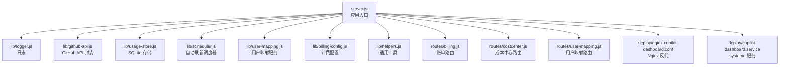
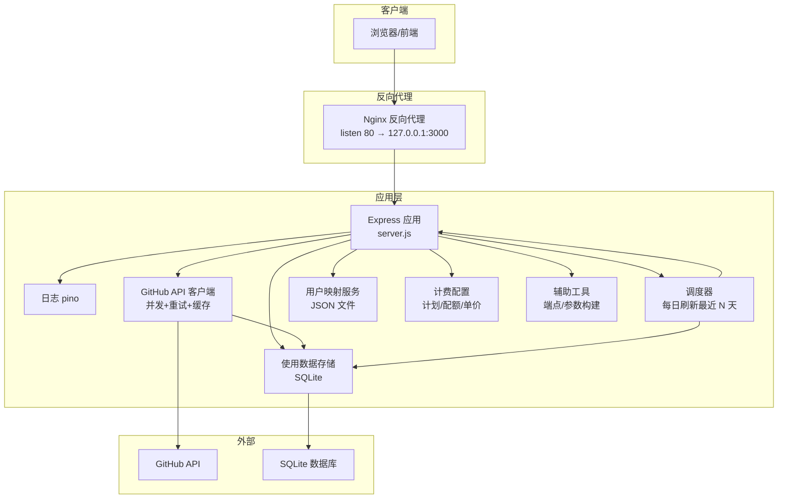
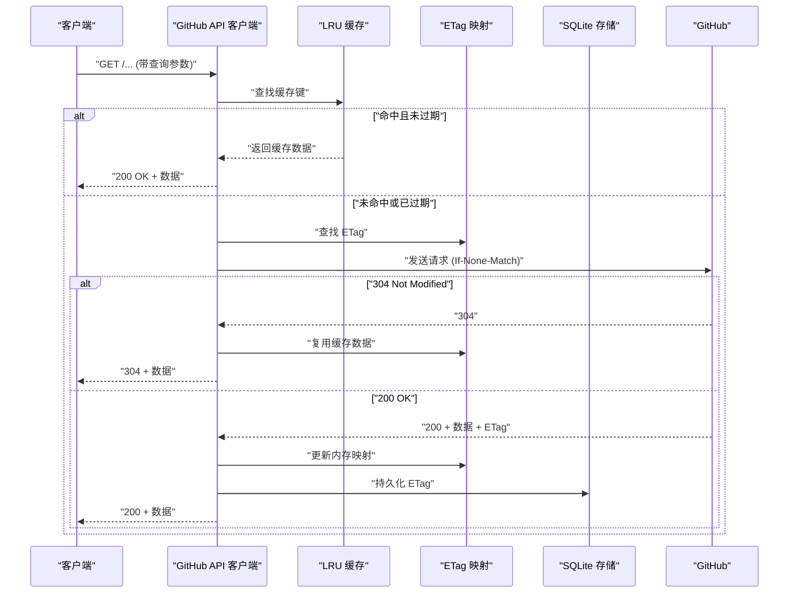
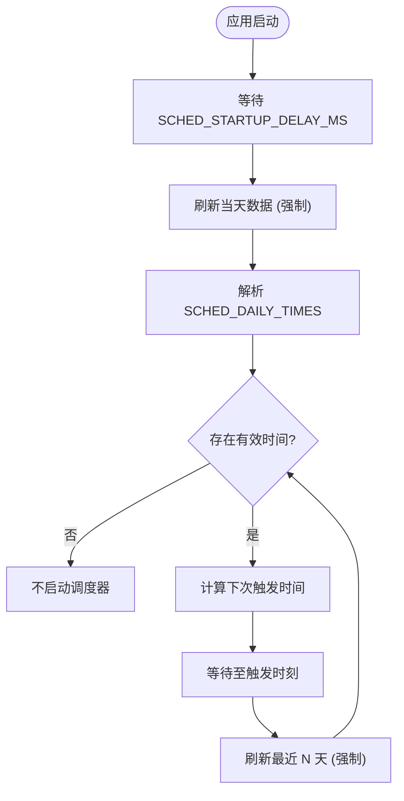
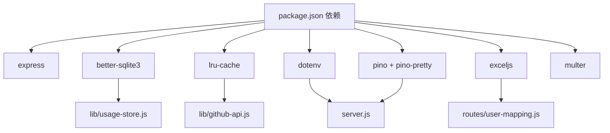

# 配置与定制

<cite>
**本文引用的文件**
- [package.json](file://package.json)
- [server.js](file://server.js)
- [lib/logger.js](file://lib/logger.js)
- [lib/github-api.js](file://lib/github-api.js)
- [lib/scheduler.js](file://lib/scheduler.js)
- [lib/usage-store.js](file://lib/usage-store.js)
- [lib/billing-config.js](file://lib/billing-config.js)
- [lib/user-mapping.js](file://lib/user-mapping.js)
- [lib/helpers.js](file://lib/helpers.js)
- [routes/billing.js](file://routes/billing.js)
- [routes/costcenter.js](file://routes/costcenter.js)
- [routes/user-mapping.js](file://routes/user-mapping.js)
- [deploy/copilot-dashboard.service](file://deploy/copilot-dashboard.service)
- [deploy/nginx-copilot-dashboard.conf](file://deploy/nginx-copilot-dashboard.conf)
- [scripts/preflight-check.sh](file://scripts/preflight-check.sh)
- [scripts/preflight-check.js](file://scripts/preflight-check.js)
</cite>

## 目录
1. [简介](#简介)
2. [项目结构](#项目结构)
3. [核心组件](#核心组件)
4. [架构总览](#架构总览)
5. [详细组件分析](#详细组件分析)
6. [依赖关系分析](#依赖关系分析)
7. [性能考量](#性能考量)
8. [故障排除指南](#故障排除指南)
9. [结论](#结论)
10. [附录](#附录)

## 简介
本指南面向系统管理员与运维工程师，提供 CopilotEnterpriseUsageDisplay 的完整配置与定制说明。内容覆盖：
- 环境变量作用与配置方法（GitHub API、缓存策略、调度器、日志级别等）
- 缓存架构配置（内存缓存、SQLite 持久化、ETag 条件请求 TTL）
- 自动刷新调度器的定制（时间、回填天数、启动延迟）
- 前端缓存策略与性能优化建议
- 不同部署场景的最佳实践（开发、测试、生产）
- 用户映射文件格式与定制化显示规则
- 成本中心功能配置与企业级定制要点
- 完整的配置管理与故障排除流程

## 项目结构
应用采用模块化组织，核心逻辑集中在 lib 与 routes 目录，服务入口在 server.js，部署与反向代理配置位于 deploy 目录。

图表来源
- [server.js:1-182](file://server.js#L1-L182)
- [lib/logger.js:1-41](file://lib/logger.js#L1-L41)
- [lib/github-api.js:1-320](file://lib/github-api.js#L1-L320)
- [lib/usage-store.js:1-324](file://lib/usage-store.js#L1-L324)
- [lib/scheduler.js:1-160](file://lib/scheduler.js#L1-L160)
- [lib/user-mapping.js:1-158](file://lib/user-mapping.js#L1-L158)
- [lib/billing-config.js:1-25](file://lib/billing-config.js#L1-L25)
- [lib/helpers.js:1-83](file://lib/helpers.js#L1-L83)
- [routes/billing.js:1-106](file://routes/billing.js#L1-L106)
- [routes/costcenter.js:1-252](file://routes/costcenter.js#L1-L252)
- [routes/user-mapping.js:1-135](file://routes/user-mapping.js#L1-L135)
- [deploy/nginx-copilot-dashboard.conf:1-14](file://deploy/nginx-copilot-dashboard.conf#L1-L14)
- [deploy/copilot-dashboard.service:1-18](file://deploy/copilot-dashboard.service#L1-L18)

章节来源
- [server.js:1-182](file://server.js#L1-L182)
- [package.json:1-26](file://package.json#L1-L26)

## 核心组件
- 日志系统：基于 pino，支持按环境切换日志级别与输出格式，并对敏感字段进行脱敏。
- GitHub API 客户端：封装并发队列、重试退避、LRU GET 缓存、ETag 条件请求与单飞去重。
- 使用数据存储：SQLite 表结构包含每日用量、座位快照、ETag 缓存与月度账单，带索引与清理策略。
- 调度器：每日定时刷新最近 N 天用量，支持禁用、回填天数与启动延迟配置。
- 计费配置：计划类型、配额、单价与超量计费计算。
- 用户映射：本地 JSON 映射文件，支持热加载与文件变更监控。
- 辅助工具：查询参数构建、端点选择（企业/组织）、错误统一处理。

章节来源
- [lib/logger.js:1-41](file://lib/logger.js#L1-L41)
- [lib/github-api.js:1-320](file://lib/github-api.js#L1-L320)
- [lib/usage-store.js:1-324](file://lib/usage-store.js#L1-L324)
- [lib/scheduler.js:1-160](file://lib/scheduler.js#L1-L160)
- [lib/billing-config.js:1-25](file://lib/billing-config.js#L1-L25)
- [lib/user-mapping.js:1-158](file://lib/user-mapping.js#L1-L158)
- [lib/helpers.js:1-83](file://lib/helpers.js#L1-L83)

## 架构总览
下图展示从浏览器到后端路由、API 缓存与数据库的交互路径，以及调度器的自动刷新机制。

图表来源
- [server.js:1-182](file://server.js#L1-L182)
- [lib/logger.js:1-41](file://lib/logger.js#L1-L41)
- [lib/github-api.js:1-320](file://lib/github-api.js#L1-L320)
- [lib/usage-store.js:1-324](file://lib/usage-store.js#L1-L324)
- [lib/scheduler.js:1-160](file://lib/scheduler.js#L1-L160)
- [lib/user-mapping.js:1-158](file://lib/user-mapping.js#L1-L158)
- [lib/billing-config.js:1-25](file://lib/billing-config.js#L1-L25)
- [lib/helpers.js:1-83](file://lib/helpers.js#L1-L83)
- [deploy/nginx-copilot-dashboard.conf:1-14](file://deploy/nginx-copilot-dashboard.conf#L1-L14)

## 详细组件分析

### 环境变量与配置项总览
以下为本项目涉及的关键环境变量及其作用范围与默认值说明（若存在）：

- GitHub API 配置
  - GITHUB_TOKEN：必填，用于访问 GitHub API。
  - GITHUB_API_BASE：可选，默认 https://api.github.com；用于指向 GitHub 企业版 API 或自定义网关。
  - GITHUB_MAX_CONCURRENT：并发请求数，默认 3；用于限流与资源占用控制。
  - GITHUB_MAX_RETRIES：最大重试次数，默认 3；配合指数退避与速率限制处理。
- 日志与运行时
  - NODE_ENV：生产/开发模式，影响日志级别默认值。
  - LOG_LEVEL：显式设置日志级别，优先于 NODE_ENV。
  - PORT：服务监听端口，默认 3000。
- 调度器
  - SCHED_DISABLED：设为 "true" 禁用调度器（适用于只读副本或多实例场景）。
  - SCHED_DAILY_TIMES：逗号分隔的 HH:MM 列表，默认 "03:00,12:00"。
  - SCHED_BACKFILL_DAYS：回填天数，默认 2（包含当天）。
  - SCHED_STARTUP_DELAY_MS：启动延迟毫秒数，默认 5000。
- 计费与账单
  - ENTERPRISE_SLUG 或 ORG_NAME：二选一，决定企业或组织维度的账单查询端点。
  - BILLING_YEAR/BILLING_MONTH/BILLING_DAY：账单查询的年、月、日参数。
  - PRODUCT/MODEL：产品与模型过滤参数。
  - INCLUDED_QUOTA：业务计划的包含配额，默认 300。
- 前端与静态资源
  - 前端缓存策略由 Nginx 与浏览器共同实现，可通过反代配置调整缓存头与压缩策略。
- 部署与 systemd
  - systemd 服务通过 EnvironmentFile 加载 .env；确保 .env 放置于 /opt/copilot-dashboard/.env 并具备正确权限。

章节来源
- [lib/github-api.js:24-27](file://lib/github-api.js#L24-L27)
- [lib/github-api.js:111-115](file://lib/github-api.js#L111-L115)
- [lib/logger.js:13-14](file://lib/logger.js#L13-L14)
- [server.js:11](file://server.js#L11)
- [lib/scheduler.js:14-19](file://lib/scheduler.js#L14-L19)
- [lib/billing-config.js:11](file://lib/billing-config.js#L11)
- [lib/helpers.js:58-80](file://lib/helpers.js#L58-L80)
- [deploy/copilot-dashboard.service:12](file://deploy/copilot-dashboard.service#L12)
- [deploy/nginx-copilot-dashboard.conf:1-14](file://deploy/nginx-copilot-dashboard.conf#L1-L14)

### GitHub API 配置与缓存策略
- 并发与重试
  - 并发上限由 GITHUB_MAX_CONCURRENT 控制；内部维护运行中的请求数与等待队列，避免瞬时拥塞。
  - 最大重试次数由 GITHUB_MAX_RETRIES 控制；当遇到 429/403（速率限制）或 5xx 时，按 retry-after、速率限制重置时间或指数退避策略等待。
- LRU GET 缓存
  - 对 GET 请求启用 LRU 缓存，键为方法+路径+排序后的查询参数；命中则直接返回缓存数据。
  - 缓存 TTL 由路径匹配函数动态决定，部分路径（如 seats、teams、预算、usage、cost-centers 等）具有特定 TTL。
- ETag 条件请求与 SQLite 持久化
  - 首次请求成功后保存 ETag 与响应体；后续请求携带 If-None-Match，若 304，则复用缓存数据并更新内存 ETag 映射。
  - 内存 ETag 映射与 SQLite etag_cache 表双向同步，重启后通过 initEtagCache 恢复。
- 单飞去重
  - 对同一缓存键的并发请求进行去重，避免重复拉取。

图表来源
- [lib/github-api.js:57-98](file://lib/github-api.js#L57-L98)
- [lib/github-api.js:231-269](file://lib/github-api.js#L231-L269)
- [lib/github-api.js:271-289](file://lib/github-api.js#L271-L289)
- [lib/usage-store.js:241-278](file://lib/usage-store.js#L241-L278)

章节来源
- [lib/github-api.js:57-98](file://lib/github-api.js#L57-L98)
- [lib/github-api.js:231-269](file://lib/github-api.js#L231-L269)
- [lib/github-api.js:271-289](file://lib/github-api.js#L271-L289)
- [lib/usage-store.js:241-278](file://lib/usage-store.js#L241-L278)

### 调度器参数与自动刷新
- 启动行为
  - 应用启动后按 SCHED_STARTUP_DELAY_MS 延迟执行一次“仅今天”的刷新，保证首次访问时数据尽可能新鲜。
- 固定时间槽
  - 解析 SCHED_DAILY_TIMES（如 "03:00,12:00"），计算下次触发距离当前的时间并设置定时器。
- 回填策略
  - 每次触发刷新最近 N 天（包含当天），N 由 SCHED_BACKFILL_DAYS 指定；刷新时绕过内存与 SQLite TTL，强制拉取最新数据。
- 多实例安全
  - 当 SCHED_DISABLED=true 时，调度器完全禁用，适合只读副本或额外工作进程。

图表来源
- [lib/scheduler.js:54-157](file://lib/scheduler.js#L54-L157)

章节来源
- [lib/scheduler.js:14-19](file://lib/scheduler.js#L14-L19)
- [lib/scheduler.js:54-157](file://lib/scheduler.js#L54-L157)

### 日志级别与可观测性
- 日志级别
  - 开发模式默认 debug，生产模式默认 info；可通过 LOG_LEVEL 覆盖。
  - 日志包含请求时间、来源地址、方法、URL、动作、状态码、耗时等字段。
- 敏感信息脱敏
  - 对 authorization、token、password、secret 等字段进行脱敏处理。
- 输出格式
  - 开发模式使用 pino-pretty 彩色输出，生产模式直出 JSON。

章节来源
- [lib/logger.js:13-38](file://lib/logger.js#L13-L38)

### 计费配置与成本中心功能
- 计费配置
  - PLAN_CONFIG 定义 business 与 enterprise 两种计划的配额、基础费用与超量单价。
  - INCLUDED_QUOTA 可通过环境变量覆盖默认值。
- 成本中心
  - 通过 ENTERPRISE_SLUG 获取企业维度的成本中心列表与预算，结合预算允许的 SKU 过滤实际消耗。
  - 支持按名称查询成本中心详情、批量从团队导入用户并可选择移除缺失用户。

章节来源
- [lib/billing-config.js:11-22](file://lib/billing-config.js#L11-L22)
- [routes/costcenter.js:10-29](file://routes/costcenter.js#L10-L29)
- [routes/costcenter.js:113-171](file://routes/costcenter.js#L113-L171)
- [routes/costcenter.js:173-248](file://routes/costcenter.js#L173-L248)

### 用户映射文件与定制化显示
- 文件位置与格式
  - 默认路径 data/user_mapping.json；必须为数组，每条记录包含 "AD-name"、"AD-mail"、"Github-name"、"Github-mail" 字段。
  - 仅当 "AD-name" 与 "Github-name" 非空时计入有效映射。
- 功能特性
  - 支持 Excel 导入（.xlsx/.xls），自动转换为 JSON 并写入 user_mapping.json。
  - 提供手动重载接口，支持文件变更监控与防抖重载。
  - 在成员列表与用户信息查询中，可将 GitHub 登录名映射为 AD 名称与邮箱，用于定制化展示。

章节来源
- [lib/user-mapping.js:24-92](file://lib/user-mapping.js#L24-L92)
- [routes/user-mapping.js:39-70](file://routes/user-mapping.js#L39-L70)
- [routes/user-mapping.js:96-102](file://routes/user-mapping.js#L96-L102)
- [routes/user-mapping.js:104-131](file://routes/user-mapping.js#L104-L131)

### 前端缓存策略与性能优化
- 反向代理缓存
  - Nginx 将请求转发至本地 3000 端口；可在反代层增加静态资源缓存与压缩策略以提升性能。
- 浏览器缓存
  - 前端资源通过 Express 静态托管；可在 Nginx 层设置 Expires/Cache-Control 与 gzip/br 压缩。
- API 缓存
  - GitHub API 层面已内置 ETag 条件请求与 LRU 缓存；应用层 SQLite 持久化 ETag，减少重复请求与网络开销。

章节来源
- [server.js:13-14](file://server.js#L13-L14)
- [deploy/nginx-copilot-dashboard.conf:1-14](file://deploy/nginx-copilot-dashboard.conf#L1-L14)
- [lib/github-api.js:57-98](file://lib/github-api.js#L57-L98)
- [lib/usage-store.js:241-278](file://lib/usage-store.js#L241-L278)

## 依赖关系分析
- 运行时依赖
  - Express：Web 服务器与路由框架。
  - better-sqlite3：高性能 SQLite 客户端。
  - lru-cache：LRU 缓存。
  - dotenv：加载 .env。
  - exceljs：Excel 文件解析。
  - pino/pino-pretty：结构化日志。
  - multer：文件上传中间件。
- 组件耦合
  - server.js 作为入口，集中初始化日志、存储、ETag 缓存、调度器与路由。
  - routes 依赖 lib 层工具与配置，形成清晰的分层。

图表来源
- [package.json:12-21](file://package.json#L12-L21)
- [server.js:1-10](file://server.js#L1-L10)
- [lib/github-api.js:8](file://lib/github-api.js#L8)
- [lib/usage-store.js:3](file://lib/usage-store.js#L3)
- [routes/user-mapping.js:8](file://routes/user-mapping.js#L8)

章节来源
- [package.json:12-21](file://package.json#L12-L21)

## 性能考量
- GitHub API 并发与重试
  - 合理设置 GITHUB_MAX_CONCURRENT 与 GITHUB_MAX_RETRIES，避免触发速率限制与服务端压力。
- 缓存 TTL 与回填
  - 根据数据更新频率与准确性需求调整路径级 TTL；调度器回填可确保滞后数据补齐。
- SQLite 与 ETag
  - 定期清理过期数据（使用数据与 ETag 缓存）；限制座位快照数量防止无限增长。
- 日志级别
  - 生产环境建议 info 或更高，避免过多 debug 日志带来的 I/O 压力。

章节来源
- [lib/github-api.js:24-27](file://lib/github-api.js#L24-L27)
- [lib/usage-store.js:6-8](file://lib/usage-store.js#L6-L8)
- [lib/usage-store.js:195-198](file://lib/usage-store.js#L195-L198)
- [lib/usage-store.js:275-278](file://lib/usage-store.js#L275-L278)
- [lib/logger.js:13-14](file://lib/logger.js#L13-L14)

## 故障排除指南
- 启动前检查
  - 使用 preflight-check.sh/js 检查 .env 必填项（GITHUB_TOKEN、ENTERPRISE_SLUG 或 ORG_NAME）、端口、DNS 与 HTTPS 可达性。
- 常见问题定位
  - 401/403：检查 GITHUB_TOKEN 是否有效、权限是否足够。
  - 429：降低并发或增加重试等待，观察速率限制重置时间。
  - 5xx：检查 GitHub API 可达性与网络连通性。
  - 日志级别：生产环境开启 info，必要时临时提升到 debug 定位问题。
- 资源释放与优雅停机
  - 应用监听 SIGTERM/SIGINT，关闭 HTTP 服务器、调度器、数据库与映射服务，10 秒后强制退出。

章节来源
- [scripts/preflight-check.sh:71-113](file://scripts/preflight-check.sh#L71-L113)
- [scripts/preflight-check.js:23-31](file://scripts/preflight-check.js#L23-L31)
- [server.js:150-182](file://server.js#L150-L182)

## 结论
本指南提供了 CopilotEnterpriseUsageDisplay 的全栈配置与定制方案，涵盖 GitHub API、缓存、调度器、日志、成本中心、用户映射与部署等关键方面。通过合理设置环境变量与缓存策略，结合调度器的回填机制与前端反代优化，可在不同环境中获得稳定、高效与可维护的运行体验。

## 附录

### 环境变量清单与建议值
- GitHub API
  - GITHUB_TOKEN：必填，建议使用细粒度 Token。
  - GITHUB_API_BASE：默认 https://api.github.com；企业版可指向对应网关。
  - GITHUB_MAX_CONCURRENT：默认 3；高并发场景可适度提高。
  - GITHUB_MAX_RETRIES：默认 3；网络波动较大时可提高。
- 日志与运行
  - NODE_ENV：生产/开发；生产建议 production。
  - LOG_LEVEL：info 或更高；调试阶段可设为 debug。
  - PORT：默认 3000；多实例时注意端口冲突。
- 调度器
  - SCHED_DISABLED：默认 false；只读副本设为 true。
  - SCHED_DAILY_TIMES：默认 "03:00,12:00"；根据业务窗口调整。
  - SCHED_BACKFILL_DAYS：默认 2；若 GitHub 数据滞后较长可提高。
  - SCHED_STARTUP_DELAY_MS：默认 5000；确保应用完全启动。
- 计费与账单
  - ENTERPRISE_SLUG 或 ORG_NAME：二选一，决定查询维度。
  - BILLING_YEAR/MONTH/DAY：按需设置；为空则使用当前时间。
  - PRODUCT/MODEL：按需过滤。
  - INCLUDED_QUOTA：业务计划包含配额，可按实际情况调整。
- 部署
  - systemd：通过 EnvironmentFile=/opt/copilot-dashboard/.env 加载配置。
  - Nginx：将 80 端口转发至 127.0.0.1:3000。

章节来源
- [lib/github-api.js:24-27](file://lib/github-api.js#L24-L27)
- [lib/github-api.js:111-115](file://lib/github-api.js#L111-L115)
- [lib/logger.js:13-14](file://lib/logger.js#L13-L14)
- [server.js:11](file://server.js#L11)
- [lib/scheduler.js:14-19](file://lib/scheduler.js#L14-L19)
- [lib/billing-config.js:11](file://lib/billing-config.js#L11)
- [lib/helpers.js:58-80](file://lib/helpers.js#L58-L80)
- [deploy/copilot-dashboard.service:12](file://deploy/copilot-dashboard.service#L12)
- [deploy/nginx-copilot-dashboard.conf:1-14](file://deploy/nginx-copilot-dashboard.conf#L1-L14)

### 不同部署场景的最佳实践
- 开发环境
  - NODE_ENV=development，LOG_LEVEL=debug，便于快速迭代与问题定位。
  - 可适当提高 GITHUB_MAX_CONCURRENT 以缩短拉取时间。
- 测试环境
  - 与生产相近的配置，但可启用更严格的日志级别与更短的回填天数以验证刷新逻辑。
- 生产环境
  - NODE_ENV=production，LOG_LEVEL=info，启用 systemd 与 Nginx 反代。
  - 合理设置调度器回填天数与启动延迟，避免高峰时段大量请求。
  - 定期清理 SQLite 中过期数据，保持数据库健康。

章节来源
- [lib/logger.js:13-14](file://lib/logger.js#L13-L14)
- [lib/scheduler.js:69-71](file://lib/scheduler.js#L69-L71)
- [lib/usage-store.js:195-198](file://lib/usage-store.js#L195-L198)
- [deploy/copilot-dashboard.service:12](file://deploy/copilot-dashboard.service#L12)
- [deploy/nginx-copilot-dashboard.conf:1-14](file://deploy/nginx-copilot-dashboard.conf#L1-L14)