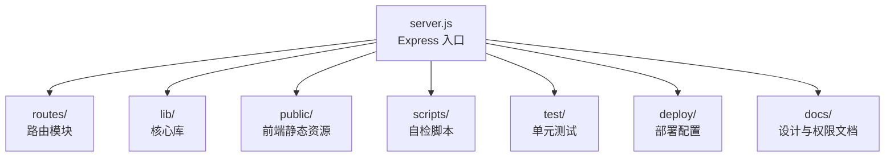
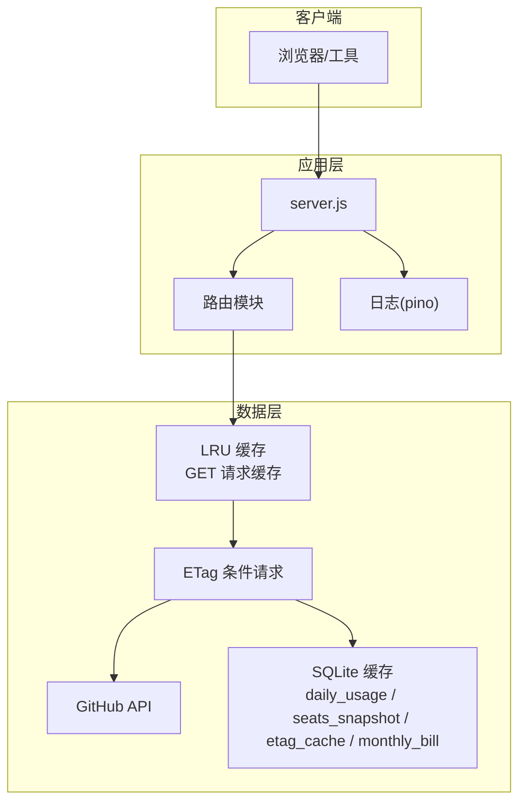
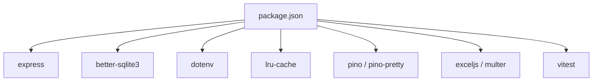

# 快速开始

<cite>
**本文引用的文件**
- [README.md](file://README.md)
- [package.json](file://package.json)
- [server.js](file://server.js)
- [.env.example](file://.env.example)
- [scripts/preflight-check.js](file://scripts/preflight-check.js)
- [scripts/preflight-check.sh](file://scripts/preflight-check.sh)
- [lib/github-api.js](file://lib/github-api.js)
- [lib/usage-store.js](file://lib/usage-store.js)
- [docs/github-enterprise-copilot-billing-scope-checklist.md](file://docs/github-enterprise-copilot-billing-scope-checklist.md)
- [docs/minimal-env-and-preflight-design.md](file://docs/minimal-env-and-preflight-design.md)
</cite>

## 目录
1. [简介](#简介)
2. [项目结构](#项目结构)
3. [核心组件](#核心组件)
4. [架构概览](#架构概览)
5. [详细组件分析](#详细组件分析)
6. [依赖分析](#依赖分析)
7. [性能考虑](#性能考虑)
8. [故障排除指南](#故障排除指南)
9. [结论](#结论)
10. [附录](#附录)

## 简介
本指南面向首次部署 CopilotEnterpriseUsageDisplay 的管理员与开发者，帮助你在最短时间内完成安装、配置与启动，并掌握权限校验、启动前自检、多种启动方式与常见问题排查方法。项目基于 Node.js + Express，提供 GitHub Copilot Premium Request 用量可视化仪表盘，支持每用户用量排行、费用估算、Team 管理与账单汇总等功能。

## 项目结构
项目采用模块化分层架构，后端入口为 server.js，路由按功能拆分，核心库包括 GitHub API 服务、SQLite 缓存、调度器与日志等。前端静态资源位于 public 目录，测试位于 test 目录，部署与文档位于 deploy 与 docs 目录。

图表来源
- [server.js:1-182](file://server.js#L1-L182)
- [README.md:46-96](file://README.md#L46-L96)

章节来源
- [README.md:46-96](file://README.md#L46-L96)
- [server.js:1-182](file://server.js#L1-L182)

## 核心组件
- 服务入口与路由挂载：server.js 负责加载环境变量、挂载路由、健康检查、全局错误处理与优雅关闭。
- GitHub API 服务：封装并发队列、重试与退避、ETag 条件请求、单次飞行去重与 LRU 缓存。
- SQLite 持久缓存：三层缓存体系（内存 → SQLite → GitHub API），支持每日用量、席位快照、ETag 持久化与月度账单。
- 调度器：默认开启的自动刷新调度器，按配置在特定时间点强制刷新近期数据。
- 日志：pino 结构化日志，区分开发与生产输出格式。
- 自检脚本：Shell 与 Node 两版，用于环境变量、网络连通性、Token 有效性与关键 API 权限探测。

章节来源
- [server.js:1-182](file://server.js#L1-L182)
- [lib/github-api.js:1-200](file://lib/github-api.js#L1-L200)
- [lib/usage-store.js:1-200](file://lib/usage-store.js#L1-L200)
- [scripts/preflight-check.js:1-188](file://scripts/preflight-check.js#L1-L188)
- [scripts/preflight-check.sh:1-182](file://scripts/preflight-check.sh#L1-L182)

## 架构概览
系统采用三层缓存与多级保护机制，减少对 GitHub API 的调用压力，提升响应速度与稳定性。

图表来源
- [lib/github-api.js:57-168](file://lib/github-api.js#L57-L168)
- [lib/usage-store.js:24-79](file://lib/usage-store.js#L24-L79)
- [server.js:101-118](file://server.js#L101-L118)

## 详细组件分析

### 安装与前置要求
- Node.js 版本要求：>= 18
- GitHub PAT 权限：至少具备 Enterprise billing 读取权限，推荐使用 PAT classic，并包含最小 scope（manage_billing:copilot + read:enterprise）

安装步骤
- 克隆仓库并安装依赖
- 复制示例配置文件并填写必要环境变量
- 启动服务或运行开发模式

章节来源
- [README.md:132-143](file://README.md#L132-L143)
- [README.md:196-217](file://README.md#L196-L217)

### 环境变量配置
必填项
- GITHUB_TOKEN：GitHub PAT（classic），需具备 Enterprise billing 读取权限
- ENTERPRISE_SLUG：企业 slug（如 YourEnterprise-slug）

可选项
- BILLING_YEAR / BILLING_MONTH / BILLING_DAY：账单查询日期
- PRODUCT / MODEL：产品与模型过滤
- INCLUDED_QUOTA：每用户每周期包含请求配额（默认 300）
- CACHE_TTL：前端缓存时长（秒，默认 300）
- GITHUB_MAX_CONCURRENT / GITHUB_MAX_RETRIES：GitHub API 并发与重试上限
- GITHUB_API_BASE：API 地址（默认 https://api.github.com）
- PORT：服务端口（默认 3000）
- SCHED_*：自动刷新调度器相关配置（SCHED_DISABLED、SCHED_DAILY_TIMES、SCHED_BACKFILL_DAYS、SCHED_STARTUP_DELAY_MS）

章节来源
- [.env.example:1-35](file://.env.example#L1-L35)
- [README.md:196-217](file://README.md#L196-L217)

### 获取与配置 GitHub PAT
- 在 GitHub 上生成 PAT classic，确保具备最小 scope：manage_billing:copilot + read:enterprise
- 将生成的 token 填入 .env 的 GITHUB_TOKEN 字段
- ENTERPRISE_SLUG 填写企业 slug（可在企业设置中查看）

章节来源
- [docs/github-enterprise-copilot-billing-scope-checklist.md:14-21](file://docs/github-enterprise-copilot-billing-scope-checklist.md#L14-L21)
- [.env.example:1-8](file://.env.example#L1-L8)

### 启动方式
- 生产环境启动
  - npm start
  - 访问 http://localhost:3000
- 开发模式启动（文件变更自动重启）
  - npm run dev
- 运行测试
  - npm test / npm run test:watch

章节来源
- [README.md:159-178](file://README.md#L159-L178)
- [package.json:6-11](file://package.json#L6-L11)

### 启动前自检脚本
- Shell 版：./scripts/preflight-check.sh
- Node 版：node ./scripts/preflight-check.js
- 严格模式：添加 --strict 将 WARN 视为 FAIL
- 检查内容
  - 必填环境变量校验
  - DNS 与网络连通性
  - Token 有效性
  - Seats 与 Premium Usage 必要权限
  - Cost Centers / Budgets 能力探测（可选）

章节来源
- [README.md:180-194](file://README.md#L180-L194)
- [scripts/preflight-check.js:65-187](file://scripts/preflight-check.js#L65-L187)
- [scripts/preflight-check.sh:62-181](file://scripts/preflight-check.sh#L62-L181)
- [docs/minimal-env-and-preflight-design.md:40-138](file://docs/minimal-env-and-preflight-design.md#L40-L138)

### GitHub API 权限与必要性说明
- 用量查询与聚合：需要读取企业 Copilot 席位与 Premium Request 用量
- 账单汇总：需要读取企业整体账单
- Cost Center 与预算：按需启用，需要相应权限
- 不同权限级别
  - 只读看板：manage_billing:copilot + read:enterprise
  - 含写操作：补充 admin:enterprise（组织级接口补充 admin:org）

章节来源
- [docs/github-enterprise-copilot-billing-scope-checklist.md:14-21](file://docs/github-enterprise-copilot-billing-scope-checklist.md#L14-L21)
- [README.md:98-127](file://README.md#L98-L127)

### 三层缓存与刷新策略
- 缓存层次
  - 内存缓存（refreshCache、etagCache、teamCache）
  - SQLite 持久缓存（daily_usage、seats_snapshot、etag_cache、monthly_bill）
  - GitHub API
- 动态 TTL 抖动防护：近 3 天 1 小时，更老 90 天
- 自动刷新调度器：默认启动后强制刷新当天，每天固定时间点强制刷新近期 N 天
- 强制刷新接口：按日/按月强制回源 GitHub API 并覆盖写入

章节来源
- [README.md:218-288](file://README.md#L218-L288)
- [lib/usage-store.js:24-79](file://lib/usage-store.js#L24-L79)
- [lib/github-api.js:57-98](file://lib/github-api.js#L57-L98)

## 依赖分析
- 后端框架与工具
  - Express：Web 服务器与路由
  - better-sqlite3：SQLite 数据库访问
  - dotenv：环境变量加载
  - lru-cache：LRU 缓存
  - pino / pino-pretty：结构化日志
  - exceljs / multer：Excel 上传与解析
  - vitest：单元测试
- 前端静态资源：HTML/CSS/JS 位于 public 目录，按需加载

图表来源
- [package.json:12-24](file://package.json#L12-L24)

章节来源
- [package.json:12-24](file://package.json#L12-L24)

## 性能考虑
- 并发控制：通过并发队列与最大重试次数限制 GitHub API 调用，避免触发速率限制
- 缓存策略：三层缓存与 ETag 条件请求显著减少 API 调用
- 动态 TTL：针对近期数据采用更短 TTL，避免 GitHub Billing API 延迟导致的缓存“锁死”
- 自动刷新：默认开启的调度器在固定时间点回填近期数据，保证数据新鲜度

章节来源
- [lib/github-api.js:23-48](file://lib/github-api.js#L23-L48)
- [README.md:243-288](file://README.md#L243-L288)

## 故障排除指南
- 启动前自检失败
  - 检查 .env 中 GITHUB_TOKEN 与 ENTERPRISE_SLUG 是否正确
  - 确认网络可达性与 DNS 解析正常
  - 使用严格模式 (--strict) 将 WARN 视为 FAIL，确保无任何警告
- 权限不足
  - 确保 PAT classic 具备 manage_billing:copilot + read:enterprise
  - 如需写操作，补充 admin:enterprise（组织级接口补充 admin:org）
- API 速率限制
  - 调整 GITHUB_MAX_CONCURRENT 与 GITHUB_MAX_RETRIES
  - 使用强制刷新接口按日/按月回源 GitHub API
- 数据延迟
  - 使用自动刷新调度器或按月强制刷新，确保近期数据及时更新
- 健康检查
  - 访问 /api/health 确认服务运行状态

章节来源
- [scripts/preflight-check.js:65-187](file://scripts/preflight-check.js#L65-L187)
- [scripts/preflight-check.sh:62-181](file://scripts/preflight-check.sh#L62-L181)
- [docs/github-enterprise-copilot-billing-scope-checklist.md:14-21](file://docs/github-enterprise-copilot-billing-scope-checklist.md#L14-L21)
- [README.md:100-127](file://README.md#L100-L127)

## 结论
通过本快速开始指南，你可以在几分钟内完成安装、配置与启动，并借助自检脚本与权限文档确保部署的稳定性。建议在生产环境中先运行自检脚本，再启动服务，并根据实际需求调整并发与缓存策略，以获得最佳性能与可靠性。

## 附录
- 常用命令
  - 安装：npm install
  - 启动：npm start
  - 开发：npm run dev
  - 测试：npm test / npm run test:watch
  - 自检：./scripts/preflight-check.sh 或 node ./scripts/preflight-check.js
- 部署建议
  - 使用 systemd 与 Nginx 反向代理
  - 将数据目录与上传目录置于持久化路径
  - 通过 /api/health 进行健康检查

章节来源
- [README.md:412-470](file://README.md#L412-L470)
- [README.md:159-178](file://README.md#L159-L178)