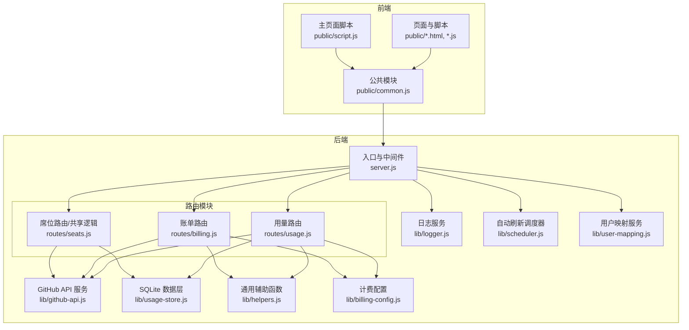
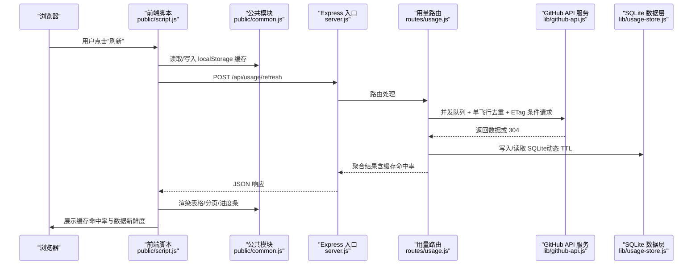
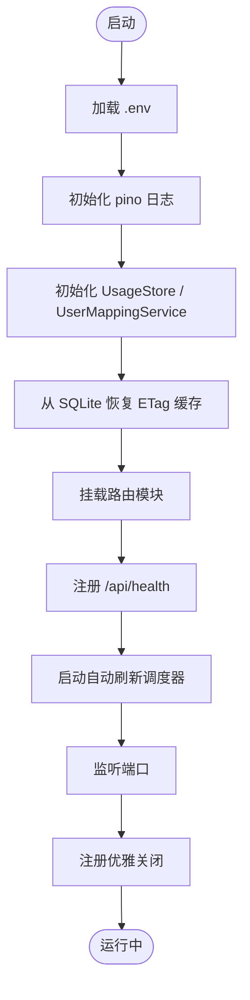
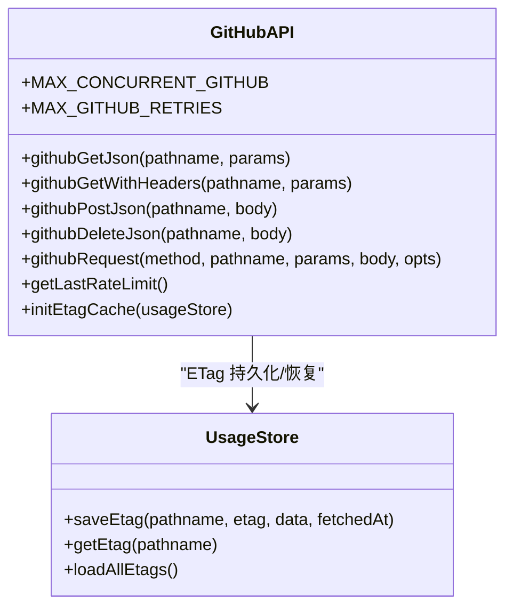
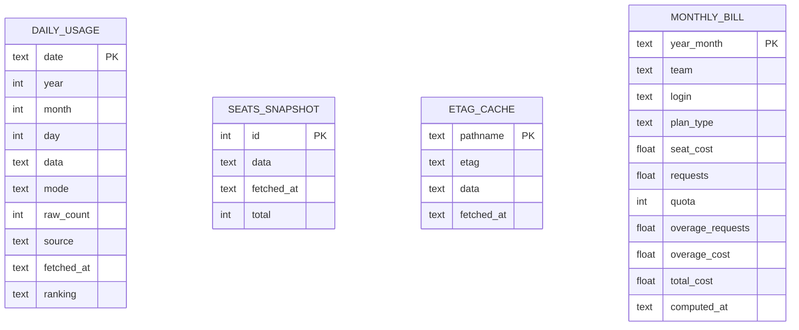
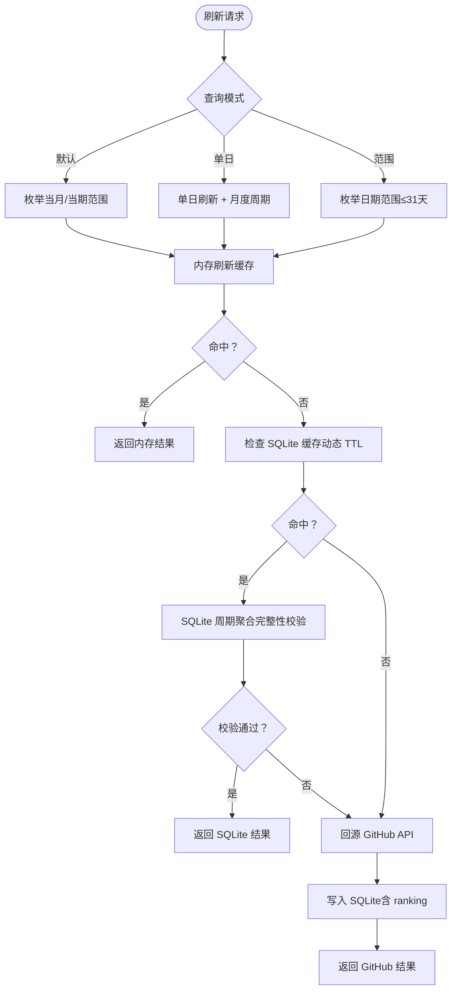
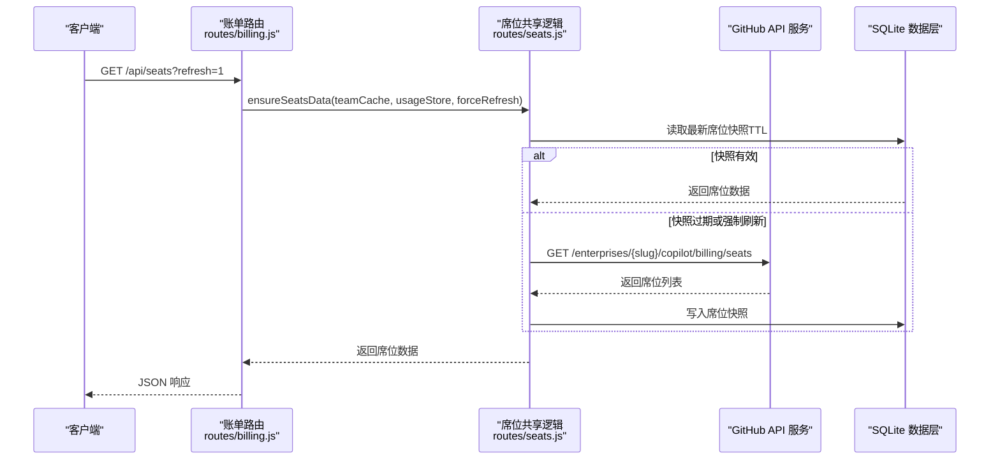
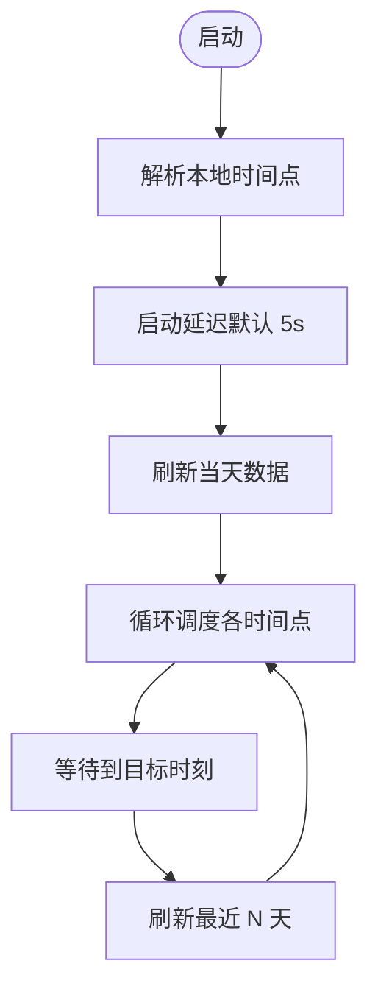
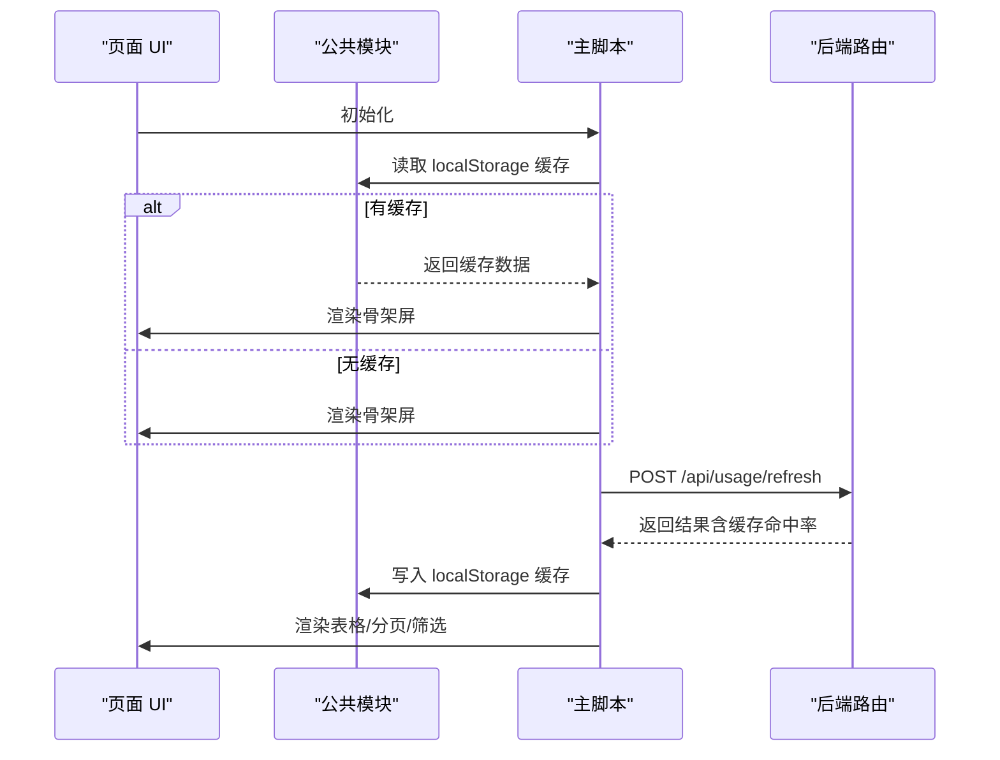
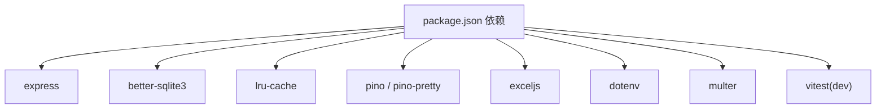

# 技术栈与架构

<cite>
**本文引用的文件**
- [README.md](file://README.md)
- [package.json](file://package.json)
- [server.js](file://server.js)
- [lib/logger.js](file://lib/logger.js)
- [lib/github-api.js](file://lib/github-api.js)
- [lib/usage-store.js](file://lib/usage-store.js)
- [lib/scheduler.js](file://lib/scheduler.js)
- [lib/user-mapping.js](file://lib/user-mapping.js)
- [lib/billing-config.js](file://lib/billing-config.js)
- [lib/helpers.js](file://lib/helpers.js)
- [routes/usage.js](file://routes/usage.js)
- [routes/billing.js](file://routes/billing.js)
- [routes/seats.js](file://routes/seats.js)
- [public/common.js](file://public/common.js)
- [public/script.js](file://public/script.js)
</cite>

## 目录
1. [简介](#简介)
2. [项目结构](#项目结构)
3. [核心组件](#核心组件)
4. [架构总览](#架构总览)
5. [详细组件分析](#详细组件分析)
6. [依赖分析](#依赖分析)
7. [性能考量](#性能考量)
8. [故障排查指南](#故障排查指南)
9. [结论](#结论)
10. [附录](#附录)

## 简介
本项目是一个基于 Node.js + Express 的 GitHub Copilot 企业用量可视化仪表盘，面向 GitHub Enterprise 管理员，提供每用户请求量排行、费用估算、Team 管理和账单汇总等功能。项目采用模块化分层架构，后端按入口层、路由层、服务层、数据层职责拆分；前端通过 IIFE + 公共命名空间封装，避免全局变量污染。核心特性包括三层缓存架构（内存缓存、SQLite 持久缓存、GitHub API）、并发控制与去重、优雅错误处理、结构化日志与健康检查、自动刷新调度器等。

## 项目结构
项目采用“模块化分层 + 前端 IIFE 封装”的组织方式：
- 入口与中间件：server.js 负责挂载路由、全局中间件、健康检查、优雅关闭与错误处理。
- 路由层：routes/* 模块化拆分，分别处理用量、账单、团队、成本中心、分析、用户映射、账单刷新等业务。
- 服务层：lib/* 提供 GitHub API 服务、SQLite 数据层、调度器、用户映射、计费配置、通用辅助函数等。
- 前端：public/* 包含页面 HTML 与脚本，common.js 作为公共模块，script.js 等页面脚本通过 IIFE 封装。
- 数据与配置：data/ 存放 SQLite 数据库与用户映射 JSON；.env 配置环境变量；package.json 管理依赖。

图表来源
- [server.js:1-182](file://server.js#L1-L182)
- [routes/usage.js:1-470](file://routes/usage.js#L1-L470)
- [routes/billing.js:1-106](file://routes/billing.js#L1-L106)
- [routes/seats.js:1-78](file://routes/seats.js#L1-L78)
- [lib/github-api.js:1-320](file://lib/github-api.js#L1-L320)
- [lib/usage-store.js:1-324](file://lib/usage-store.js#L1-L324)
- [lib/scheduler.js:1-160](file://lib/scheduler.js#L1-L160)
- [lib/user-mapping.js:1-158](file://lib/user-mapping.js#L1-L158)
- [lib/helpers.js:1-83](file://lib/helpers.js#L1-L83)
- [lib/billing-config.js:1-25](file://lib/billing-config.js#L1-L25)
- [public/common.js:1-113](file://public/common.js#L1-L113)
- [public/script.js:1-541](file://public/script.js#L1-L541)

章节来源
- [README.md:46-96](file://README.md#L46-L96)
- [server.js:1-182](file://server.js#L1-L182)

## 核心组件
- 后端框架与运行时
  - Express：提供路由、静态资源、中间件与错误处理。
  - dotenv：加载 .env 环境变量。
- 数据库与缓存
  - better-sqlite3：SQLite ORM，负责每日用量、账单、ETag、席位快照等持久化。
  - LRU 缓存：内存级 LRU 缓存（github-api）与内存 Map（刷新缓存、ETag、团队缓存）。
- 日志与可观测性
  - pino：结构化日志，支持开发/生产不同输出格式与敏感信息脱敏。
- 前端数据处理
  - ExcelJS：用于用户映射 Excel 文件解析与上传处理。
- 并发与去重
  - GitHub API 并发队列与单飞行去重，防止触发二级限流。
- 自动刷新与调度
  - 轻量调度器，基于 setTimeout 自重排，支持启动即刷与定时回填。

章节来源
- [package.json:12-21](file://package.json#L12-L21)
- [lib/logger.js:1-41](file://lib/logger.js#L1-L41)
- [lib/github-api.js:23-48](file://lib/github-api.js#L23-L48)
- [lib/usage-store.js:10-79](file://lib/usage-store.js#L10-L79)
- [lib/scheduler.js:54-157](file://lib/scheduler.js#L54-L157)

## 架构总览
系统采用“三层缓存 + GitHub API”的数据获取策略：
- 内存缓存：5 分钟（刷新缓存）+ ETag 条件请求 + 团队席位缓存。
- SQLite 持久缓存：每日用量、账单、ETag、席位快照，动态 TTL（近 3 天 1 小时，更老 90 天）。
- GitHub API：按需回源，配合并发队列、重试退避、单飞行去重与 ETag 条件请求。

图表来源
- [public/script.js:298-326](file://public/script.js#L298-L326)
- [routes/usage.js:387-462](file://routes/usage.js#L387-L462)
- [lib/github-api.js:170-227](file://lib/github-api.js#L170-L227)
- [lib/usage-store.js:135-198](file://lib/usage-store.js#L135-L198)

章节来源
- [README.md:218-242](file://README.md#L218-L242)
- [routes/usage.js:237-348](file://routes/usage.js#L237-L348)

## 详细组件分析

### 后端入口与中间件（server.js）
- 职责
  - 初始化日志、单例服务（UsageStore、UserMappingService）、ETag 缓存恢复。
  - 注册访问日志中间件（结构化输出）。
  - 挂载路由模块（用量、账单、团队、成本中心、分析、用户映射、账单刷新）。
  - 健康检查、全局错误处理、优雅关闭（SIGTERM/SIGINT）。
  - 启动自动刷新调度器，释放资源。
- 关键点
  - URL 到动作映射，便于日志追踪。
  - 通过依赖注入传递共享状态（UsageStore、teamCache、UserMappingService）。

图表来源
- [server.js:1-182](file://server.js#L1-L182)

章节来源
- [server.js:10-182](file://server.js#L10-L182)

### GitHub API 服务（lib/github-api.js）
- 职责
  - 并发队列：限制最大并发，避免触发二级限流。
  - 单飞行去重：相同请求键仅保留一个进行中 Promise。
  - LRU 缓存：GET 请求结果缓存（按路径 TTL 策略）。
  - ETag 条件请求：持久化 ETag，304 时不消耗配额。
  - 重试与退避：速率限制、5xx、配额归零时指数退避。
  - 错误包装：统一 ApiError，携带状态码与速率限制信息。
- 关键点
  - 缓存键构建、路径 TTL、ETag 持久化与恢复。
  - 与 UsageStore 协作，写入/读取 etag_cache。

图表来源
- [lib/github-api.js:1-320](file://lib/github-api.js#L1-L320)
- [lib/usage-store.js:241-278](file://lib/usage-store.js#L241-L278)

章节来源
- [lib/github-api.js:23-319](file://lib/github-api.js#L23-L319)

### SQLite 数据层（lib/usage-store.js）
- 职责
  - 表结构：daily_usage、seats_snapshot、etag_cache、monthly_bill。
  - 预编译语句：提升查询性能，避免 SQL 解析开销。
  - 动态 TTL：近 3 天 1 小时，更老 90 天，缓解 GitHub Billing API 延迟。
  - 席位快照清理：最多保留最近 20 条，避免膨胀。
  - ETag 缓存：与 GitHub API 协同，重启后恢复。
- 关键点
  - getFreshDays/getMissingDays：支持范围查询与缺失日期发现。
  - 事务写入 monthly_bill，保证一致性。

图表来源
- [lib/usage-store.js:24-71](file://lib/usage-store.js#L24-L71)

章节来源
- [lib/usage-store.js:10-324](file://lib/usage-store.js#L10-L324)

### 用量路由（routes/usage.js）
- 职责
  - 提供 /api/usage 查询与 /api/usage/refresh 刷新接口。
  - 三层缓存命中优先级：内存刷新缓存 → SQLite → GitHub API。
  - 月度周期聚合：SQLite 中按日聚合，进行三重完整性校验（覆盖、新鲜度、非空 ranking）。
  - 单日强制刷新：支持 force=true 跳过内存与 SQLite TTL，直接回源并覆盖写入。
  - per-user fallback：当 GitHub 返回未知用户或聚合不足时，按用户逐 API 聚合。
- 关键点
  - refreshForDateOverride：统一刷新入口，支持 force、单飞行去重、缓存命中统计。
  - getEffectiveTTL：动态 TTL 抖动防护。
  - buildCycleFromSQLite：周期聚合兜底策略。

图表来源
- [routes/usage.js:237-348](file://routes/usage.js#L237-L348)
- [routes/usage.js:134-235](file://routes/usage.js#L134-L235)

章节来源
- [routes/usage.js:13-470](file://routes/usage.js#L13-L470)

### 账单与席位路由（routes/billing.js, routes/seats.js）
- 职责
  - /api/seats：加载/刷新 Copilot 席位数据，支持强制刷新。
  - /api/billing/summary：企业整体账单汇总（席位费 + Premium Requests 超额）。
  - /api/billing/models：按月模型使用排行。
  - ensureSeatsData：优先从 SQLite 恢复，否则调用 GitHub API 并写入快照。
- 关键点
  - buildEndpoint/buildQueryParams：根据 ENTERPRISE_SLUG/ORG_NAME 生成端点与查询参数。
  - PLAN_CONFIG：按 Business/Enterprise 计算配额与单价。

图表来源
- [routes/billing.js:13-62](file://routes/billing.js#L13-L62)
- [routes/seats.js:37-75](file://routes/seats.js#L37-L75)

章节来源
- [routes/billing.js:1-106](file://routes/billing.js#L1-L106)
- [routes/seats.js:1-78](file://routes/seats.js#L1-L78)

### 自动刷新调度器（lib/scheduler.js）
- 职责
  - 启动后延迟刷新当天数据，随后在指定本地时间点刷新最近 N 天。
  - 多实例安全：通过 SCHED_DISABLED 控制是否启用。
  - 配置项：SCHED_DAILY_TIMES、SCHED_BACKFILL_DAYS、SCHED_STARTUP_DELAY_MS。
- 关键点
  - setTimeout 自重排，异常仅记录警告，不影响主流程。
  - 通过回调 forceRefreshDay 与路由共享刷新逻辑。

图表来源
- [lib/scheduler.js:54-157](file://lib/scheduler.js#L54-L157)

章节来源
- [lib/scheduler.js:1-160](file://lib/scheduler.js#L1-L160)

### 用户映射服务（lib/user-mapping.js）
- 职责
  - 读取 data/user_mapping.json，提供 GitHub 用户名到展示名的映射。
  - fs.watch + debounce（300ms）热重载，避免频繁 I/O。
  - 提供查询接口与统计信息。
- 关键点
  - 文件不存在自动创建空数组，异常安全降级。

章节来源
- [lib/user-mapping.js:1-158](file://lib/user-mapping.js#L1-L158)

### 前端公共模块与页面脚本（public/common.js, public/script.js）
- 公共模块（common.js）
  - 提供 HTML 转义、时间格式化、错误处理、ETag/速率限制消息格式化、fetch 封装、本地缓存（localStorage）等。
- 主页面脚本（script.js）
  - 首屏加载：若 localStorage 缓存存在则先渲染，再发起一次刷新请求。
  - 三种查询模式：默认（按月）、单日、日期范围。
  - 分页与排序、Team 筛选、缓存命中率展示、自动刷新、模态框（席位/账单/模型/预算）。
  - 与后端交互：/api/usage/refresh、/api/seats、/api/billing/*、/api/enterprise-teams/* 等。

图表来源
- [public/script.js:298-340](file://public/script.js#L298-L340)
- [public/common.js:82-96](file://public/common.js#L82-L96)

章节来源
- [public/common.js:1-113](file://public/common.js#L1-L113)
- [public/script.js:1-541](file://public/script.js#L1-L541)

## 依赖分析
- 运行时与框架
  - Express：路由与中间件。
  - better-sqlite3：高性能 SQLite 访问。
  - lru-cache：LRU 缓存。
  - pino/pino-pretty：结构化日志。
  - exceljs：Excel 文件解析。
  - dotenv：环境变量加载。
- 前端与工具
  - 前端无构建工具，直接使用原生 ES5 IIFE。
  - 测试：vitest（单元测试）。

图表来源
- [package.json:12-24](file://package.json#L12-L24)

章节来源
- [package.json:1-26](file://package.json#L1-L26)

## 性能考量
- 缓存策略
  - 三层缓存：内存（5 分钟）→ SQLite（动态 TTL）→ GitHub API，显著降低 API 调用。
  - ETag 条件请求：数据未变返回 304，不消耗配额。
  - 刷新缓存：按查询参数键去重，避免重复计算。
- 并发与限流
  - GitHub API 并发队列 + 单飞行去重，防止触发二级限流。
  - 重试与指数退避，结合速率限制信息反馈给前端。
- 数据库优化
  - 预编译语句、WAL 模式、索引，减少解析与 I/O 开销。
  - 动态 TTL 与缺失日期检测，避免空数据写入缓存。
- 前端体验
  - 骨架屏 + localStorage 缓存，首屏秒开。
  - 分页与虚拟滚动（通过分页实现）避免大数据阻塞主线程。
  - 自动刷新与缓存命中率展示，提升感知性能。

[本节为通用性能讨论，不直接分析具体文件]

## 故障排查指南
- 日志级别与输出
  - 开发：pino-pretty，彩色输出；生产：JSON 格式，支持结构化采集。
  - 敏感信息自动脱敏（Authorization、Token、Password、Secret）。
- 常见问题定位
  - 429/速率限制：查看日志中的 retry-after、resetAt，前端展示恢复时间。
  - GitHub API 失败：检查 .env 中 GITHUB_TOKEN、ENTERPRISE_SLUG/ORG_NAME 权限。
  - SQLite 异常：检查 data/usage.db 是否可写，必要时清理或迁移。
  - 自动刷新未生效：确认 SCHED_DISABLED=false，SCHED_DAILY_TIMES 格式正确。
- 优雅关闭
  - SIGTERM/SIGINT 触发，10 秒强制退出，释放数据库与调度器资源。

章节来源
- [lib/logger.js:13-38](file://lib/logger.js#L13-L38)
- [server.js:150-182](file://server.js#L150-L182)

## 结论
本项目通过模块化分层与三层缓存架构，在保证数据准确性的同时，显著降低了 GitHub API 调用频率与前端等待时间。后端以 Express 为核心，结合 better-sqlite3、pino、lru-cache 等成熟库，实现了高可用与可观测性；前端采用 IIFE 封装与公共模块，兼顾可维护性与性能。并发控制、ETag 条件请求、动态 TTL、自动刷新调度器等机制共同构成了稳定可靠的工程实践。

[本节为总结性内容，不直接分析具体文件]

## 附录
- 环境变量与配置
  - GITHUB_TOKEN、ENTERPRISE_SLUG、PRODUCT、MODEL、INCLUDED_QUOTA、CACHE_TTL、GITHUB_MAX_CONCURRENT、GITHUB_MAX_RETRIES、GITHUB_API_BASE、PORT、SCHED_DISABLED、SCHED_DAILY_TIMES、SCHED_BACKFILL_DAYS、SCHED_STARTUP_DELAY_MS、LOG_LEVEL。
- API 端点概览
  - /api/health、/api/usage、/api/usage/refresh、/api/seats、/api/billing/*、/api/analytics/*、/api/bill/*、/api/cost-centers/*、/user/*。

章节来源
- [README.md:196-217](file://README.md#L196-L217)
- [README.md:111-128](file://README.md#L111-L128)