# 核心功能特性

<cite>
**本文引用的文件**
- [README.md](file://README.md)
- [package.json](file://package.json)
- [server.js](file://server.js)
- [lib/billing-config.js](file://lib/billing-config.js)
- [lib/date-utils.js](file://lib/date-utils.js)
- [lib/github-api.js](file://lib/github-api.js)
- [lib/helpers.js](file://lib/helpers.js)
- [lib/usage-store.js](file://lib/usage-store.js)
- [lib/user-mapping.js](file://lib/user-mapping.js)
- [lib/logger.js](file://lib/logger.js)
- [routes/usage.js](file://routes/usage.js)
- [routes/billing.js](file://routes/billing.js)
- [routes/teams.js](file://routes/teams.js)
- [routes/costcenter.js](file://routes/costcenter.js)
- [routes/analytics.js](file://routes/analytics.js)
- [routes/user-mapping.js](file://routes/user-mapping.js)
- [routes/bill.js](file://routes/bill.js)
- [public/index.html](file://public/index.html)
- [public/user.html](file://public/user.html)
- [public/user.js](file://public/user.js)
- [public/costcenter.html](file://public/costcenter.html)
- [public/costcenter.js](file://public/costcenter.js)
- [public/common.js](file://public/common.js)
- [test/user-mapping.test.js](file://test/user-mapping.test.js)
</cite>

## 目录
1. [简介](#简介)
2. [项目结构](#项目结构)
3. [核心组件](#核心组件)
4. [架构总览](#架构总览)
5. [详细组件分析](#详细组件分析)
6. [依赖分析](#依赖分析)
7. [性能考量](#性能考量)
8. [故障排查指南](#故障排查指南)
9. [结论](#结论)
10. [附录](#附录)

## 简介
本项目是一个基于 Node.js + Express 的 GitHub Copilot Premium Request 用量可视化仪表盘，面向 GitHub Enterprise 管理员，提供每用户用量排行、费用估算、Team 管理和账单汇总等功能。本文聚焦"核心功能特性"，围绕以下能力进行深入说明：
- 每用户用量排行
- 默认范围查询模式
- 当日/本周期双列展示
- Team 多选筛选
- Premium Requests (%) 百分比计算与配额基线
- 费用估算（额度内/超额）
- 平滑刷新体验（SWR + 缓存）
- 防限流与并发控制
- 分批渲染大表（requestAnimationFrame + 分块）
- 排序、分页、用户映射、成本中心、模型排行、自动刷新调度器等

**更新** 新增 Excel 导出、用户映射管理、成本中心优化等核心功能特性

## 项目结构
后端采用模块化分层架构：入口层（server.js）、路由层（routes/*）、服务层（lib/*）、数据层（SQLite）。前端通过 IIFE + 公共命名空间组织页面脚本，首页提供默认"按日期范围查询"。

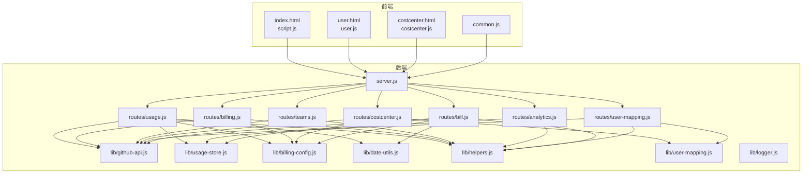

**图表来源**
- [server.js:1-182](file://server.js#L1-L182)
- [routes/usage.js:1-493](file://routes/usage.js#L1-L493)
- [routes/billing.js:1-106](file://routes/billing.js#L1-L106)
- [routes/teams.js:1-104](file://routes/teams.js#L1-L104)
- [routes/costcenter.js:1-246](file://routes/costcenter.js#L1-L246)
- [routes/analytics.js:1-132](file://routes/analytics.js#L1-L132)
- [routes/user-mapping.js:1-181](file://routes/user-mapping.js#L1-L181)
- [routes/bill.js:1-407](file://routes/bill.js#L1-L407)
- [lib/github-api.js:1-320](file://lib/github-api.js#L1-L320)
- [lib/usage-store.js:1-324](file://lib/usage-store.js#L1-L324)
- [lib/billing-config.js:1-25](file://lib/billing-config.js#L1-L25)
- [lib/date-utils.js:1-46](file://lib/date-utils.js#L1-L46)
- [lib/helpers.js:1-149](file://lib/helpers.js#L1-L149)
- [lib/user-mapping.js:1-173](file://lib/user-mapping.js#L1-L173)
- [lib/logger.js:1-41](file://lib/logger.js#L1-L41)

**章节来源**
- [README.md:46-96](file://README.md#L46-L96)
- [server.js:88-98](file://server.js#L88-L98)

## 核心组件
- 每用户用量排行：按日期/范围聚合用户请求量，支持"按日期查询"时同时显示当日与本周期累计。
- 默认范围查询模式：首页默认切换为"按日期范围查询"，提升批量分析效率。
- 当日/本周期双列展示：在"按日期查询"模式下，表格同时呈现当日请求量与本周期累计请求量。
- Team 多选筛选：支持下拉复选 Team，默认全选，可按 Team 过滤表格数据。
- Premium Requests (%)：基于订阅计划额度（Business=300、Enterprise=1000）计算百分比，用于配额进度条与超额标记。
- 费用估算：额度内按基础价计费，超出部分按 $0.04/request 累加。
- 平滑刷新体验：采用 SWR（Stale-While-Revalidate）缓存策略，刷新时优先显示缓存并后台静默更新，配合骨架屏消除长时间白屏感知。
- 防限流与并发控制：内置 GitHub API 调用并发队列与请求防抖（single-flight），遇速率限制自动指数退避重试。
- 分批渲染大表：处理海量用量数据时采用 requestAnimationFrame 进行 chunked 渲染，避免卡死浏览器主线程。
- 排序与分页：全部表格列支持升序/降序点击排序；默认每页 15 行，支持页码跳转。
- 用户与 Team 信息：查看 Enterprise Teams（名称、描述、成员数），点击展开查看 Team 成员。
- 整体账单汇总：席位订阅费 + Premium Requests 超额计算 + 费用合计。
- 模型使用排行：按月查看各 AI 模型的请求量和费用占比。
- 成本中心详情增强：点击名称查看常规信息卡片、资源分组明细（Users/Organizations/Repositories）。
- 成本中心预算进度条：预算按百分比可视化（<75% 蓝色，75%-100% 黄色，>=100% 红色）。
- Team 批量加 Users：在成本中心详情页可按 Team 批量将成员加入该 cost center 的 Users 资源。
- 用户映射管理：上传 Excel 映射表，将 GitHub 用户名关联到展示名称；支持一键刷新成员列表与自动热重载。
- Excel 导出功能：支持用户映射表的 Excel 导出，包含用户名、Team、AD 用户名、邮箱、计划类型、最后活跃时间等字段。

**更新** 新增 Excel 导出、用户映射管理、成本中心优化等核心功能特性

**章节来源**
- [README.md:5-45](file://README.md#L5-L45)
- [public/index.html:16-84](file://public/index.html#L16-L84)
- [public/user.html:1-55](file://public/user.html#L1-L55)
- [public/costcenter.html:1-71](file://public/costcenter.html#L1-L71)

## 架构总览
系统采用三层缓存架构（内存 5 分钟 → SQLite 90 天 → GitHub API），并结合 ETag 条件请求与单次飞行去重，显著降低 API 调用频率。调度器负责自动刷新近期数据，账单页提供按月强制刷新能力，保障数据新鲜度与一致性。

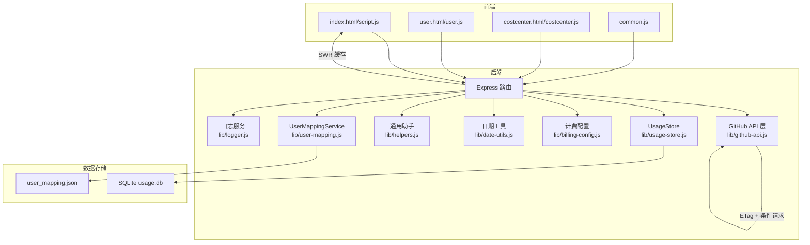

**图表来源**
- [server.js:13-182](file://server.js#L13-L182)
- [lib/github-api.js:67-74](file://lib/github-api.js#L67-L74)
- [lib/usage-store.js:24-79](file://lib/usage-store.js#L24-L79)
- [routes/usage.js:11-14](file://routes/usage.js#L11-L14)
- [lib/user-mapping.js:1-173](file://lib/user-mapping.js#L1-L173)

## 详细组件分析

### 每用户用量排行与默认范围查询模式
- 默认范围查询模式：首页默认激活"按日期范围查询"，便于一次性分析多日数据。
- 每用户排行：后端根据查询模式（默认/单日/范围）聚合用户请求量，支持 per-user fallback 与 SQLite 聚合双重路径，确保覆盖率与准确性。
- 当日/本周期双列展示：在"按日期查询"模式下，表格同时显示当日请求量与本周期累计请求量，帮助快速识别超额风险。

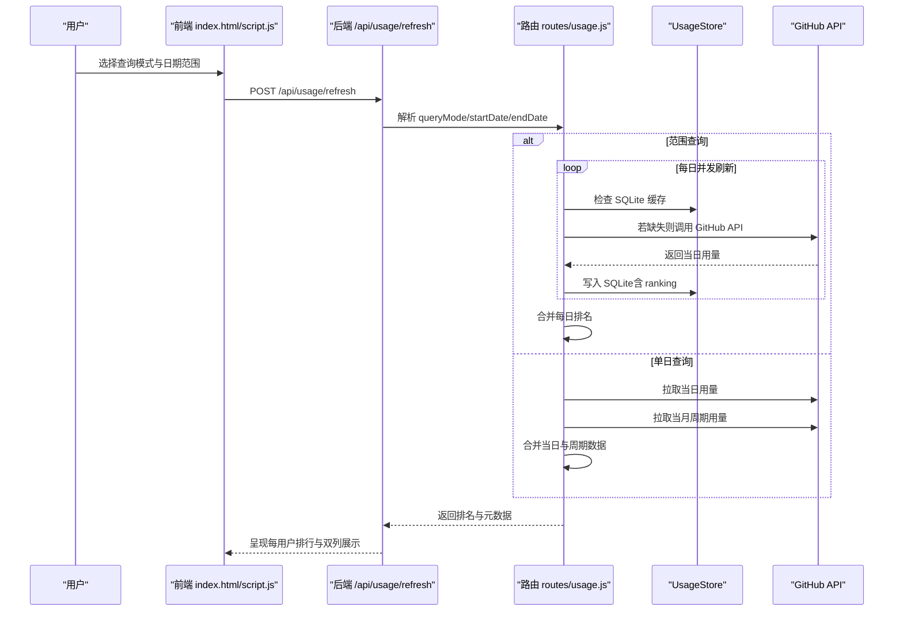

**图表来源**
- [routes/usage.js:387-462](file://routes/usage.js#L387-L462)
- [lib/usage-store.js:137-160](file://lib/usage-store.js#L137-L160)
- [lib/github-api.js:231-269](file://lib/github-api.js#L231-L269)

**章节来源**
- [public/index.html:18-32](file://public/index.html#L18-L32)
- [routes/usage.js:387-462](file://routes/usage.js#L387-L462)

### Premium Requests (%) 与本周期进度条展示
- 配额基线：Business=300，Enterprise=1000，用于百分比计算与进度条展示。
- 本周期进度条：基于当月周期聚合结果（优先 SQLite，必要时回源 GitHub），支持超额标记（超出配额）。
- 百分比计算：按用户当月累计请求量除以配额，四舍五入到百分比。

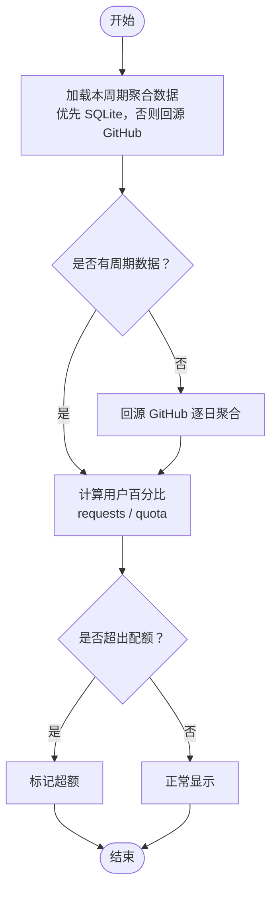

**图表来源**
- [routes/usage.js:120-235](file://routes/usage.js#L120-L235)
- [lib/billing-config.js:11-24](file://lib/billing-config.js#L11-L24)

**章节来源**
- [routes/usage.js:74-91](file://routes/usage.js#L74-L91)
- [lib/billing-config.js:11-24](file://lib/billing-config.js#L11-L24)

### Team 多选筛选
- Team 列表与成员数：通过 GitHub API 获取 Enterprise Teams 列表与成员数，缓存 10 分钟。
- 多选筛选：前端提供下拉复选 Team，默认全选；后端根据所选 Team 过滤用户排名结果。

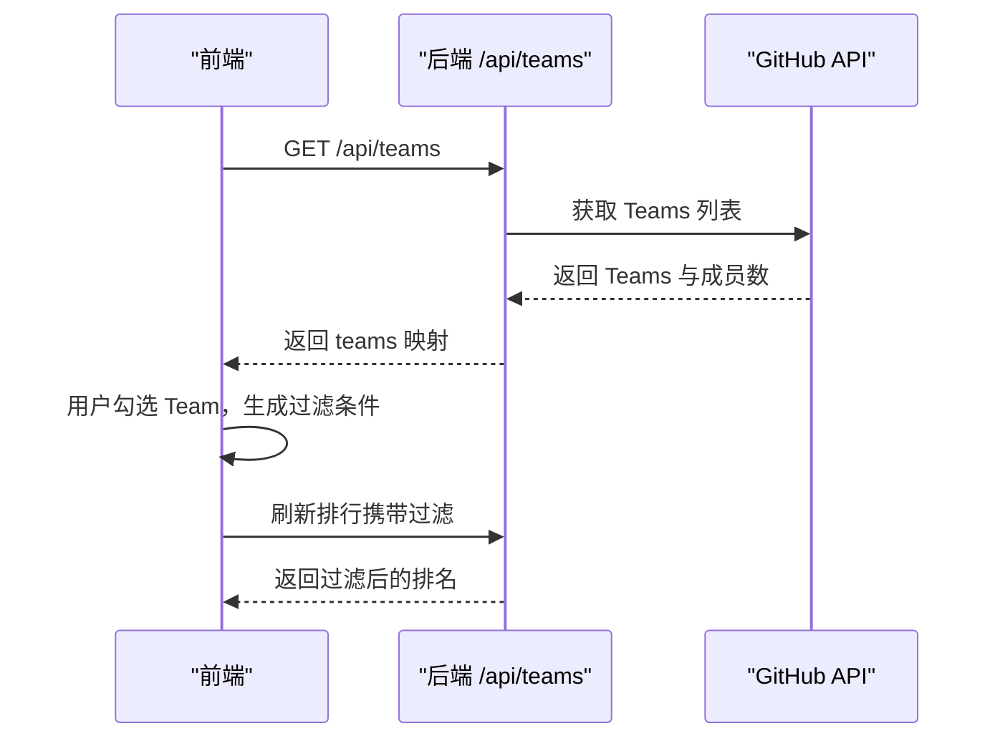

**图表来源**
- [routes/teams.js:39-100](file://routes/teams.js#L39-L100)
- [routes/usage.js:387-462](file://routes/usage.js#L387-L462)

**章节来源**
- [routes/teams.js:39-100](file://routes/teams.js#L39-L100)
- [public/index.html:55-63](file://public/index.html#L55-L63)

### 费用估算（额度内/超额）
- 额度内：按计划基础价计费（Business $19 / Enterprise $39）。
- 超额：超出部分按 $0.04/request 累加，四舍五入到分。
- 月度费用：每用户月度费用 = 基础价 + 超额数量 × $0.04。

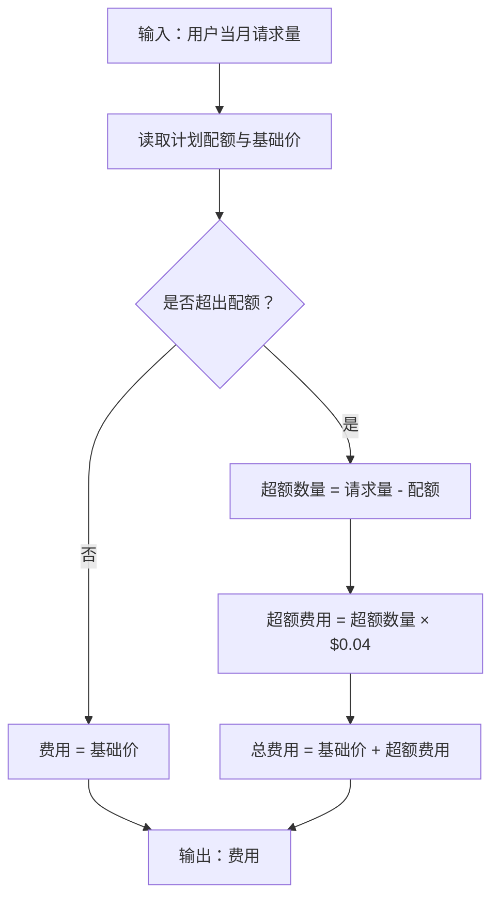

**图表来源**
- [lib/billing-config.js:18-24](file://lib/billing-config.js#L18-L24)
- [routes/billing.js:22-62](file://routes/billing.js#L22-L62)

**章节来源**
- [lib/billing-config.js:11-24](file://lib/billing-config.js#L11-L24)
- [routes/billing.js:22-62](file://routes/billing.js#L22-L62)

### 平滑刷新体验（SWR + 缓存）
- 前端缓存：CACHE_TTL（默认 300 秒）内的数据采用 SWR 策略，优先返回缓存并后台更新。
- 内存缓存：refreshCache（5 分钟）与 in-flight 去重（single-flight）避免重复请求。
- SQLite 缓存：每日用量与周期聚合结果持久化，支持按月强制刷新与动态 TTL（近 3 天 1 小时，更老 90 天）。

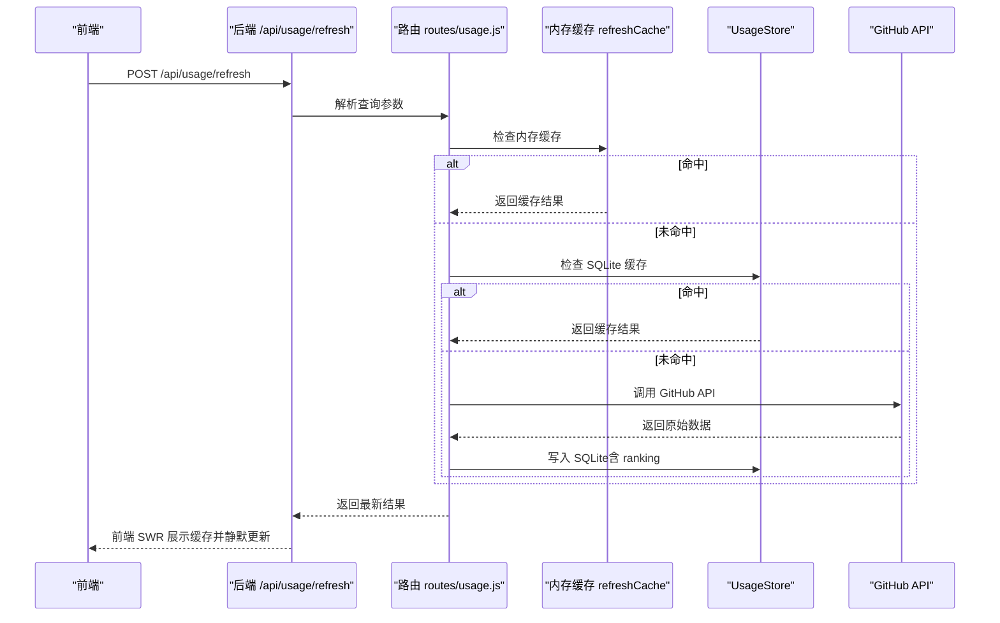

**图表来源**
- [routes/usage.js:237-251](file://routes/usage.js#L237-L251)
- [routes/usage.js:325-348](file://routes/usage.js#L325-L348)
- [lib/usage-store.js:137-160](file://lib/usage-store.js#L137-L160)
- [lib/github-api.js:231-269](file://lib/github-api.js#L231-L269)

**章节来源**
- [routes/usage.js:11-14](file://routes/usage.js#L11-L14)
- [routes/usage.js:237-251](file://routes/usage.js#L237-L251)

### 防限流与并发控制
- 并发队列：最大并发数可配置，默认 3；请求排队与释放，避免瞬时触发 Secondary Rate Limit。
- 单次飞行去重：同一请求键仅允许一个进行中，多标签页刷新自动复用。
- 指数退避重试：遇到 429/403 rate limit 或 5xx 时自动等待并重试，最多 N 次。

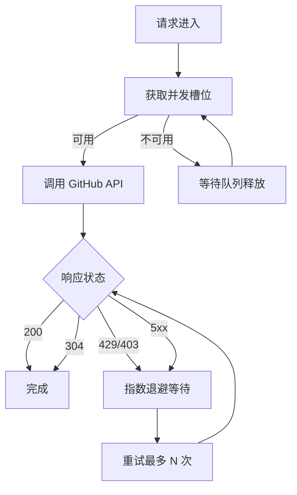

**图表来源**
- [lib/github-api.js:25-48](file://lib/github-api.js#L25-L48)
- [lib/github-api.js:172-227](file://lib/github-api.js#L172-L227)
- [lib/github-api.js:243-269](file://lib/github-api.js#L243-L269)

**章节来源**
- [lib/github-api.js:25-48](file://lib/github-api.js#L25-L48)
- [lib/github-api.js:172-227](file://lib/github-api.js#L172-L227)

### 分批渲染大表（requestAnimationFrame + 分块）
- 分块策略：按用户分块（每块 8 人），逐块发起 GitHub API 查询，避免阻塞主线程。
- 渲染优化：前端使用 requestAnimationFrame 将大数据集分片插入 DOM，避免浏览器卡死。
- 分页与排序：表格默认每页 15 行，支持点击排序与页码跳转。

**章节来源**
- [routes/usage.js:93-118](file://routes/usage.js#L93-L118)
- [README.md:26-31](file://README.md#L26-L31)
- [public/index.html:76-84](file://public/index.html#L76-L84)

### 用户映射管理与 Excel 导出
- 映射文件上传：支持 .xlsx / .xls，校验必需列（AD-name、Github-name），写入本地 JSON。
- 名称优先级：已映射用户优先显示 AD 用户名，未映射显示 GitHub 登录名。
- 自动热重载：文件变更时内存数据自动同步，无需重启服务。
- Excel 导出：支持用户映射表的 Excel 导出，包含用户名、Team、AD 用户名、邮箱、计划类型、最后活跃时间等字段。
- 成员列表增强：集成用户映射信息，提供更丰富的成员视图。

**更新** 新增用户映射管理和 Excel 导出功能

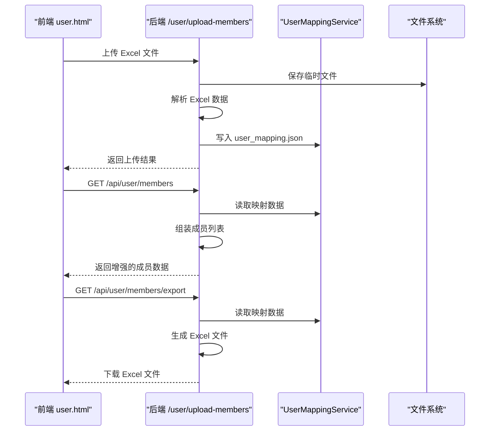

**图表来源**
- [routes/user-mapping.js:79-102](file://routes/user-mapping.js#L79-L102)
- [routes/user-mapping.js:105-131](file://routes/user-mapping.js#L105-L131)
- [routes/user-mapping.js:126-168](file://routes/user-mapping.js#L126-L168)
- [lib/user-mapping.js:36-92](file://lib/user-mapping.js#L36-L92)

**章节来源**
- [routes/user-mapping.js:79-102](file://routes/user-mapping.js#L79-L102)
- [routes/user-mapping.js:105-131](file://routes/user-mapping.js#L105-L131)
- [routes/user-mapping.js:126-168](file://routes/user-mapping.js#L126-L168)
- [lib/user-mapping.js:36-92](file://lib/user-mapping.js#L36-L92)
- [public/user.html:17-24](file://public/user.html#L17-L24)
- [public/user.js:206-253](file://public/user.js#L206-L253)
- [public/user.js:210-212](file://public/user.js#L210-L212)

### 成本中心与预算进度条
- 成本中心列表：获取预算与已花费，按预算金额与 SKU 过滤。
- 预算进度条：按百分比可视化（<75% 蓝色，75%-100% 黄色，>=100% 红色）。
- 批量同步：按 Team 批量将成员加入 Cost Center Users，支持预览与二次确认删除。
- 资源增强：支持 AD 用户名显示，提升成本中心管理的用户体验。

**更新** 成本中心优化，支持 AD 用户名显示和批量用户管理

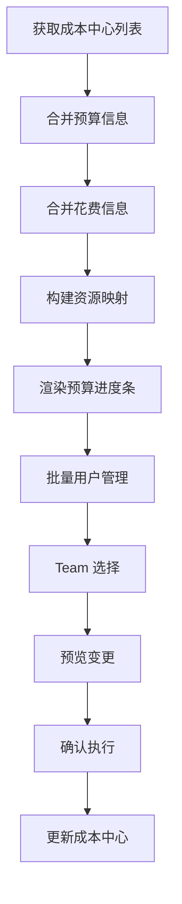

**图表来源**
- [routes/costcenter.js:106-135](file://routes/costcenter.js#L106-L135)
- [routes/costcenter.js:137-165](file://routes/costcenter.js#L137-L165)
- [routes/costcenter.js:167-242](file://routes/costcenter.js#L167-L242)

**章节来源**
- [routes/costcenter.js:113-141](file://routes/costcenter.js#L113-L141)
- [routes/costcenter.js:173-248](file://routes/costcenter.js#L173-L248)
- [README.md:323-375](file://README.md#L323-L375)

### 模型使用排行与数据分析
- 模型排行：按月统计各模型的请求量与费用占比，支持排序与导出。
- 数据分析页：提供趋势图、Top 用户排行、汇总统计（30/90/365 天），纯本地读取 SQLite，响应迅速。

**章节来源**
- [routes/billing.js:64-102](file://routes/billing.js#L64-L102)
- [routes/analytics.js:10-131](file://routes/analytics.js#L10-L131)
- [README.md:37-44](file://README.md#L37-L44)

### 自动刷新调度器与按月强制刷新
- 自动刷新：默认开启，启动后延迟刷新当天数据，每天 03:00 与 12:00 强制刷新今天 + 最近 N 天（默认 N=2）。
- 按月强制刷新：删除该月 SQLite 缓存后逐日回源 GitHub，重新计算账单，支持二次确认与失败列表展示。

**章节来源**
- [server.js:146-148](file://server.js#L146-L148)
- [routes/bill.js:321-403](file://routes/bill.js#L321-L403)
- [README.md:243-296](file://README.md#L243-L296)

## 依赖分析
- 模块耦合与内聚：路由模块依赖 lib 层（GitHub API、SQLite、计费配置、日期工具、通用助手、用户映射服务），形成清晰的分层。
- 外部依赖：better-sqlite3（持久化）、lru-cache（LRU 缓存）、exceljs（Excel 处理）、multer（文件上传）、pino（日志）。
- 关键依赖链：routes/usage.js → lib/github-api.js → GitHub API；routes/usage.js → lib/usage-store.js → SQLite；routes/billing.js → lib/billing-config.js；routes/user-mapping.js → lib/user-mapping.js。

**更新** 新增 exceljs 和 multer 依赖用于 Excel 导出和文件上传功能

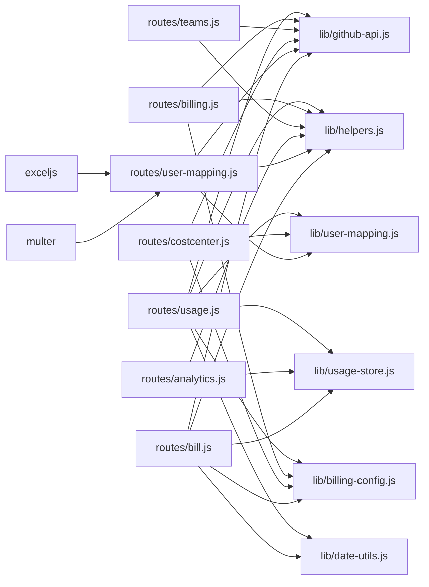

**图表来源**
- [routes/usage.js:6-10](file://routes/usage.js#L6-L10)
- [routes/billing.js:5-8](file://routes/billing.js#L5-L8)
- [routes/teams.js:5-7](file://routes/teams.js#L5-L7)
- [routes/costcenter.js:5-8](file://routes/costcenter.js#L5-L8)
- [routes/analytics.js:5](file://routes/analytics.js#L5)
- [routes/user-mapping.js:10](file://routes/user-mapping.js#L10)
- [routes/bill.js:7-11](file://routes/bill.js#L7-L11)
- [package.json:12-21](file://package.json#L12-L21)

**章节来源**
- [package.json:12-21](file://package.json#L12-L21)

## 性能考量
- 缓存策略：三层缓存（内存 5 分钟、SQLite 90 天、GitHub API）+ ETag 条件请求，极大减少 API 调用。
- 动态 TTL：近 3 天 1 小时，更老 90 天，避免 GitHub Billing API 延迟写入导致的缓存"锁死"。
- 并发与去重：最大并发与单次飞行去重，避免重复请求与限流。
- 分批渲染：requestAnimationFrame + 分块，避免主线程阻塞。
- 预编译语句：SQLite 预编译减少 SQL 解析开销。
- 自动刷新：减少人工干预，保障数据新鲜度。
- 文件监控：用户映射文件的自动热重载，避免频繁重启服务。

**更新** 新增文件监控和自动热重载机制

## 故障排查指南
- 速率限制：查看后端日志中的 retry 与 limitExceeded 提示，确认 GITHUB_MAX_CONCURRENT 与 GITHUB_MAX_RETRIES 设置。
- 缓存命中率：页面顶部显示缓存命中百分比，低命中通常意味着首次查询或缓存过期。
- 强制刷新：按日/按月强制刷新可解决缓存错误或 API 数据延迟问题。
- 日志级别：开发模式 debug，生产模式 info，必要时临时提升 LOG_LEVEL 观察缓存与重试细节。
- Excel 导出：检查 Excel 文件格式和列定义，确保包含必需的 AD-name 和 Github-name 字段。
- 用户映射：验证映射文件的 JSON 格式正确性和必需字段完整性。

**更新** 新增 Excel 导出和用户映射相关的故障排查指导

**章节来源**
- [lib/github-api.js:172-227](file://lib/github-api.js#L172-L227)
- [README.md:236-242](file://README.md#L236-L242)
- [README.md:243-296](file://README.md#L243-L296)
- [lib/logger.js:13-38](file://lib/logger.js#L13-L38)

## 结论
本项目通过"三层缓存 + SWR + 并发控制 + 分批渲染 + 自动刷新调度器"的组合拳，为企业提供了稳定、高效、可观测的 Copilot 使用监控解决方案。核心功能特性覆盖了用量排行、费用估算、Team 筛选、成本中心管理、模型排行与数据分析，既满足初学者的快速上手，也为经验丰富的管理员提供了可调优的底层机制与可观测性。

**更新** 新版本进一步增强了用户体验，通过 Excel 导出、用户映射管理和成本中心优化等功能，提供了更完整的 Copilot 使用监控解决方案。

## 附录
- 环境变量关键项：GITHUB_TOKEN、ENTERPRISE_SLUG、BILLING_YEAR/MONTH/DAY、PRODUCT/MODEL、INCLUDED_QUOTA、CACHE_TTL、GITHUB_MAX_CONCURRENT/GITHUB_MAX_RETRIES、PORT、SCHED_*。
- API 端点概览：/api/usage、/api/usage/refresh、/api/bill、/api/bill/refresh、/api/seats、/api/teams、/api/cost-centers、/api/analytics/*、/api/user/*。
- 新增功能端点：/user/upload-members、/user/reload-mapping、/api/user/members、/api/user/members/export、/api/cost-centers/:id/add-users-from-teams。

**更新** 新增用户映射和成本中心管理相关的 API 端点

**章节来源**
- [README.md:196-217](file://README.md#L196-L217)
- [README.md:111-127](file://README.md#L111-L127)
- [routes/user-mapping.js:78-181](file://routes/user-mapping.js#L78-L181)
- [routes/costcenter.js:167-242](file://routes/costcenter.js#L167-L242)