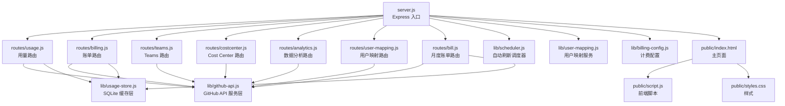
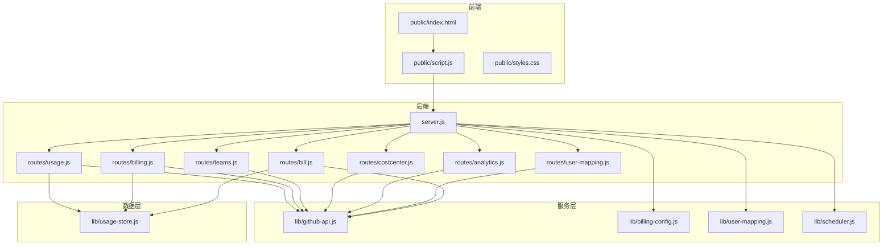
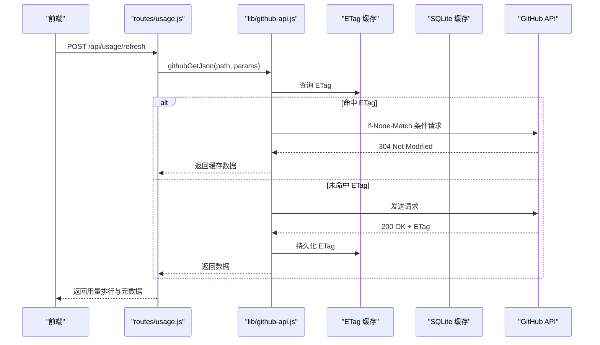
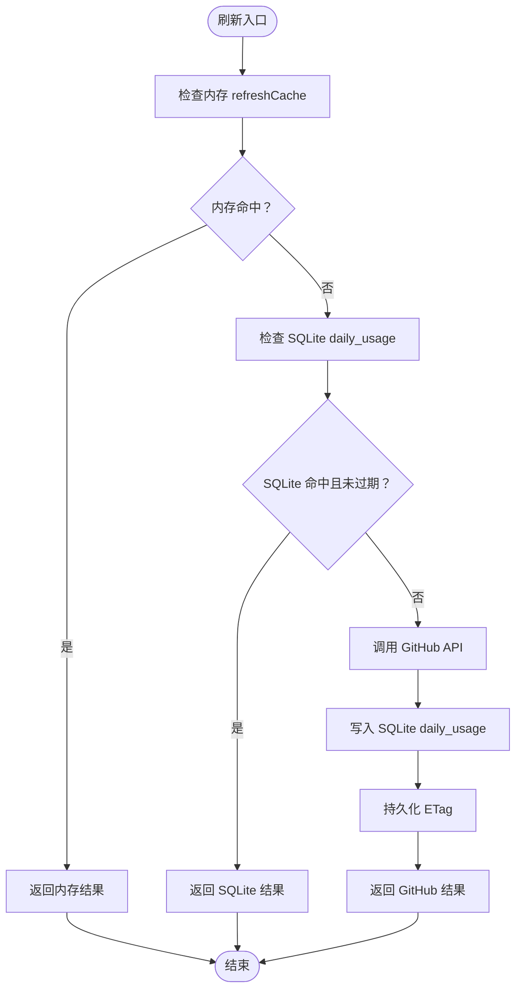
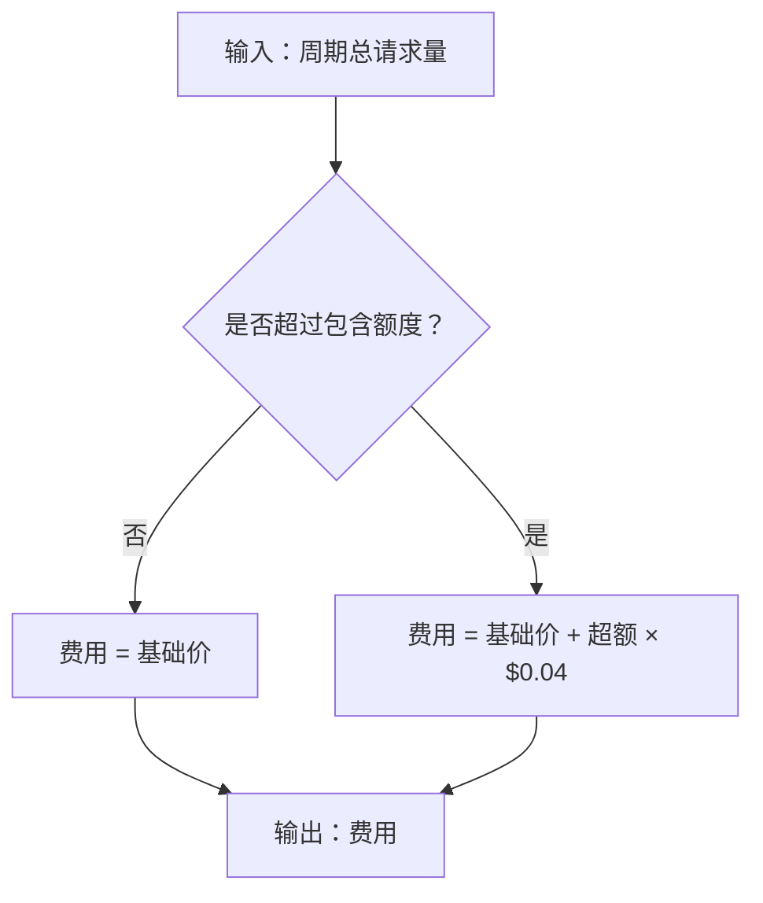
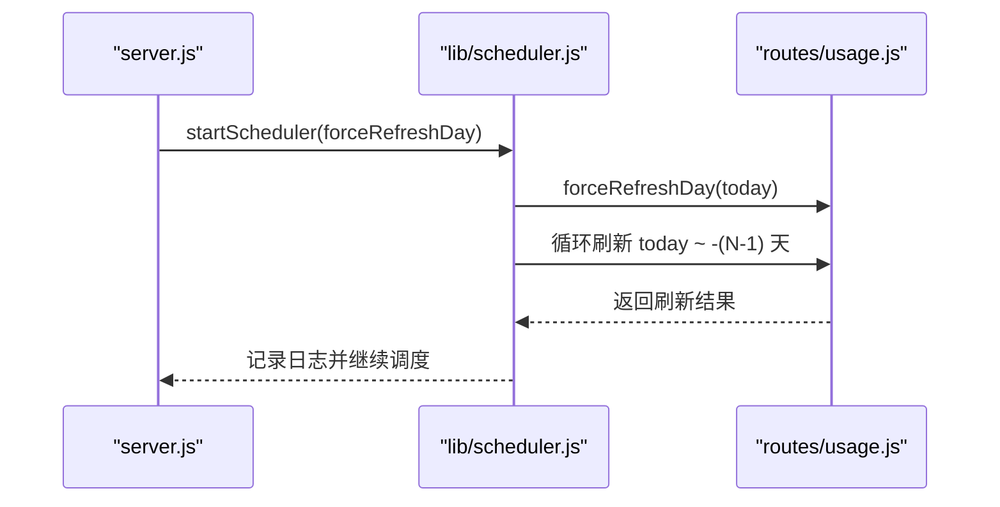
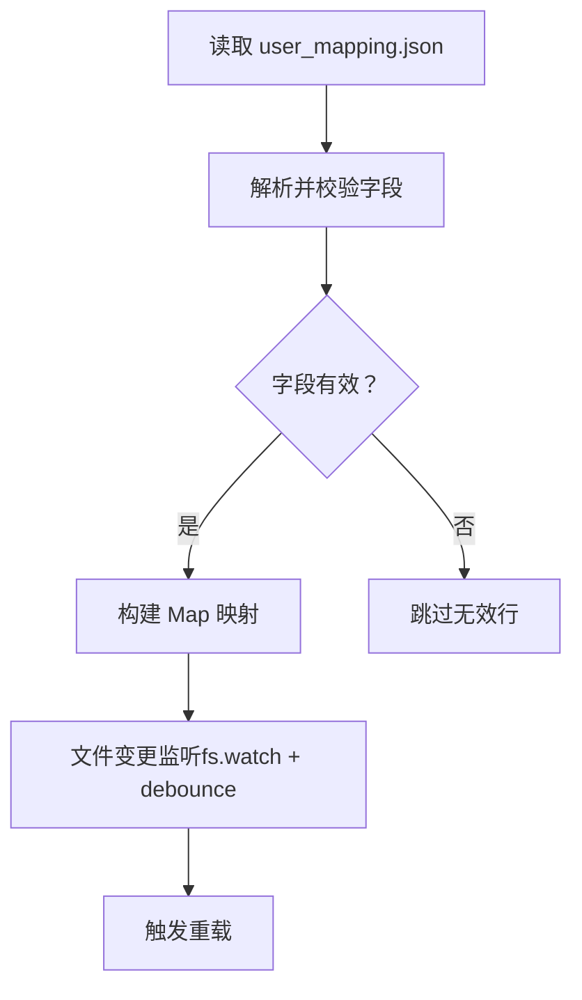
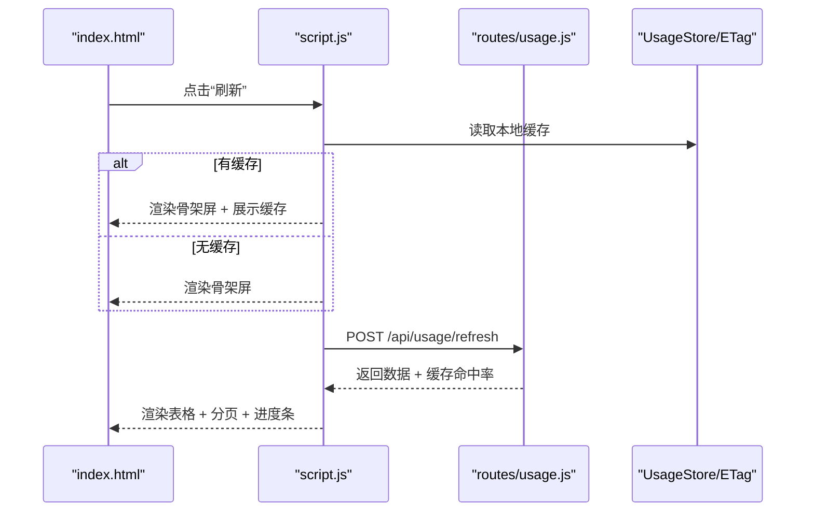
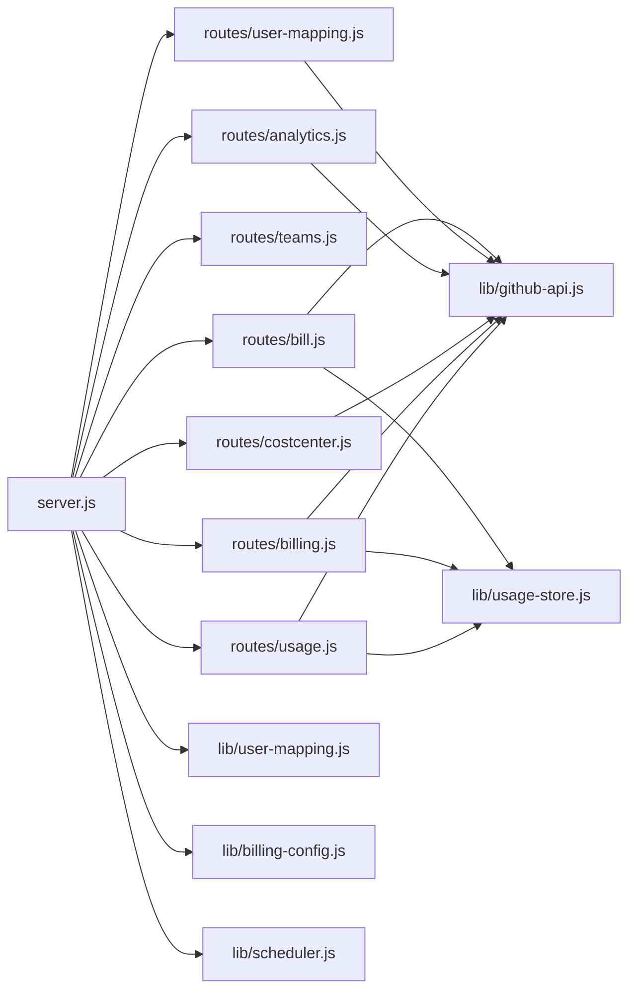

# 项目介绍

<cite>
**本文引用的文件**
- [README.md](file://README.md)
- [package.json](file://package.json)
- [server.js](file://server.js)
- [lib/github-api.js](file://lib/github-api.js)
- [lib/usage-store.js](file://lib/usage-store.js)
- [lib/billing-config.js](file://lib/billing-config.js)
- [lib/scheduler.js](file://lib/scheduler.js)
- [lib/user-mapping.js](file://lib/user-mapping.js)
- [routes/usage.js](file://routes/usage.js)
- [routes/billing.js](file://routes/billing.js)
- [public/index.html](file://public/index.html)
- [public/script.js](file://public/script.js)
- [public/styles.css](file://public/styles.css)
</cite>

## 目录
1. [简介](#简介)
2. [项目结构](#项目结构)
3. [核心组件](#核心组件)
4. [架构总览](#架构总览)
5. [详细组件分析](#详细组件分析)
6. [依赖关系分析](#依赖关系分析)
7. [性能考量](#性能考量)
8. [故障排查指南](#故障排查指南)
9. [结论](#结论)
10. [附录](#附录)

## 简介
CopilotEnterpriseUsageDisplay 是一个基于 Node.js + Express 的 GitHub Copilot Premium Request 用量可视化仪表盘，专为 GitHub Enterprise 管理员打造。它提供每用户用量排行、费用估算、Team 管理、账单汇总、模型使用排行、Cost Center 预算与资源管理、用户映射与团队筛选等能力，帮助管理员实时掌握团队 Copilot 使用情况、优化预算分配、预防超支，并提升企业级 Copilot 管理效率与透明度。

本项目的核心价值在于：
- 可视化与交互：以直观的表格、进度条、图表与分页展示，支持排序、筛选、自动刷新与缓存命中率提示。
- 企业级可观测性：提供按日/按范围查询、按周期汇总、按 Team 筛选、按模型排行、按 Cost Center 预算可视化等。
- 成本控制与预算管理：内置费用估算、额度内/外计费、周期进度条、预算进度条、超支标记，辅助财务与IT团队进行成本控制。
- 高可用与高可靠：三层缓存（内存/SQLite/GitHub）、ETag 条件请求、并发队列与去重、指数退避重试、自动刷新调度器、优雅关闭与日志体系，显著降低 API 调用与前端卡顿风险。

## 项目结构
项目采用模块化分层架构，后端按职责拆分为入口层、路由层、服务层、数据层，前端通过 IIFE + 公共命名空间消除全局变量污染。主要目录与文件如下：
- 入口与路由：server.js 挂载路由、健康检查、全局错误处理、优雅关闭；routes/ 下按功能划分路由模块。
- 服务与数据：lib/ 下封装 GitHub API、SQLite 缓存、计费配置、调度器、用户映射等。
- 前端：public/ 下包含 HTML 页面与脚本、样式，前端脚本通过 CopilotDashboard 命名空间共享通用方法。
- 部署与文档：deploy/ 提供 systemd 与 Nginx 配置；docs/ 包含架构与缓存设计文档；scripts/ 提供启动前自检脚本。

**图表来源**
- [server.js:1-182](file://server.js#L1-L182)
- [routes/usage.js:1-470](file://routes/usage.js#L1-L470)
- [routes/billing.js:1-106](file://routes/billing.js#L1-L106)
- [lib/github-api.js:1-320](file://lib/github-api.js#L1-L320)
- [lib/usage-store.js:1-324](file://lib/usage-store.js#L1-L324)
- [lib/scheduler.js:1-160](file://lib/scheduler.js#L1-L160)
- [lib/user-mapping.js:1-158](file://lib/user-mapping.js#L1-L158)
- [lib/billing-config.js:1-25](file://lib/billing-config.js#L1-L25)
- [public/index.html:1-103](file://public/index.html#L1-L103)
- [public/script.js:1-541](file://public/script.js#L1-L541)
- [public/styles.css:1-800](file://public/styles.css#L1-L800)

**章节来源**
- [README.md:46-96](file://README.md#L46-L96)
- [server.js:88-118](file://server.js#L88-L118)

## 核心组件
- GitHub API 服务层：封装并发队列、去重、ETag 条件请求、指数退避重试、LRU 缓存与 TTL 策略，统一对外提供稳定可靠的 GitHub API 调用。
- SQLite 缓存层：三层缓存架构（内存 5 分钟、SQLite 90 天、GitHub API），持久化每日用量、席位快照、ETag、月度账单，显著降低 API 调用与前端渲染压力。
- 计费配置与费用计算：根据订阅计划（Business/Enterprise）与包含额度，计算周期内费用与超额费用，支持费用估算与预算可视化。
- 自动刷新调度器：默认启动后立即刷新当天数据，并在指定本地时间点强制刷新近期 N 天，缓解 GitHub Billing API 24–48 小时延迟影响。
- 用户映射服务：支持 Excel 导入用户映射表，将 GitHub 用户名映射为展示名称，前端优先显示映射后的名称，支持热重载与文件变更监听。
- 前端交互与可视化：主页面支持按日/按范围查询、双列展示当日与周期累计、周期进度条、Team 筛选、分页、排序、自动刷新、缓存命中率提示；提供用户 & Team 信息、整体账单汇总、模型使用排行、Cost Center 预算与资源管理等弹窗卡片。

**章节来源**
- [lib/github-api.js:23-320](file://lib/github-api.js#L23-L320)
- [lib/usage-store.js:10-324](file://lib/usage-store.js#L10-L324)
- [lib/billing-config.js:6-24](file://lib/billing-config.js#L6-L24)
- [lib/scheduler.js:54-160](file://lib/scheduler.js#L54-L160)
- [lib/user-mapping.js:7-158](file://lib/user-mapping.js#L7-L158)
- [public/script.js:1-541](file://public/script.js#L1-L541)

## 架构总览
项目采用“入口层 + 路由层 + 服务层 + 数据层”的模块化分层架构，前后端分离清晰，前端通过 CopilotDashboard 命名空间共享通用方法，后端通过依赖注入将共享服务（UsageStore、TeamCache、UserMappingService）注入到路由模块，提升可维护性与可测试性。

**图表来源**
- [server.js:88-118](file://server.js#L88-L118)
- [routes/usage.js:13-469](file://routes/usage.js#L13-L469)
- [routes/billing.js:10-105](file://routes/billing.js#L10-L105)
- [lib/github-api.js:1-320](file://lib/github-api.js#L1-L320)
- [lib/usage-store.js:1-324](file://lib/usage-store.js#L1-L324)
- [lib/user-mapping.js:1-158](file://lib/user-mapping.js#L1-L158)
- [lib/billing-config.js:1-25](file://lib/billing-config.js#L1-L25)
- [lib/scheduler.js:1-160](file://lib/scheduler.js#L1-L160)
- [public/index.html:1-103](file://public/index.html#L1-L103)
- [public/script.js:1-541](file://public/script.js#L1-L541)
- [public/styles.css:1-800](file://public/styles.css#L1-L800)

## 详细组件分析

### GitHub API 服务层（并发、去重、缓存与重试）
- 并发队列与去重：通过 acquire/release slot 与 in-flight Map，限制最大并发并合并相同请求，避免重复打 GitHub API。
- ETag 条件请求：将 GitHub API 的 ETag 与数据持久化到内存与 SQLite，304 Not Modified 时不消耗配额。
- LRU 缓存与 TTL：针对不同端点设置不同 TTL，提升缓存命中率与稳定性。
- 指数退避重试：对速率限制与 5xx 错误进行指数退避重试，必要时返回可读的恢复时间提示。
- 统一错误包装：统一抛出 ApiError，便于上层捕获与处理。

**图表来源**
- [lib/github-api.js:108-168](file://lib/github-api.js#L108-L168)
- [lib/github-api.js:231-269](file://lib/github-api.js#L231-L269)
- [routes/usage.js:387-462](file://routes/usage.js#L387-L462)

**章节来源**
- [lib/github-api.js:23-320](file://lib/github-api.js#L23-L320)
- [routes/usage.js:387-462](file://routes/usage.js#L387-L462)

### SQLite 缓存层（三层缓存与数据持久化）
- 三层缓存：内存 refreshCache（5 分钟）、SQLite daily_usage（动态 TTL：近 3 天 1 小时，更老 90 天）、GitHub API。
- 数据表结构：daily_usage（含日期、原始数据、模式、原始计数、来源、抓取时间、排名）、seats_snapshot、etag_cache、monthly_bill。
- 动态 TTL 抖动防护：近 3 天使用 1 小时 TTL，避免 GitHub Billing API 24–48 小时延迟写入不完整数据被长期缓存锁死。
- 月度账单持久化：monthly_bill 表按年月聚合 Team 与用户维度的账单，支持强制刷新与回源重算。

**图表来源**
- [lib/usage-store.js:137-160](file://lib/usage-store.js#L137-L160)
- [lib/usage-store.js:280-320](file://lib/usage-store.js#L280-L320)
- [routes/usage.js:279-348](file://routes/usage.js#L279-L348)

**章节来源**
- [lib/usage-store.js:10-324](file://lib/usage-store.js#L10-L324)
- [routes/usage.js:237-348](file://routes/usage.js#L237-L348)

### 计费配置与费用计算
- 计费配置：支持 Business（300 requests/月/用户）与 Enterprise（1000 requests/月/用户），基础价格分别为 $19/$39。
- 费用计算：额度内按基础价计费，超出部分按 $0.04/request 累加；支持按周期汇总与模型使用排行费用占比。

**图表来源**
- [lib/billing-config.js:18-22](file://lib/billing-config.js#L18-L22)
- [routes/billing.js:47-49](file://routes/billing.js#L47-L49)

**章节来源**
- [lib/billing-config.js:6-24](file://lib/billing-config.js#L6-L24)
- [routes/billing.js:22-102](file://routes/billing.js#L22-L102)

### 自动刷新调度器
- 启动后延迟刷新当天数据，确保首次访问即获得最新数据。
- 每日在指定本地时间点（默认 03:00、12:00）强制刷新“今天 + 前 N 天”，绕过内存与 SQLite TTL，缓解 GitHub Billing API 延迟。
- 支持禁用（SCHED_DISABLED=true）与多副本安全部署。

**图表来源**
- [server.js:146-148](file://server.js#L146-L148)
- [lib/scheduler.js:54-160](file://lib/scheduler.js#L54-L160)
- [routes/usage.js:273-277](file://routes/usage.js#L273-L277)

**章节来源**
- [lib/scheduler.js:54-160](file://lib/scheduler.js#L54-L160)
- [server.js:146-168](file://server.js#L146-L168)

### 用户映射服务
- 支持 Excel 导入映射表（AD-name、AD-mail、Github-name、Github-mail），校验必填字段并去空格。
- 前端优先显示映射后的 AD 名称，未映射用户显示 GitHub 登录名。
- 文件变更监听与去抖重载，避免频繁 IO。

**图表来源**
- [lib/user-mapping.js:36-92](file://lib/user-mapping.js#L36-L92)
- [lib/user-mapping.js:98-116](file://lib/user-mapping.js#L98-L116)

**章节来源**
- [lib/user-mapping.js:7-158](file://lib/user-mapping.js#L7-L158)

### 前端交互与可视化
- 主页面：支持按日/按范围查询、双列展示当日与周期累计、周期进度条、Team 筛选、分页、排序、自动刷新、缓存命中率提示。
- 弹窗卡片：用户 & Team 信息、整体账单汇总、模型使用排行、Cost Center 预算与资源管理。
- 骨架屏与 SWR：刷新时优先显示缓存并后台静默更新，配合骨架屏消除长时间白屏感知。

**图表来源**
- [public/index.html:16-84](file://public/index.html#L16-L84)
- [public/script.js:298-340](file://public/script.js#L298-L340)
- [routes/usage.js:387-462](file://routes/usage.js#L387-L462)
- [lib/usage-store.js:137-160](file://lib/usage-store.js#L137-L160)

**章节来源**
- [public/index.html:1-103](file://public/index.html#L1-L103)
- [public/script.js:1-541](file://public/script.js#L1-L541)
- [public/styles.css:1-800](file://public/styles.css#L1-L800)

## 依赖关系分析
- 依赖注入：server.js 将 UsageStore、teamCache、UserMappingService 注入到各路由模块，降低耦合度。
- 路由模块：routes/usage.js、routes/billing.js 等通过 githubGetJson 与 UsageStore 读写数据，形成清晰的职责边界。
- 外部依赖：better-sqlite3、pino、lru-cache、express、exceljs、multer 等，分别负责数据库、日志、缓存、Web 框架、Excel 处理与文件上传。

**图表来源**
- [server.js:88-118](file://server.js#L88-L118)
- [routes/usage.js:13-469](file://routes/usage.js#L13-L469)
- [routes/billing.js:10-105](file://routes/billing.js#L10-L105)
- [lib/github-api.js:1-320](file://lib/github-api.js#L1-L320)
- [lib/usage-store.js:1-324](file://lib/usage-store.js#L1-L324)
- [lib/user-mapping.js:1-158](file://lib/user-mapping.js#L1-L158)
- [lib/billing-config.js:1-25](file://lib/billing-config.js#L1-L25)
- [lib/scheduler.js:1-160](file://lib/scheduler.js#L1-L160)

**章节来源**
- [server.js:88-118](file://server.js#L88-L118)
- [package.json:12-24](file://package.json#L12-L24)

## 性能考量
- 缓存策略：三层缓存与 ETag 条件请求显著降低 API 调用，SWR 与骨架屏提升刷新体验。
- 并发控制：GitHub API 并发队列与去重，避免触发二级速率限制。
- 数据新鲜度：动态 TTL 抖动防护与自动刷新调度器，缓解 GitHub Billing API 延迟。
- 前端渲染：分页与 requestAnimationFrame 分片渲染，避免主线程阻塞。
- 日志与可观测性：结构化日志、URL 动作映射、敏感信息脱敏、缓存追踪，便于故障定位与性能分析。

[本节为通用性能讨论，无需特定文件引用]

## 故障排查指南
- 启动前自检：运行 preflight-check.sh 或 preflight-check.js，检查环境变量、网络连通性、Token 权限与必要能力。
- 健康检查：访问 /api/health，确认服务运行状态与内存占用。
- 日志级别：开发模式 debug，生产模式 info；可通过 LOG_LEVEL 调整。
- 速率限制：当触发 GitHub API 速率限制时，系统自动指数退避重试并返回恢复时间提示。
- 强制刷新：按日强制刷新（POST /api/usage/refresh force:true）与按月强制刷新（POST /api/bill/refresh）作为兜底手段。
- 优雅关闭：SIGTERM/SIGINT 信号处理，10 秒超时强制退出，确保资源释放。

**章节来源**
- [README.md:297-314](file://README.md#L297-L314)
- [server.js:100-118](file://server.js#L100-L118)
- [lib/github-api.js:170-227](file://lib/github-api.js#L170-L227)
- [README.md:243-296](file://README.md#L243-L296)
- [server.js:150-182](file://server.js#L150-L182)

## 结论
CopilotEnterpriseUsageDisplay 通过模块化分层架构、三层缓存与 ETag 条件请求、并发控制与指数退避重试、自动刷新调度器与结构化日志体系，为企业级 GitHub Copilot 管理提供了高可用、高可靠、高可视化的用量与成本管理平台。它不仅满足 IT 与财务团队的成本控制与预算管理需求，也为 DevOps 团队提供了实时、准确、可追溯的 Copilot 使用洞察，是 GitHub Enterprise 管理不可或缺的重要工具。

[本节为总结性内容，无需特定文件引用]

## 附录
- 适用人群与使用场景：IT 管理部门、财务部门、DevOps 团队、企业管理员。
- 主要应用场景：企业级 Copilot 使用监控、成本控制、团队管理、预算与资源管理、模型使用分析。
- 业务价值：实时了解团队使用情况、优化预算分配、预防超支、提升管理效率与透明度。

[本节为概览性内容，无需特定文件引用]