# 项目介绍

<cite>
**本文引用的文件**
- [README.md](file://README.md)
- [package.json](file://package.json)
- [server.js](file://server.js)
- [routes/insights.js](file://routes/insights.js)
- [lib/insights-aggregator.js](file://lib/insights-aggregator.js)
- [public/insights.html](file://public/insights.html)
- [public/insights.js](file://public/insights.js)
- [test/insights-aggregator.test.js](file://test/insights-aggregator.test.js)
- [test/insights-routes.test.js](file://test/insights-routes.test.js)
- [lib/github-api.js](file://lib/github-api.js)
- [lib/usage-store.js](file://lib/usage-store.js)
- [lib/billing-config.js](file://lib/billing-config.js)
- [lib/scheduler.js](file://lib/scheduler.js)
- [lib/user-mapping.js](file://lib/user-mapping.js)
- [routes/usage.js](file://routes/usage.js)
- [routes/billing.js](file://routes/billing.js)
- [public/index.html](file://public/index.html)
- [public/script.js](file://public/script.js)
- [public/styles.css](file://public/styles.css)
</cite>

## 更新摘要
**变更内容**
- 新增 Copilot Enterprise Insights 仪表板系统功能说明
- 更新项目概述，突出 AI 洞察与优化建议能力
- 新增 Copilot Insights 双 Tab 界面设计说明
- 补充智能洞察规则引擎与推荐算法
- 更新核心组件分析，包含 Insights 聚合器模块

## 目录
1. [简介](#简介)
2. [Copilot Enterprise Insights 仪表板系统](#copilot-enterprise-insights-仪表板系统)
3. [项目结构](#项目结构)
4. [核心组件](#核心组件)
5. [架构总览](#架构总览)
6. [详细组件分析](#详细组件分析)
7. [依赖关系分析](#依赖关系分析)
8. [性能考量](#性能考量)
9. [故障排查指南](#故障排查指南)
10. [结论](#结论)
11. [附录](#附录)

## 简介
CopilotEnterpriseUsageDisplay 是一个基于 Node.js + Express 的 GitHub Copilot Premium Request 用量可视化仪表盘，专为 GitHub Enterprise 管理员打造。它提供每用户用量排行、费用估算、Team 管理、账单汇总、模型使用排行、Cost Center 预算与资源管理、用户映射与团队筛选等能力，帮助管理员实时掌握团队 Copilot 使用情况、优化预算分配、预防超支，并提升企业级 Copilot 管理效率与透明度。

**新增 Copilot Enterprise Insights 仪表板系统**：项目现已集成先进的 Copilot Enterprise Insights 仪表板系统，提供基于 GitHub Copilot Metrics Reports 的 AI 洞察与优化建议。该系统包含 Copilot IDE Usage 与 Code Generation 双 Tab，涵盖活跃用户、Agent adoption、最常用模型、代码吞吐、模型效能、语言分布等关键指标，并通过智能规则引擎生成高价值优化建议。

本项目的核心价值在于：
- **可视化与交互**：以直观的表格、进度条、图表与分页展示，支持排序、筛选、自动刷新与缓存命中率提示。
- **企业级可观测性**：提供按日/按范围查询、按周期汇总、按 Team 筛选、按模型排行、按 Cost Center 预算可视化等。
- **成本控制与预算管理**：内置费用估算、额度内/外计费、周期进度条、预算进度条、超支标记，辅助财务与IT团队进行成本控制。
- **AI 洞察与优化建议**：通过智能规则引擎分析 Copilot 使用数据，生成 ROI、模型配额优化、技术债重构健康度、语言覆盖率推广盲区等高价值建议。
- **高可用与高可靠**：三层缓存（内存/SQLite/GitHub）、ETag 条件请求、并发队列与去重、指数退避重试、自动刷新调度器、优雅关闭与日志体系，显著降低 API 调用与前端卡顿风险。

## Copilot Enterprise Insights 仪表板系统

Copilot Enterprise Insights 仪表板系统是项目的核心创新功能，提供企业级 Copilot 使用洞察与智能优化建议。该系统通过分析 GitHub Copilot Metrics Reports 和 AI Credits 使用数据，为企业管理员提供深度的使用模式洞察。

### 系统架构
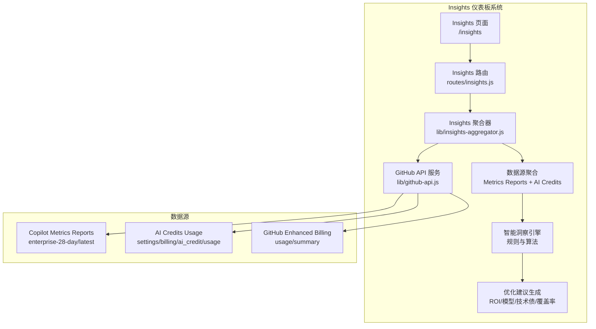
```mermaid
graph TB
subgraph "Insights 仪表板系统"
A["Insights 页面<br/>/insights"] --> B["Insights 路由<br/>routes/insights.js"]
B --> C["Insights 聚合器<br/>lib/insights-aggregator.js"]
C --> D["GitHub API 服务<br/>lib/github-api.js"]
C --> E["数据源聚合<br/>Metrics Reports + AI Credits"]
E --> F["智能洞察引擎<br/>规则与算法"]
F --> G["优化建议生成<br/>ROI/模型/技术债/覆盖率"]
end
subgraph "数据源"
H["Copilot Metrics Reports<br/>enterprise-28-day/latest"]
I["AI Credits Usage<br/>settings/billing/ai_credit/usage"]
J["GitHub Enhanced Billing<br/>usage/summary"]
end
D --> H
D --> I
D --> J
```

**图表来源**
- [routes/insights.js:104-121](file://routes/insights.js#L104-L121)
- [lib/insights-aggregator.js:424-533](file://lib/insights-aggregator.js#L424-L533)
- [lib/github-api.js:1-320](file://lib/github-api.js#L1-L320)

### 双 Tab 界面设计
系统提供两个主要分析界面：

**Copilot IDE Usage Tab**：
- IDE daily active users：每日活跃用户趋势
- IDE weekly active users：每周活跃用户趋势  
- Average chat requests per active user：活跃用户平均对话请求数
- Requests per chat mode：按对话模式分类的请求数
- Code completions：代码补全的建议与接受率
- Code completions acceptance rate：代码补全接受率趋势
- Chat model usage：对话模式的模型使用分布
- Language usage：编程语言使用分布
- Model usage per chat mode：按对话模式的模型使用情况

**Code Generation Tab**：
- Daily total of lines added and deleted：每日代码变更行数
- User-initiated code changes：用户发起的代码变更
- Agent-initiated code changes：代理发起的代码变更
- User-initiated code changes per model：按模型的用户代码变更
- Agent-initiated code changes per model：按模型的代理代码变更
- User-initiated code changes per language：按语言的用户代码变更
- Agent-initiated code changes per language：按语言的代理代码变更
- 模型效能对比图：模型吞吐量与接受率对比

### 智能洞察引擎
系统内置智能洞察规则引擎，基于使用数据生成高价值优化建议：

**高价值警报**：检测深度 AI 驱动研发模式，AI 独立变更代码接近半数
**代码资产重构评估**：分析 AI 重构对技术债清理的成效
**模型配额优化**：识别复杂 Agent 场景下表现更优的模型
**技术栈失衡提示**：分析核心语言采纳率与 TypeScript 覆盖率的平衡

**章节来源**
- [routes/insights.js:104-121](file://routes/insights.js#L104-L121)
- [lib/insights-aggregator.js:362-422](file://lib/insights-aggregator.js#L362-L422)
- [public/insights.html:34-68](file://public/insights.html#L34-L68)
- [public/insights.js:79-204](file://public/insights.js#L79-L204)

## 项目结构
项目采用模块化分层架构，后端按职责拆分为入口层、路由层、服务层、数据层，前端通过 IIFE + 公共命名空间消除全局变量污染。主要目录与文件如下：
- 入口与路由：server.js 挂载路由、健康检查、全局错误处理、优雅关闭；routes/ 下按功能划分路由模块。
- 服务与数据：lib/ 下封装 GitHub API、SQLite 缓存、计费配置、调度器、用户映射、Insights 聚合器等。
- 前端：public/ 下包含 HTML 页面与脚本、样式，前端脚本通过 CopilotDashboard 命名空间共享通用方法。
- 部署与文档：deploy/ 提供 systemd 与 Nginx 配置；docs/ 包含架构与缓存设计文档；scripts/ 提供启动前自检脚本。

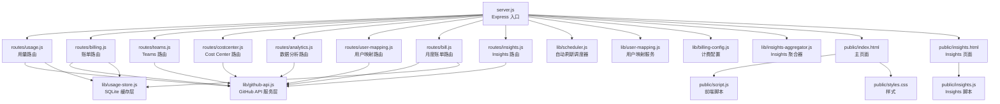
```mermaid
graph TB
A["server.js<br/>Express 入口"] --> B["routes/usage.js<br/>用量路由"]
A --> C["routes/billing.js<br/>账单路由"]
A --> D["routes/teams.js<br/>Teams 路由"]
A --> E["routes/costcenter.js<br/>Cost Center 路由"]
A --> F["routes/analytics.js<br/>数据分析路由"]
A --> G["routes/user-mapping.js<br/>用户映射路由"]
A --> H["routes/bill.js<br/>月度账单路由"]
A --> I["routes/insights.js<br/>Insights 路由"]
B --> J["lib/github-api.js<br/>GitHub API 服务层"]
C --> J
D --> J
E --> J
F --> J
G --> J
H --> J
I --> J
B --> K["lib/usage-store.js<br/>SQLite 缓存层"]
C --> K
H --> K
A --> L["lib/scheduler.js<br/>自动刷新调度器"]
A --> M["lib/user-mapping.js<br/>用户映射服务"]
A --> N["lib/billing-config.js<br/>计费配置"]
A --> O["lib/insights-aggregator.js<br/>Insights 聚合器"]
A --> P["public/index.html<br/>主页面"]
P --> Q["public/script.js<br/>前端脚本"]
P --> R["public/styles.css<br/>样式"]
A --> S["public/insights.html<br/>Insights 页面"]
S --> T["public/insights.js<br/>Insights 脚本"]
```

**图表来源**
- [server.js:149-162](file://server.js#L149-L162)
- [routes/usage.js:1-470](file://routes/usage.js#L1-L470)
- [routes/billing.js:1-106](file://routes/billing.js#L1-L106)
- [routes/insights.js:1-129](file://routes/insights.js#L1-L129)
- [lib/github-api.js:1-320](file://lib/github-api.js#L1-L320)
- [lib/usage-store.js:1-324](file://lib/usage-store.js#L1-L324)
- [lib/scheduler.js:1-160](file://lib/scheduler.js#L1-L160)
- [lib/user-mapping.js:1-158](file://lib/user-mapping.js#L1-L158)
- [lib/billing-config.js:1-25](file://lib/billing-config.js#L1-L25)
- [lib/insights-aggregator.js:1-558](file://lib/insights-aggregator.js#L1-L558)
- [public/index.html:1-103](file://public/index.html#L1-L103)
- [public/script.js:1-541](file://public/script.js#L1-L541)
- [public/styles.css:1-800](file://public/styles.css#L1-L800)
- [public/insights.html:1-81](file://public/insights.html#L1-L81)
- [public/insights.js:1-263](file://public/insights.js#L1-L263)

**章节来源**
- [README.md:57-118](file://README.md#L57-L118)
- [server.js:88-118](file://server.js#L88-L118)

## 核心组件
- **GitHub API 服务层**：封装并发队列、去重、ETag 条件请求、指数退避重试、LRU 缓存与 TTL 策略，统一对外提供稳定可靠的 GitHub API 调用。
- **SQLite 缓存层**：三层缓存架构（内存 5 分钟、SQLite 90 天、GitHub API），持久化每日用量、席位快照、ETag、月度账单，显著降低 API 调用与前端渲染压力。
- **计费配置与费用计算**：根据订阅计划（Business/Enterprise）与包含额度，计算周期内费用与超额费用，支持费用估算与预算可视化。
- **自动刷新调度器**：默认启动后立即刷新当天数据，并在指定本地时间点强制刷新近期 N 天，缓解 GitHub Billing API 24–48 小时延迟影响。
- **用户映射服务**：支持 Excel 导入用户映射表，将 GitHub 用户名映射为展示名称，前端优先显示映射后的名称，支持热重载与文件变更监听。
- **Copilot Insights 聚合器**：智能数据聚合与分析引擎，处理 GitHub Metrics Reports 和 AI Credits 数据，生成多维度使用洞察与优化建议。
- **智能洞察规则引擎**：基于使用模式识别高价值优化机会，包括 ROI 分析、模型配额优化、技术债评估、语言覆盖率分析等。
- **前端交互与可视化**：主页面支持按日/按范围查询、双列展示当日与周期累计、周期进度条、Team 筛选、分页、排序、自动刷新、缓存命中率提示；提供用户 & Team 信息、整体账单汇总、模型使用排行、Cost Center 预算与资源管理等弹窗卡片。

**章节来源**
- [lib/github-api.js:23-320](file://lib/github-api.js#L23-L320)
- [lib/usage-store.js:10-324](file://lib/usage-store.js#L10-L324)
- [lib/billing-config.js:6-24](file://lib/billing-config.js#L6-L24)
- [lib/scheduler.js:54-160](file://lib/scheduler.js#L54-L160)
- [lib/user-mapping.js:7-158](file://lib/user-mapping.js#L7-L158)
- [lib/insights-aggregator.js:424-533](file://lib/insights-aggregator.js#L424-L533)
- [public/script.js:1-541](file://public/script.js#L1-L541)

## 架构总览
项目采用"入口层 + 路由层 + 服务层 + 数据层"的模块化分层架构，前后端分离清晰，前端通过 CopilotDashboard 命名空间共享通用方法，后端通过依赖注入将共享服务（UsageStore、TeamCache、UserMappingService、InsightsAggregator）注入到路由模块，提升可维护性与可测试性。

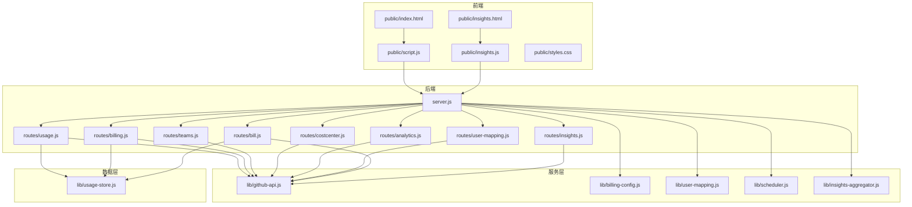
```mermaid
graph TB
subgraph "前端"
UI["public/index.html"]
INSIGHTS["public/insights.html"]
JS["public/script.js"]
INSIGHTS_JS["public/insights.js"]
CSS["public/styles.css"]
end
subgraph "后端"
S["server.js"]
R1["routes/usage.js"]
R2["routes/billing.js"]
R3["routes/teams.js"]
R4["routes/costcenter.js"]
R5["routes/analytics.js"]
R6["routes/user-mapping.js"]
R7["routes/bill.js"]
R8["routes/insights.js"]
end
subgraph "服务层"
GH["lib/github-api.js"]
BC["lib/billing-config.js"]
UM["lib/user-mapping.js"]
SCH["lib/scheduler.js"]
IA["lib/insights-aggregator.js"]
end
subgraph "数据层"
US["lib/usage-store.js"]
end
UI --> JS
INSIGHTS --> INSIGHTS_JS
JS --> S
INSIGHTS_JS --> S
S --> R1
S --> R2
S --> R3
S --> R4
S --> R5
S --> R6
S --> R7
S --> R8
R1 --> GH
R2 --> GH
R3 --> GH
R4 --> GH
R5 --> GH
R6 --> GH
R7 --> GH
R8 --> GH
R1 --> US
R2 --> US
R7 --> US
S --> UM
S --> BC
S --> SCH
S --> IA
```

**图表来源**
- [server.js:88-118](file://server.js#L88-L118)
- [routes/usage.js:13-469](file://routes/usage.js#L13-L469)
- [routes/billing.js:10-105](file://routes/billing.js#L10-L105)
- [routes/insights.js:104-121](file://routes/insights.js#L104-L121)
- [lib/github-api.js:1-320](file://lib/github-api.js#L1-L320)
- [lib/usage-store.js:1-324](file://lib/usage-store.js#L1-L324)
- [lib/user-mapping.js:1-158](file://lib/user-mapping.js#L1-L158)
- [lib/billing-config.js:1-25](file://lib/billing-config.js#L1-L25)
- [lib/scheduler.js:1-160](file://lib/scheduler.js#L1-L160)
- [lib/insights-aggregator.js:1-558](file://lib/insights-aggregator.js#L1-L558)
- [public/index.html:1-103](file://public/index.html#L1-L103)
- [public/script.js:1-541](file://public/script.js#L1-L541)
- [public/styles.css:1-800](file://public/styles.css#L1-L800)
- [public/insights.html:1-81](file://public/insights.html#L1-L81)
- [public/insights.js:1-263](file://public/insights.js#L1-L263)

## 详细组件分析

### GitHub API 服务层（并发、去重、缓存与重试）
- 并发队列与去重：通过 acquire/release slot 与 in-flight Map，限制最大并发并合并相同请求，避免重复打 GitHub API。
- ETag 条件请求：将 GitHub API 的 ETag 与数据持久化到内存与 SQLite，304 Not Modified 时不消耗配额。
- LRU 缓存与 TTL：针对不同端点设置不同 TTL，提升缓存命中率与稳定性。
- 指数退避重试：对速率限制与 5xx 错误进行指数退避重试，必要时返回可读的恢复时间提示。
- 统一错误包装：统一抛出 ApiError，便于上层捕获与处理。

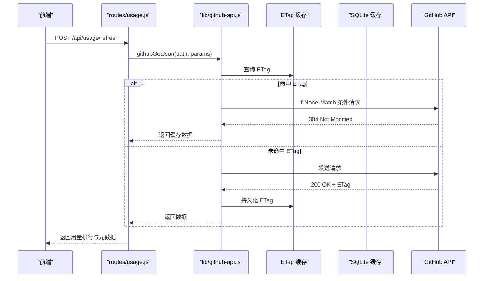
```mermaid
sequenceDiagram
participant FE as "前端"
participant API as "routes/usage.js"
participant GH as "lib/github-api.js"
participant ETAG as "ETag 缓存"
participant SQL as "SQLite 缓存"
participant GHAPI as "GitHub API"
FE->>API : POST /api/usage/refresh
API->>GH : githubGetJson(path, params)
GH->>ETAG : 查询 ETag
alt 命中 ETag
GH->>GHAPI : If-None-Match 条件请求
GHAPI-->>GH : 304 Not Modified
GH-->>API : 返回缓存数据
else 未命中 ETag
GH->>GHAPI : 发送请求
GHAPI-->>GH : 200 OK + ETag
GH->>ETAG : 持久化 ETag
GH-->>API : 返回数据
end
API-->>FE : 返回用量排行与元数据
```

**图表来源**
- [lib/github-api.js:108-168](file://lib/github-api.js#L108-L168)
- [lib/github-api.js:231-269](file://lib/github-api.js#L231-L269)
- [routes/usage.js:387-462](file://routes/usage.js#L387-L462)

**章节来源**
- [lib/github-api.js:23-320](file://lib/github-api.js#L23-L320)
- [routes/usage.js:387-462](file://routes/usage.js#L387-L462)

### SQLite 缓存层（三层缓存与数据持久化）
- 三层缓存：内存 refreshCache（5 分钟）、SQLite daily_usage（动态 TTL：近 3 天 1 小时，更老 90 天）、GitHub API。
- 数据表结构：daily_usage（含日期、原始数据、模式、原始计数、来源、抓取时间、排名）、seats_snapshot、etag_cache、monthly_bill。
- 动态 TTL 抖动防护：近 3 天使用 1 小时 TTL，避免 GitHub Billing API 24–48 小时延迟写入不完整数据被长期缓存锁死。
- 月度账单持久化：monthly_bill 表按年月聚合 Team 与用户维度的账单，支持强制刷新与回源重算。

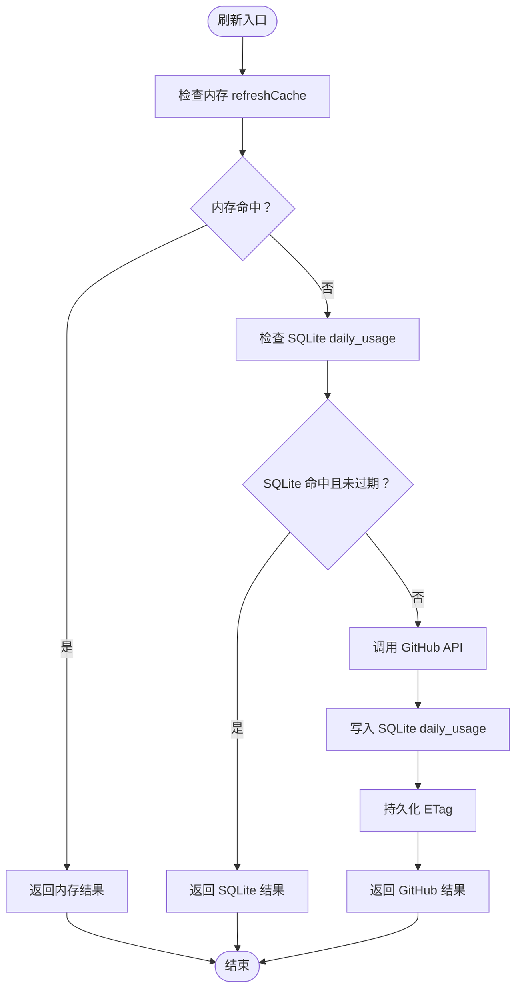
```mermaid
flowchart TD
Start(["刷新入口"]) --> CheckMem["检查内存 refreshCache"]
CheckMem --> MemHit{"内存命中？"}
MemHit --> |是| ReturnMem["返回内存结果"]
MemHit --> |否| CheckSQL["检查 SQLite daily_usage"]
CheckSQL --> SQLHit{"SQLite 命中且未过期？"}
SQLHit --> |是| ReturnSQL["返回 SQLite 结果"]
SQLHit --> |否| FetchGH["调用 GitHub API"]
FetchGH --> SaveSQL["写入 SQLite daily_usage"]
SaveSQL --> SaveETag["持久化 ETag"]
SaveETag --> ReturnGH["返回 GitHub 结果"]
ReturnMem --> End(["结束"])
ReturnSQL --> End
ReturnGH --> End
```

**图表来源**
- [lib/usage-store.js:137-160](file://lib/usage-store.js#L137-L160)
- [lib/usage-store.js:280-320](file://lib/usage-store.js#L280-L320)
- [routes/usage.js:279-348](file://routes/usage.js#L279-L348)

**章节来源**
- [lib/usage-store.js:10-324](file://lib/usage-store.js#L10-L324)
- [routes/usage.js:237-348](file://routes/usage.js#L237-L348)

### 计费配置与费用计算
- 计费配置：支持 Business（300 requests/月/用户）与 Enterprise（1000 requests/月/用户），基础价格分别为 $19/$39。
- 费用计算：额度内按基础价计费，超出部分按 $0.04/request 累加；支持按周期汇总与模型使用排行费用占比。

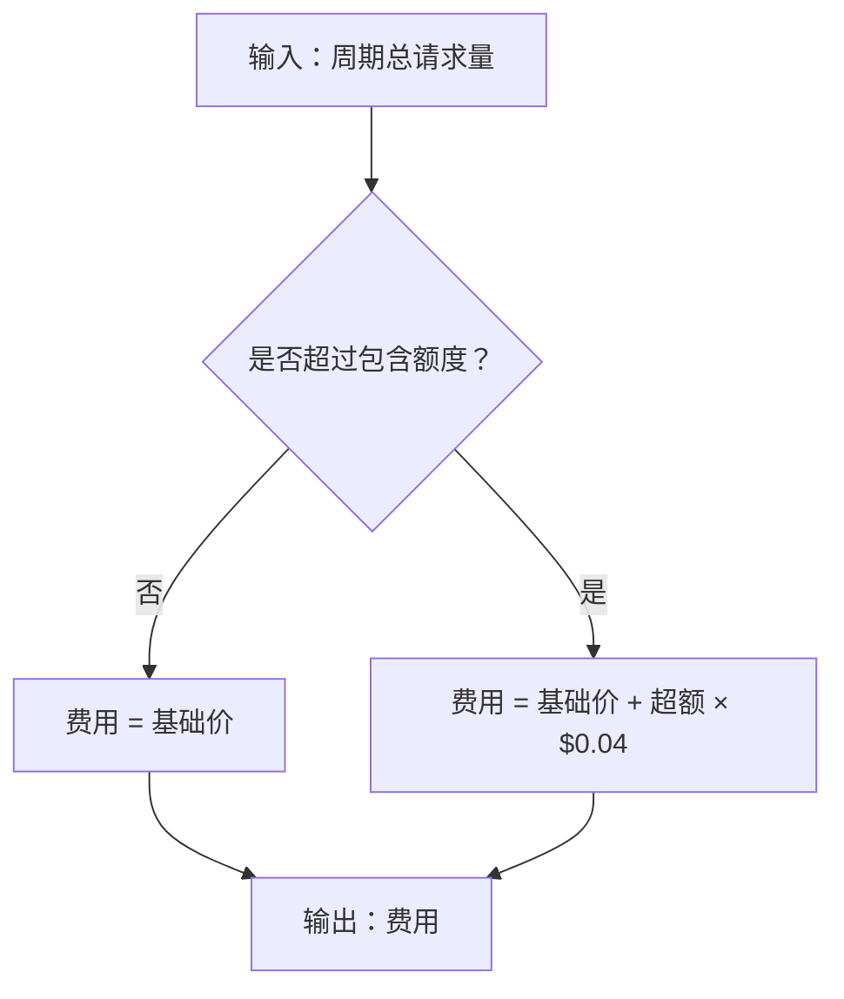
```mermaid
flowchart TD
A["输入：周期总请求量"] --> B{"是否超过包含额度？"}
B --> |否| C["费用 = 基础价"]
B --> |是| D["费用 = 基础价 + 超额 × $0.04"]
C --> E["输出：费用"]
D --> E
```

**图表来源**
- [lib/billing-config.js:18-22](file://lib/billing-config.js#L18-L22)
- [routes/billing.js:47-49](file://routes/billing.js#L47-L49)

**章节来源**
- [lib/billing-config.js:6-24](file://lib/billing-config.js#L6-L24)
- [routes/billing.js:22-102](file://routes/billing.js#L22-L102)

### 自动刷新调度器
- 启动后延迟刷新当天数据，确保首次访问即获得最新数据。
- 每日在指定本地时间点（默认 03:00、12:00）强制刷新"今天 + 前 N 天"，绕过内存与 SQLite TTL，缓解 GitHub Billing API 延迟。
- 支持禁用（SCHED_DISABLED=true）与多副本安全部署。

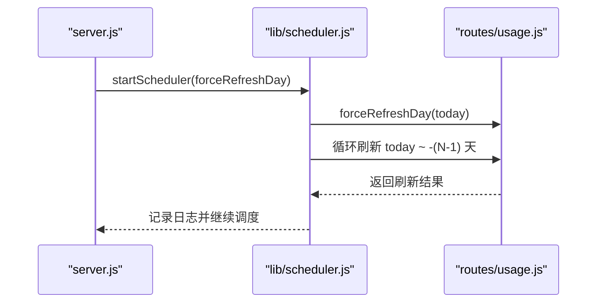
```mermaid
sequenceDiagram
participant S as "server.js"
participant SCH as "lib/scheduler.js"
participant U as "routes/usage.js"
S->>SCH : startScheduler(forceRefreshDay)
SCH->>U : forceRefreshDay(today)
SCH->>U : 循环刷新 today ~ -(N-1) 天
U-->>SCH : 返回刷新结果
SCH-->>S : 记录日志并继续调度
```

**图表来源**
- [server.js:146-148](file://server.js#L146-L148)
- [lib/scheduler.js:54-160](file://lib/scheduler.js#L54-L160)
- [routes/usage.js:273-277](file://routes/usage.js#L273-L277)

**章节来源**
- [lib/scheduler.js:54-160](file://lib/scheduler.js#L54-L160)
- [server.js:146-168](file://server.js#L146-L168)

### 用户映射服务
- 支持 Excel 导入映射表（AD-name、AD-mail、Github-name、Github-mail），校验必填字段并去空格。
- 前端优先显示映射后的 AD 名称，未映射用户显示 GitHub 登录名。
- 文件变更监听与去抖重载，避免频繁 IO。

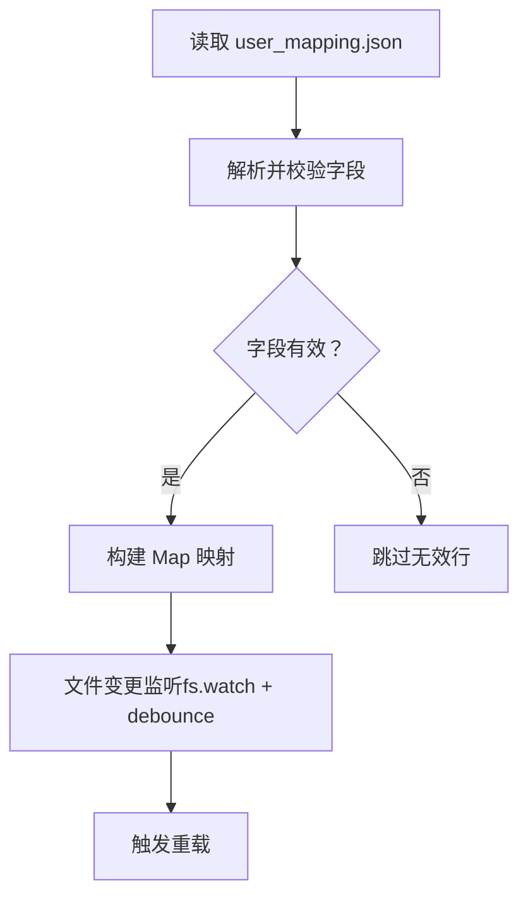
```mermaid
flowchart TD
Load["读取 user_mapping.json"] --> Parse["解析并校验字段"]
Parse --> Valid{"字段有效？"}
Valid --> |是| Map["构建 Map 映射"]
Valid --> |否| Skip["跳过无效行"]
Map --> Watch["文件变更监听fs.watch + debounce"]
Watch --> Reload["触发重载"]
```

**图表来源**
- [lib/user-mapping.js:36-92](file://lib/user-mapping.js#L36-L92)
- [lib/user-mapping.js:98-116](file://lib/user-mapping.js#L98-L116)

**章节来源**
- [lib/user-mapping.js:7-158](file://lib/user-mapping.js#L7-L158)

### Copilot Insights 聚合器
- **数据源聚合**：同时处理 GitHub Metrics Reports 和 AI Credits 使用数据，提供统一的洞察视图。
- **智能规则引擎**：基于使用模式识别高价值优化机会，包括 ROI 分析、模型配额优化、技术债评估、语言覆盖率分析等。
- **多维度分析**：涵盖 IDE 使用、代码生成、模型效率、语言分布等多个维度的深度分析。
- **实时数据处理**：支持 7/14/28/30/60/90 天时间范围的数据聚合与可视化。

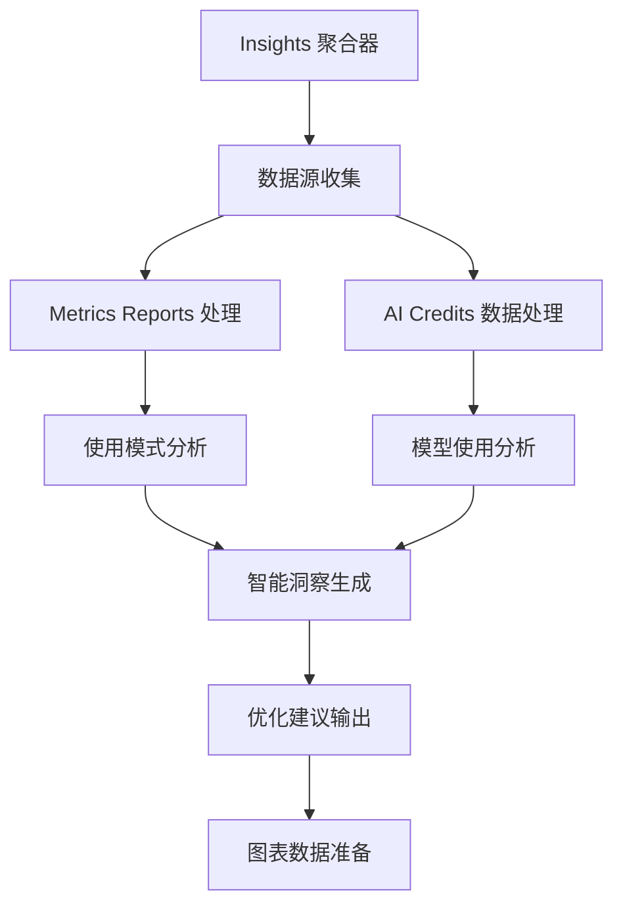
```mermaid
flowchart TD
A["Insights 聚合器"] --> B["数据源收集"]
B --> C["Metrics Reports 处理"]
B --> D["AI Credits 数据处理"]
C --> E["使用模式分析"]
D --> F["模型使用分析"]
E --> G["智能洞察生成"]
F --> G
G --> H["优化建议输出"]
H --> I["图表数据准备"]
```

**图表来源**
- [lib/insights-aggregator.js:424-533](file://lib/insights-aggregator.js#L424-L533)
- [lib/insights-aggregator.js:362-422](file://lib/insights-aggregator.js#L362-L422)

**章节来源**
- [lib/insights-aggregator.js:1-558](file://lib/insights-aggregator.js#L1-L558)
- [routes/insights.js:61-102](file://routes/insights.js#L61-L102)

### 前端交互与可视化
- 主页面：支持按日/按范围查询、双列展示当日与周期累计、周期进度条、Team 筛选、分页、排序、自动刷新、缓存命中率提示。
- 弹窗卡片：用户 & Team 信息、整体账单汇总、模型使用排行、Cost Center 预算与资源管理。
- **Insights 页面**：双 Tab 界面，支持 7/14/28/30/60/90 天时间范围切换，提供丰富的图表与指标展示。
- 骨架屏与 SWR：刷新时优先显示缓存并后台静默更新，配合骨架屏消除长时间白屏感知。

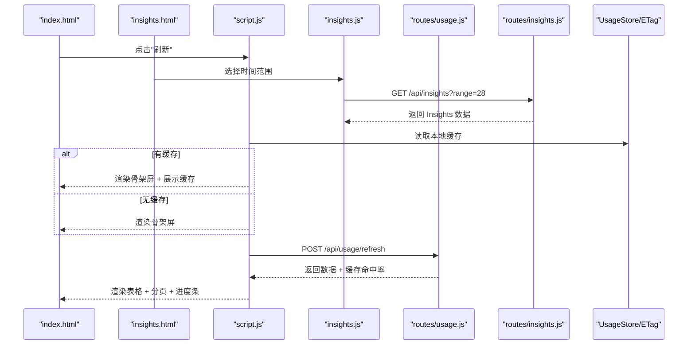
```mermaid
sequenceDiagram
participant UI as "index.html"
participant INSIGHTS as "insights.html"
participant JS as "script.js"
participant INSIGHTS_JS as "insights.js"
participant API as "routes/usage.js"
participant INSIGHTS_API as "routes/insights.js"
participant Cache as "UsageStore/ETag"
UI->>JS : 点击"刷新"
INSIGHTS->>INSIGHTS_JS : 选择时间范围
INSIGHTS_JS->>INSIGHTS_API : GET /api/insights?range=28
INSIGHTS_API-->>INSIGHTS_JS : 返回 Insights 数据
JS->>Cache : 读取本地缓存
alt 有缓存
JS-->>UI : 渲染骨架屏 + 展示缓存
else 无缓存
JS-->>UI : 渲染骨架屏
end
JS->>API : POST /api/usage/refresh
API-->>JS : 返回数据 + 缓存命中率
JS-->>UI : 渲染表格 + 分页 + 进度条
```

**图表来源**
- [public/index.html:16-84](file://public/index.html#L16-L84)
- [public/insights.html:20-37](file://public/insights.html#L20-L37)
- [public/script.js:298-340](file://public/script.js#L298-L340)
- [public/insights.js:231-240](file://public/insights.js#L231-L240)
- [routes/usage.js:387-462](file://routes/usage.js#L387-L462)
- [routes/insights.js:107-118](file://routes/insights.js#L107-L118)
- [lib/usage-store.js:137-160](file://lib/usage-store.js#L137-L160)

**章节来源**
- [public/index.html:1-103](file://public/index.html#L1-L103)
- [public/insights.html:1-81](file://public/insights.html#L1-L81)
- [public/script.js:1-541](file://public/script.js#L1-L541)
- [public/insights.js:1-263](file://public/insights.js#L1-L263)
- [public/styles.css:1-800](file://public/styles.css#L1-L800)

## 依赖关系分析
- 依赖注入：server.js 将 UsageStore、teamCache、UserMappingService、InsightsAggregator 注入到各路由模块，降低耦合度。
- 路由模块：routes/usage.js、routes/billing.js、routes/insights.js 等通过 githubGetJson 与 UsageStore 读写数据，形成清晰的职责边界。
- 外部依赖：better-sqlite3、pino、lru-cache、express、exceljs、multer、chart.js 等，分别负责数据库、日志、缓存、Web 框架、Excel 处理、文件上传、图表可视化。

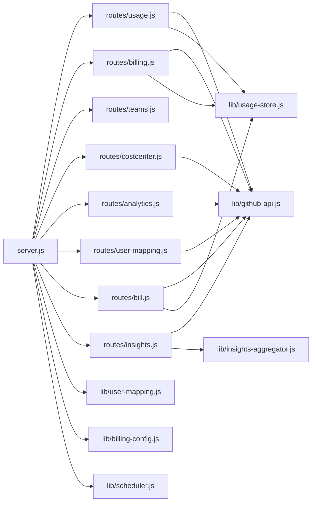
```mermaid
graph LR
S["server.js"] --> RS["routes/usage.js"]
S --> RB["routes/billing.js"]
S --> RT["routes/teams.js"]
S --> RC["routes/costcenter.js"]
S --> RA["routes/analytics.js"]
S --> RU["routes/user-mapping.js"]
S --> RBi["routes/bill.js"]
S --> RI["routes/insights.js"]
RS --> GH["lib/github-api.js"]
RB --> GH
RC --> GH
RA --> GH
RU --> GH
RBi --> GH
RI --> GH
RS --> US["lib/usage-store.js"]
RB --> US
RBi --> US
RI --> IA["lib/insights-aggregator.js"]
S --> UM["lib/user-mapping.js"]
S --> BC["lib/billing-config.js"]
S --> SCH["lib/scheduler.js"]
```

**图表来源**
- [server.js:88-118](file://server.js#L88-L118)
- [routes/usage.js:13-469](file://routes/usage.js#L13-L469)
- [routes/billing.js:10-105](file://routes/billing.js#L10-L105)
- [routes/insights.js:104-121](file://routes/insights.js#L104-L121)
- [lib/github-api.js:1-320](file://lib/github-api.js#L1-L320)
- [lib/usage-store.js:1-324](file://lib/usage-store.js#L1-L324)
- [lib/user-mapping.js:1-158](file://lib/user-mapping.js#L1-L158)
- [lib/billing-config.js:1-25](file://lib/billing-config.js#L1-L25)
- [lib/scheduler.js:1-160](file://lib/scheduler.js#L1-L160)
- [lib/insights-aggregator.js:1-558](file://lib/insights-aggregator.js#L1-L558)

**章节来源**
- [server.js:88-118](file://server.js#L88-L118)
- [package.json:12-24](file://package.json#L12-L24)

## 性能考量
- 缓存策略：三层缓存与 ETag 条件请求显著降低 API 调用，SWR 与骨架屏提升刷新体验。
- 并发控制：GitHub API 并发队列与去重，避免触发二级速率限制。
- 数据新鲜度：动态 TTL 抖动防护与自动刷新调度器，缓解 GitHub Billing API 延迟。
- 前端渲染：分页与 requestAnimationFrame 分片渲染，避免主线程阻塞。
- **Insights 性能优化**：Chart.js 图表懒加载、数据分页处理、智能缓存策略。
- 日志与可观测性：结构化日志、URL 动作映射、敏感信息脱敏、缓存追踪，便于故障定位与性能分析。

## 故障排查指南
- 启动前自检：运行 preflight-check.sh 或 preflight-check.js，检查环境变量、网络连通性、Token 权限与必要能力。
- 健康检查：访问 /api/health，确认服务运行状态与内存占用。
- 日志级别：开发模式 debug，生产模式 info；可通过 LOG_LEVEL 调整。
- 速率限制：当触发 GitHub API 速率限制时，系统自动指数退避重试并返回恢复时间提示。
- 强制刷新：按日强制刷新（POST /api/usage/refresh force:true）与按月强制刷新（POST /api/bill/refresh）作为兜底手段。
- **Insights 数据异常**：检查 GitHub Metrics Reports API 可用性，验证 ENTERPRISE_SLUG 配置。
- 优雅关闭：SIGTERM/SIGINT 信号处理，10 秒超时强制退出，确保资源释放。

**章节来源**
- [README.md:297-314](file://README.md#L297-L314)
- [server.js:100-118](file://server.js#L100-L118)
- [lib/github-api.js:170-227](file://lib/github-api.js#L170-L227)
- [README.md:243-296](file://README.md#L243-L296)
- [server.js:150-182](file://server.js#L150-L182)

## 结论
CopilotEnterpriseUsageDisplay 通过模块化分层架构、三层缓存与 ETag 条件请求、并发控制与指数退避重试、自动刷新调度器与结构化日志体系，为企业级 GitHub Copilot 管理提供了高可用、高可靠、高可视化的用量与成本管理平台。**新增的 Copilot Enterprise Insights 仪表板系统进一步增强了项目的智能化水平**，通过 AI 洞察与优化建议，为企业管理员提供深度的使用模式分析和高价值的优化指导。

它不仅满足 IT 与财务团队的成本控制与预算管理需求，也为 DevOps 团队提供了实时、准确、可追溯的 Copilot 使用洞察，是 GitHub Enterprise 管理不可或缺的重要工具。Insights 系统的引入标志着项目从传统的用量监控向智能化决策支持的转变，为企业数字化转型提供强有力的技术支撑。

## 附录
- **适用人群与使用场景**：IT 管理部门、财务部门、DevOps 团队、企业管理员、技术负责人。
- **主要应用场景**：企业级 Copilot 使用监控、成本控制、团队管理、预算与资源管理、模型使用分析、AI 洞察与优化建议。
- **业务价值**：实时了解团队使用情况、优化预算分配、预防超支、提升管理效率与透明度、提供智能化优化建议、支持数据驱动的决策制定。
- **Insights 系统特色**：双 Tab 界面设计、智能洞察规则引擎、多维度分析报告、实时数据可视化、高价值优化建议生成。