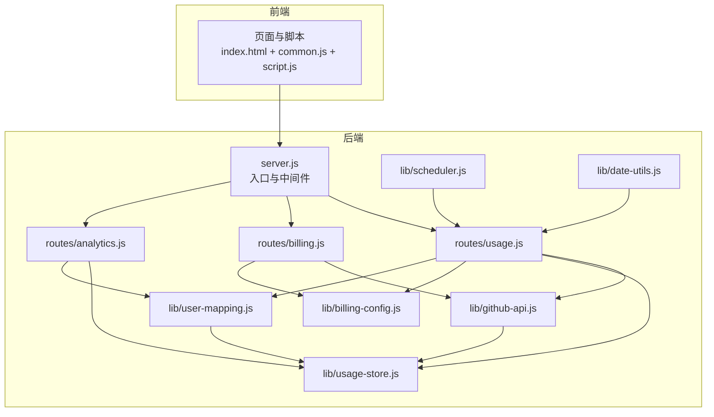
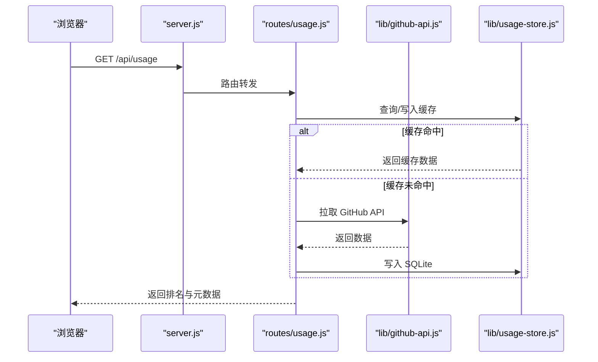
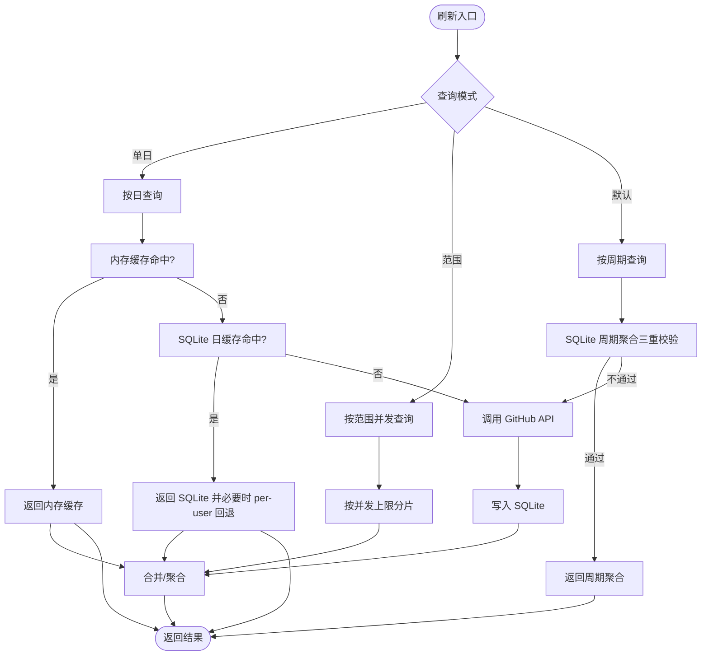
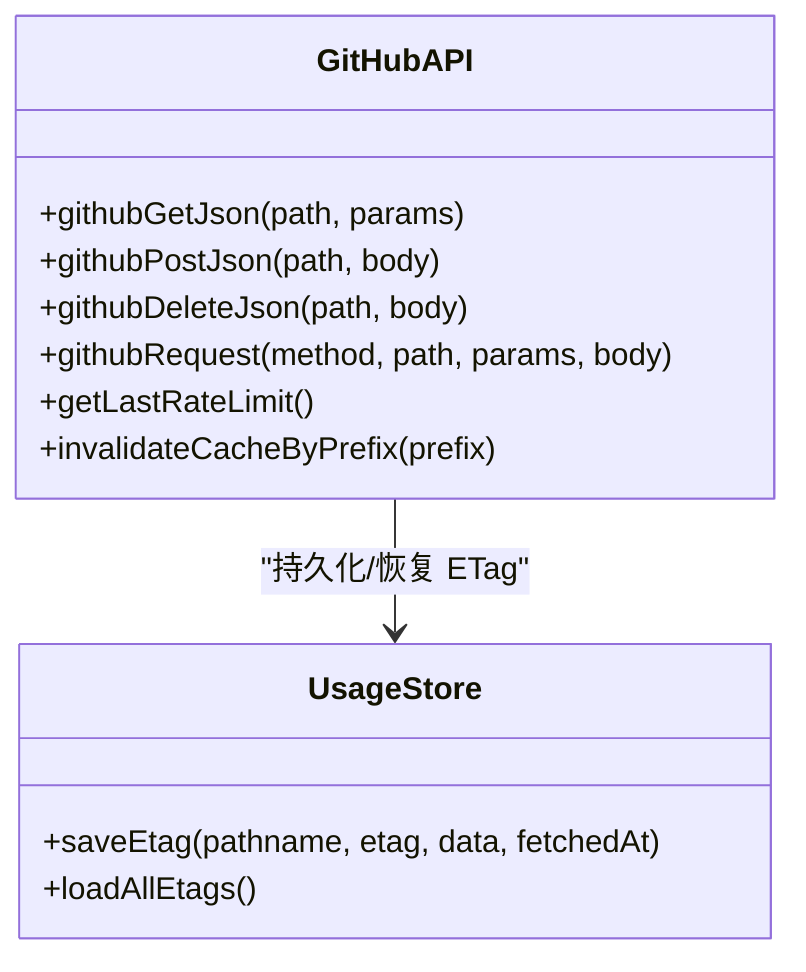
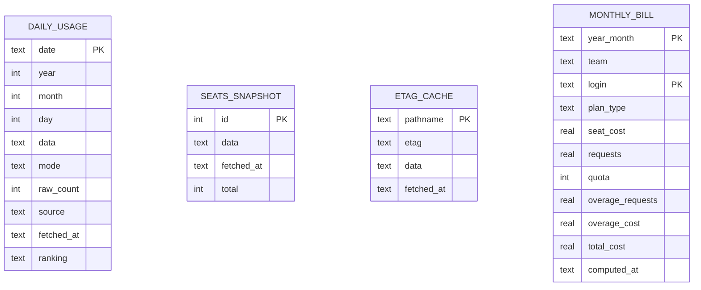
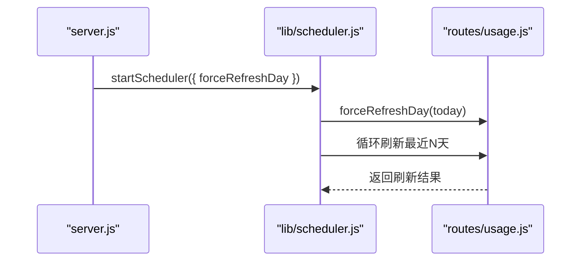
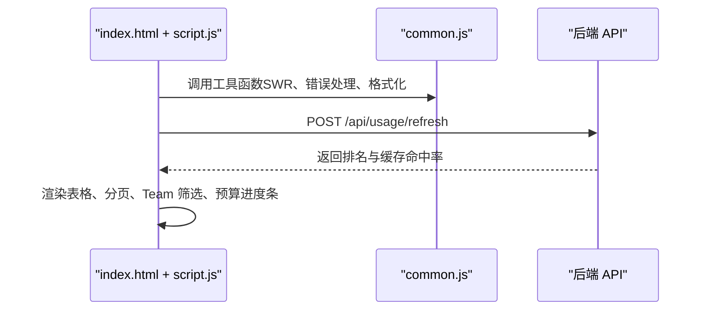
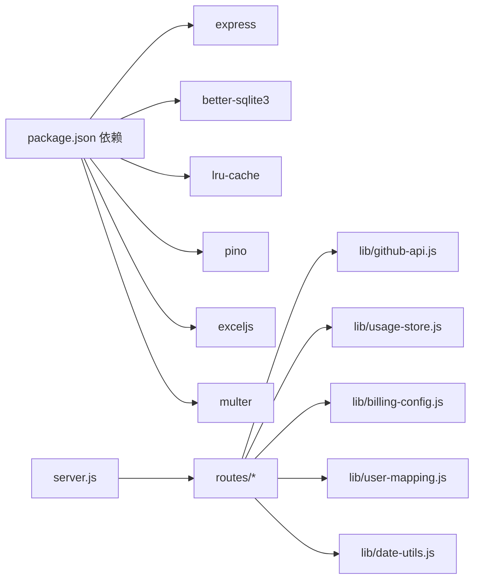

# 项目概述

<cite>
**本文引用的文件**
- [README.md](file://README.md)
- [package.json](file://package.json)
- [server.js](file://server.js)
- [lib/github-api.js](file://lib/github-api.js)
- [lib/usage-store.js](file://lib/usage-store.js)
- [lib/billing-config.js](file://lib/billing-config.js)
- [lib/scheduler.js](file://lib/scheduler.js)
- [lib/user-mapping.js](file://lib/user-mapping.js)
- [lib/date-utils.js](file://lib/date-utils.js)
- [routes/usage.js](file://routes/usage.js)
- [routes/billing.js](file://routes/billing.js)
- [routes/analytics.js](file://routes/analytics.js)
- [public/index.html](file://public/index.html)
- [public/common.js](file://public/common.js)
- [public/script.js](file://public/script.js)
</cite>

## 目录
1. [简介](#简介)
2. [项目结构](#项目结构)
3. [核心组件](#核心组件)
4. [架构总览](#架构总览)
5. [详细组件分析](#详细组件分析)
6. [依赖关系分析](#依赖关系分析)
7. [性能考量](#性能考量)
8. [故障排查指南](#故障排查指南)
9. [结论](#结论)
10. [附录](#附录)

## 简介
CopilotEnterpriseUsageDisplay 是一个基于 Node.js + Express 的 GitHub Copilot Premium Request 用量可视化仪表盘，专为 GitHub Enterprise 管理员设计。项目提供每用户用量排行、费用估算、Team 管理、账单汇总、数据分析、Cost Center 预算与同步、用户映射管理等能力，并通过三层缓存（内存 + SQLite + GitHub API）与多种工程化优化（并发队列、去重、SWR、分页、分批渲染）显著降低 API 调用与前端渲染压力。

- 目标用户：GitHub Enterprise 管理员、财务与成本中心负责人、平台工程师
- 核心价值：将复杂的企业用量与账单数据转化为直观可视化的报表与交互界面，提升运营效率与成本透明度

**章节来源**
- [README.md:1-578](file://README.md#L1-L578)

## 项目结构
项目采用模块化分层架构，前后端职责清晰：
- 入口与路由层：server.js 挂载路由模块，统一中间件与错误处理
- 服务层：lib 下的 GitHub API、缓存、调度、计费配置、用户映射等服务模块
- 数据层：better-sqlite3 持久化，提供 SQLite 表结构与预编译语句
- 前端层：IIFE 封装的公共模块与页面脚本，统一 UI 与交互逻辑

**图表来源**
- [server.js:1-182](file://server.js#L1-L182)
- [routes/usage.js:1-470](file://routes/usage.js#L1-L470)
- [routes/billing.js:1-106](file://routes/billing.js#L1-L106)
- [routes/analytics.js:1-124](file://routes/analytics.js#L1-L124)
- [lib/github-api.js:1-320](file://lib/github-api.js#L1-L320)
- [lib/usage-store.js:1-324](file://lib/usage-store.js#L1-L324)
- [lib/scheduler.js:1-160](file://lib/scheduler.js#L1-L160)
- [lib/billing-config.js:1-25](file://lib/billing-config.js#L1-L25)
- [lib/user-mapping.js:1-158](file://lib/user-mapping.js#L1-L158)
- [lib/date-utils.js:1-46](file://lib/date-utils.js#L1-L46)

**章节来源**
- [README.md:46-96](file://README.md#L46-L96)
- [server.js:88-118](file://server.js#L88-L118)

## 核心组件
- 用量查询与聚合路由（usage.js）：支持按单日、日期范围、默认周期查询；内置内存与 SQLite 缓存、按日/周期聚合、per-user 回退、动态 TTL、缓存命中率统计
- 账单与计费路由（billing.js）：获取席位、整体账单汇总、模型使用排行；与计费配置联动
- 数据分析路由（analytics.js）：趋势、Top 用户、日汇总，全部从 SQLite 读取，不直接调用 GitHub API
- GitHub API 服务（github-api.js）：并发队列、重试与指数退避、ETag 条件请求、LRU 缓存、单次飞行去重
- SQLite 缓存层（usage-store.js）：表结构（daily_usage、seats_snapshot、etag_cache、monthly_bill）、预编译语句、清理策略、月度账单存储
- 调度器（scheduler.js）：启动后立即刷新当日数据，按配置时间点刷新近期 N 天，支持禁用与多实例安全
- 计费配置（billing-config.js）：计划额度、基础价格、超额单价、金额计算
- 用户映射服务（user-mapping.js）：Excel 映射表解析、fs.watch 热重载、内存映射
- 日期工具（date-utils.js）：日期解析、日期枚举、键构建
- 前端 IIFE（common.js + script.js）：通用工具、速率限制提示、SWR、分页、Team 筛选、模态框、预算进度条、首屏缓存

**章节来源**
- [routes/usage.js:13-470](file://routes/usage.js#L13-L470)
- [routes/billing.js:10-106](file://routes/billing.js#L10-L106)
- [routes/analytics.js:7-124](file://routes/analytics.js#L7-L124)
- [lib/github-api.js:1-320](file://lib/github-api.js#L1-L320)
- [lib/usage-store.js:10-324](file://lib/usage-store.js#L10-L324)
- [lib/scheduler.js:1-160](file://lib/scheduler.js#L1-L160)
- [lib/billing-config.js:1-25](file://lib/billing-config.js#L1-L25)
- [lib/user-mapping.js:7-158](file://lib/user-mapping.js#L7-L158)
- [lib/date-utils.js:1-46](file://lib/date-utils.js#L1-L46)
- [public/common.js:1-113](file://public/common.js#L1-L113)
- [public/script.js:1-541](file://public/script.js#L1-L541)

## 架构总览
项目采用“入口层（server.js）→ 路由层（routes/*）→ 服务层（lib/*）→ 数据层（better-sqlite3）”的分层设计，前端通过 IIFE 消除全局污染，页面脚本按需加载。

**图表来源**
- [server.js:88-118](file://server.js#L88-L118)
- [routes/usage.js:378-462](file://routes/usage.js#L378-L462)
- [lib/github-api.js:108-168](file://lib/github-api.js#L108-L168)
- [lib/usage-store.js:137-160](file://lib/usage-store.js#L137-L160)

**章节来源**
- [README.md:46-96](file://README.md#L46-L96)
- [server.js:13-182](file://server.js#L13-L182)

## 详细组件分析

### 用量查询与聚合（routes/usage.js）
- 查询模式
  - 单日：同时查询当日与当月周期，支持“本周期进度条”与“当日/累计”双列展示
  - 日期范围：最多 31 天，按天并发回源，合并排名
  - 默认周期：按当前年月查询，优先使用 SQLite 周期聚合
- 缓存策略
  - 内存刷新缓存（5 分钟）+ SQLite 日粒度缓存（近 3 天 1 小时，更老 90 天）
  - ETag 条件请求 + 单次飞行去重，避免重复请求
- 聚合与回退
  - SQLite 周期聚合三重完整性校验（覆盖、新鲜度、非空 ranking）不满足则回退 GitHub
  - 当日缓存 ranking 为空且存在原始用量时，触发 per-user fallback
- 动态 TTL 与强制刷新
  - 近 3 天 1 小时，更老 90 天，避免 GitHub Billing API 延迟导致的缓存“锁死”
  - 支持按日/按月强制刷新，清空 SQLite 缓存后逐日回源并重新计算

**图表来源**
- [routes/usage.js:237-348](file://routes/usage.js#L237-L348)
- [routes/usage.js:134-235](file://routes/usage.js#L134-L235)
- [lib/usage-store.js:137-193](file://lib/usage-store.js#L137-L193)

**章节来源**
- [routes/usage.js:13-470](file://routes/usage.js#L13-L470)
- [lib/usage-store.js:10-324](file://lib/usage-store.js#L10-L324)

### GitHub API 服务（lib/github-api.js）
- 并发控制：固定大小并发队列，避免触发 Secondary Rate Limit
- 重试与退避：对 429/403（速率限制）与 5xx 自动重试，指数退避上限控制
- 缓存与去重：LRU GET 缓存 + 单次飞行去重；ETag 条件请求，304 时不消耗配额
- ETag 持久化：内存镜像 + SQLite 持久化，重启后恢复

**图表来源**
- [lib/github-api.js:108-168](file://lib/github-api.js#L108-L168)
- [lib/github-api.js:67-74](file://lib/github-api.js#L67-L74)
- [lib/usage-store.js:243-273](file://lib/usage-store.js#L243-L273)

**章节来源**
- [lib/github-api.js:1-320](file://lib/github-api.js#L1-L320)
- [lib/usage-store.js:241-279](file://lib/usage-store.js#L241-L279)

### SQLite 缓存层（lib/usage-store.js）
- 表结构
  - daily_usage：按日存储原始用量与排名，支持 ranking 列持久化
  - seats_snapshot：席位快照，限制保留数量防止膨胀
  - etag_cache：ETag 持久化
  - monthly_bill：Team 月度账单结果
- 预编译语句：所有查询在构造时 prepare，运行时直接执行，减少解析开销
- 清理策略：按 TTL 清理旧数据，定期修剪席位快照

**图表来源**
- [lib/usage-store.js:24-71](file://lib/usage-store.js#L24-L71)

**章节来源**
- [lib/usage-store.js:10-324](file://lib/usage-store.js#L10-L324)

### 调度器（lib/scheduler.js）
- 启动后延迟刷新当日数据，随后在配置时间点（默认 03:00、12:00）刷新近期 N 天
- 支持禁用（SCHED_DISABLED=true）与多实例安全
- 失败仅记录日志，不影响主流程

**图表来源**
- [server.js:147-148](file://server.js#L147-L148)
- [lib/scheduler.js:54-157](file://lib/scheduler.js#L54-L157)
- [routes/usage.js:273-277](file://routes/usage.js#L273-L277)

**章节来源**
- [lib/scheduler.js:1-160](file://lib/scheduler.js#L1-L160)
- [server.js:146-151](file://server.js#L146-L151)

### 计费配置（lib/billing-config.js）
- 计划配置：Business 与 Enterprise 的包含额度、基础价格、超额单价
- 金额计算：按周期请求量与计划类型计算费用

**章节来源**
- [lib/billing-config.js:1-25](file://lib/billing-config.js#L1-L25)

### 用户映射服务（lib/user-mapping.js）
- Excel 映射表解析（AD-name/Github-name 等列），校验必填字段
- fs.watch + debounce 热重载，内存映射即时生效
- 提供按 GitHub 用户名查询映射信息的能力

**章节来源**
- [lib/user-mapping.js:1-158](file://lib/user-mapping.js#L1-L158)

### 前端 IIFE 与页面脚本（public/common.js + public/script.js）
- IIFE 封装：CopilotDashboard 命名空间，统一工具函数（HTML 转义、数值格式化、速率限制提示、SWR、骨架屏）
- 主页面（index.html + script.js）：Tab 切换、日期选择、Team 筛选、分页、排序、模态框、预算进度条、自动刷新、缓存命中率展示
- 数据新鲜度：Analytics 页面显示数据加载时间徽章，30 秒自动更新

**图表来源**
- [public/index.html:1-103](file://public/index.html#L1-L103)
- [public/common.js:39-53](file://public/common.js#L39-L53)
- [public/script.js:299-340](file://public/script.js#L299-L340)

**章节来源**
- [public/common.js:1-113](file://public/common.js#L1-L113)
- [public/script.js:1-541](file://public/script.js#L1-L541)
- [public/index.html:1-103](file://public/index.html#L1-L103)

## 依赖关系分析
- 关键依赖
  - Express：Web 服务与路由
  - better-sqlite3：高性能 SQLite 驱动
  - lru-cache：LRU 缓存
  - pino：结构化日志
  - exceljs、multer：Excel 上传与解析
- 模块耦合
  - routes 层依赖 lib 层（github-api、usage-store、billing-config、user-mapping、date-utils）
  - server.js 作为入口，集中挂载路由与中间件，低耦合高内聚
  - 前端脚本通过 common.js 统一调用后端 API

**图表来源**
- [package.json:12-24](file://package.json#L12-L24)
- [server.js:88-98](file://server.js#L88-L98)

**章节来源**
- [package.json:1-26](file://package.json#L1-L26)
- [server.js:1-182](file://server.js#L1-L182)

## 性能考量
- 三层缓存：内存（5 分钟）→ SQLite（动态 TTL：近 3 天 1 小时，更老 90 天）→ GitHub API，大幅降低 API 调用
- 并发与去重：GitHub API 并发队列 + 单次飞行去重，避免重复请求与限流
- 前端优化：SWR + 骨架屏、分页与分批渲染、localStorage 首屏缓存、按列排序与筛选
- 聚合与回退：SQLite 周期聚合三重校验，不满足则回退 GitHub，避免错误聚合
- 调度与抖动：自动刷新调度器 + 动态 TTL 抖动防护，应对 GitHub Billing API 延迟

**章节来源**
- [README.md:218-290](file://README.md#L218-L290)
- [routes/usage.js:134-235](file://routes/usage.js#L134-L235)
- [lib/scheduler.js:54-157](file://lib/scheduler.js#L54-L157)

## 故障排查指南
- 速率限制
  - 现象：429/403，提示恢复时间
  - 处理：降低并发（GITHUB_MAX_CONCURRENT）、等待恢复时间、查看日志
- 缓存命中异常
  - 现象：缓存命中率低或数据不一致
  - 处理：使用按日/按月强制刷新，清空 SQLite 缓存后回源 GitHub
- 自动刷新未生效
  - 现象：多副本部署时重复调用 API 或未刷新
  - 处理：在非主副本设置 SCHED_DISABLED=true，或调整 SCHED_DAILY_TIMES、SCHED_BACKFILL_DAYS
- 前端白屏或长时间加载
  - 现象：首屏空白
  - 处理：启用骨架屏与 SWR，检查网络与缓存；查看控制台错误与日志

**章节来源**
- [lib/github-api.js:172-227](file://lib/github-api.js#L172-L227)
- [routes/usage.js:387-462](file://routes/usage.js#L387-L462)
- [lib/scheduler.js:59-69](file://lib/scheduler.js#L59-L69)
- [public/common.js:25-37](file://public/common.js#L25-L37)

## 结论
CopilotEnterpriseUsageDisplay 通过清晰的分层架构、完善的缓存与调度机制、以及前端工程化优化，为企业管理员提供了稳定、高效、易用的 Copilot 用量与账单可视化方案。项目在保证数据准确性的同时，显著降低了 API 调用与前端渲染成本，适合在生产环境中长期运维与扩展。

[无章节来源需求：总结性内容]

## 附录
- 使用场景
  - 每月账单核对与预算控制
  - 按 Team/用户维度的成本归集
  - 用量趋势分析与超额预警
  - 用户映射与合规展示
- 目标用户
  - GitHub Enterprise 管理员、财务与成本中心负责人、平台工程师
- 核心价值
  - 数据透明、成本可控、操作便捷、可扩展性强

**章节来源**
- [README.md:1-578](file://README.md#L1-L578)